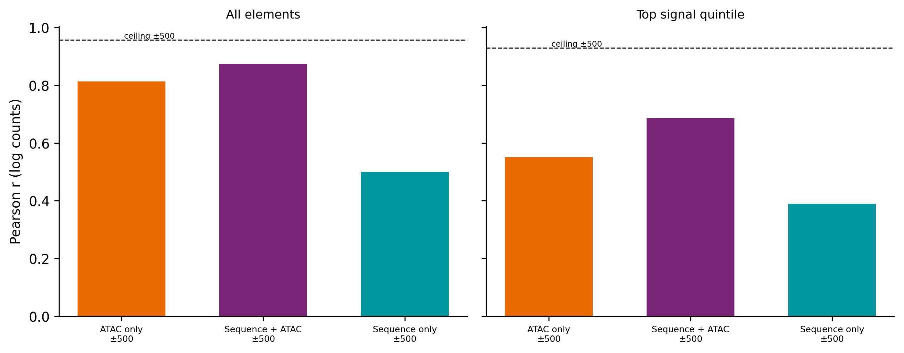
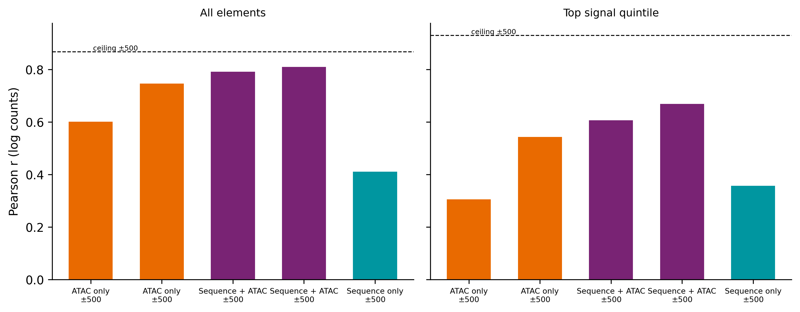
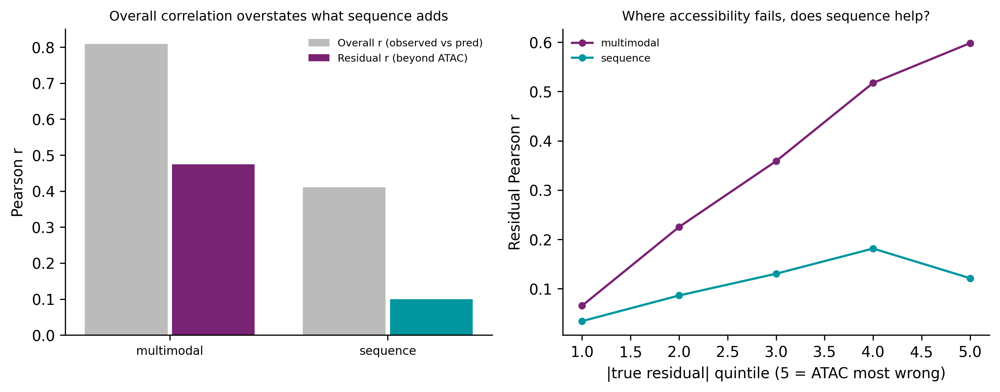
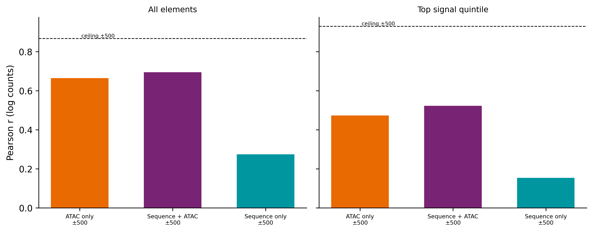

```{=html}
<style>
/* Typography and layout. Present in the document rather than the renderer so the
   report looks the same whether it is built by quarto or by the pandoc fallback
   (Sherlock has pandoc 2.10 and no quarto, which otherwise renders bare Times). */
html { -webkit-text-size-adjust: 100%; }
body {
  font-family: Arial, Calibri, "Helvetica Neue", Helvetica, sans-serif;
  font-size: 15px;
  line-height: 1.6;
  color: #1a1a1a;
  max-width: 980px;
  margin: 0 auto;
  padding: 2.5rem 1.5rem 4rem;
  background: #fff;
}
h1 { font-size: 1.7rem; font-weight: 600; line-height: 1.3; margin: 0 0 .3rem; }
h2 { font-size: 1.15rem; font-weight: 600; margin: 2.6rem 0 .6rem;
     padding-top: 1.1rem; border-top: 1px solid #e4e4e4; }
h3 { font-size: 1rem;   font-weight: 600; margin: 1.6rem 0 .4rem; }
p.date, .date { color: #666; font-size: .85rem; }

/* Figures: never exceed the text column, and centre them. Without this the
   pandoc fallback shows every PNG at natural pixel width and they overflow. */
img {
  display: block;
  max-width: 100%;
  height: auto;
  margin: 1.1rem auto 0.4rem;
}

/* The table of contents pandoc emits as a bare bulleted list */
#TOC, nav#TOC { font-size: .9rem; background: #fafafa; border: 1px solid #eaeaea;
  border-radius: 6px; padding: .8rem 1.2rem; margin: 1.5rem 0 2rem; }
#TOC ul { margin: .2rem 0; padding-left: 1.1rem; }
#TOC a { color: #235; text-decoration: none; }
#TOC a:hover { text-decoration: underline; }

/* Q:/A: lines read as the skimmable layer */
p > strong:first-child { color: #111; }

table { border-collapse: collapse; font-size: .88rem; margin: 1rem 0; width: 100%; }
th, td { border-bottom: 1px solid #e8e8e8; padding: .38rem .6rem; text-align: left;
         vertical-align: top; }
th { background: #f6f6f6; font-weight: 600; }

code, pre { font-family: "SF Mono", Menlo, Consolas, monospace; font-size: .82rem; }
pre { background: #f7f7f8; border: 1px solid #ececec; border-radius: 5px;
      padding: .7rem .9rem; overflow-x: auto; }
code { background: #f2f2f3; padding: .07em .32em; border-radius: 3px; }
pre code { background: none; padding: 0; }

blockquote { border-left: 3px solid #ddd; margin-left: 0; padding-left: 1rem;
             color: #444; }
</style>
```

## Headline figure



**Figure 1 | Sequence alone reaches 42% of the achievable ceiling for H3K27ac; adding ATAC reaches 74%.** **Headline figure.**

<details>
<summary>Full legend</summary>

**Figure 1 | Model performance for predicting K562 H3K27ac at candidate regulatory elements, by input modality.** Pearson correlation between predicted and observed log counts, pooled over the five held-out chromosome folds of a chromosome-partitioned 5-fold cross-validation (n = 58,655 element–fold observations). **a**, All candidate elements. **b**, Top quintile of elements by observed H3K27ac (n = 11,731) — the elements that actually carry the mark. Bars are the three input modalities of `MultiModalBPNet`: sequence only (4-channel one-hot DNA), ATAC only (1-channel base-resolution accessibility), and sequence + ATAC (5-channel). Dashed line is the achievable ceiling, `sqrt(2r/(1+r))` where *r* is the inter-replicate Pearson correlation on the same elements and window (Spearman–Brown correction for the two-replicate merged target, then square root because a model predicts the expected signal rather than a noisy draw of it); ceiling = 0.957 for all elements, 0.929 for the top quintile. Target is K562 H3K27ac ChIP-seq (ENCODE ENCSR000AKP), 5′-end counts summed over a 1,000 bp window centred on each element. Restricting to elements that carry the mark lowers every model, but lowers the accessibility-containing models least: sequence 0.500 → 0.389, ATAC 0.814 → 0.551, sequence + ATAC 0.874 → 0.686. Source: `results/fiveprime_stratified_evaluation.tsv`.
</details>

## Summary

- Accessibility does most of the work. On the elements that carry the mark, ATAC alone reaches 0.551 and sequence alone 0.389; together they reach 0.686, so sequence adds +0.135 over accessibility (Fig. 1b).
- The same comparison for p300, evaluated identically on the same elements, gives sequence a +0.300 margin over accessibility — **2.2× larger than for H3K27ac** (Fig. 4). H3K27ac is the higher-scoring target overall but the poorer substrate for sequence interpretation.
- A sequence-only model trained in K562 retains only 16% of the achievable ceiling when applied to GM12878, against 50% for ATAC-only (Fig. 6). The sequence component is largely cell-type-specific rather than a transferable grammar.
- Overall correlation is a misleading headline when accessibility is an available input: sequence + ATAC scores 0.809 overall but only 0.475 on the departure from what accessibility alone predicts (Fig. 5).
- ATAC and H3K27ac are spatially offset — ATAC peaks on the element centre, H3K27ac on flanking nucleosomes at ±250 bp and is far broader (Fig. 2). H3K27ac around active elements only reaches its distal plateau near ±2 kb, well beyond the model's ~1.1 kb receptive field.

## Goals

H3K27ac marks active enhancers and promoters and is used throughout the field as a readout of element activity, but it is a downstream, indirect consequence of the events DNA sequence specifies: transcription-factor binding recruits coactivators, which acetylate the *adjacent* nucleosomes. This analysis asks how much of H3K27ac at candidate regulatory elements is predictable from DNA sequence, how much is predictable from chromatin accessibility, and how much sequence adds beyond accessibility. The motivating goal is a model that takes sequence + accessibility and predicts element activity in a way that generalises to new cell types — so the analysis also asks whether whatever sequence contributes actually transfers. p300, a coactivator one step closer to the sequence-specified events, is used as a reference point evaluated identically.

## Datasets

| Dataset | Assay / system | Source | Used as |
|---|---|---|---|
| **K562 H3K27ac** | H3K27ac ChIP-seq, single-end 36 bp, 2 replicates (ENCFF790GFL, ENCFF817HMW) | ENCODE ENCSR000AKP | Prediction target |
| **K562 ATAC-seq** | ATAC-seq, paired-end, 3 replicates (ENCFF077FBI, ENCFF128WZG, ENCFF534DCE) | ENCODE ENCSR868FGK | Accessibility input |
| **K562 candidate elements** | DNase-derived candidate regulatory elements, n = 150,528, mean width 608 bp | Repo: `reference/K562_DNase_candidate_elements.narrowPeak` | Coordinate system; windows centred on element midpoints |
| **GM12878 H3K27ac** | H3K27ac ChIP-seq, single-end, 2 replicates (ENCFF645BAL, ENCFF865OOP) | ENCODE | Cross-cell-type evaluation target |
| **GM12878 ATAC-seq** | ATAC-seq | ENCODE; repo: `2026_0606_GM12878_transferability/data/atac.bw` | Accessibility input for transfer |
| **GM12878 candidate elements** | Candidate regulatory elements, n = 154,224 | Repo: `2026_0606_GM12878_transferability/reference/` | Transfer coordinate system |
| **K562 p300** | EP300 ChIP-seq, stranded | ENCODE ENCSR000EGE | Reference target for the sequence-margin comparison |
| **hg38 CV folds** | Chromosome-holdout 5-fold split | Repo: `reference/hg38_five_folds.json` | Shared across all models so numbers are comparable |
| **GC-matched negatives** | Genome-wide GC-binned background, hg38 | Repo: `reference/genomewide_gc_stride_1000_flank_size_1057.gc.bed` | Training negatives |

All ChIP-seq targets are counted as **5′ read ends** at single-base resolution (`bedtools genomecov -5 -dz`, stranded), matching the convention already used for the p300 models in this repository. Model architecture is `MultiModalBPNet` (`scripts/multimodal_bpnet.py`), a BPNet variant with a profile head and a counts head; only the counts head is analysed here. All correlations are on log counts.

## H3K27ac sits on flanking nucleosomes and is far broader than ATAC

**Q:** Are ATAC and H3K27ac located in the same place relative to a candidate element?

**A:** No — ATAC peaks on the element centre (offset −12 bp, no central dip) while H3K27ac is bimodal with shoulders at ±250 bp, and at ±2 kb H3K27ac is still at 28% of its maximum where ATAC has fallen to 17%.


<details>
<summary>Figure 2 legend</summary>

**Figure 2 | H3K27ac is displaced onto flanking nucleosomes and is much broader than accessibility.** Meta-profiles over the top quintile of elements by H3K27ac signal (n = 30,000 elements sampled with seed 0; profiles computed on the same element set for all tracks so the comparison is not confounded by each track selecting its own strong elements). **a**, Each track normalised to its own maximum, so the comparison is of *location*, not magnitude. **b**, Raw magnitudes, log scale. Tracks: K562 ATAC (teal), K562 H3K27ac as 5′ ends (orange). Dashed vertical line marks the element centre. Summary statistics (`results/profile_comparison_summary.tsv`): peak offset −12.5 bp for ATAC versus −262.5 bp for H3K27ac 5′ ends; centre-to-peak ratio 1.000 for ATAC (no dip) versus 0.944 for H3K27ac. The bimodality is the expected signature of a nucleosome-free element flanked by acetylated nucleosomes. The breadth difference is the more consequential one for modelling: H3K27ac around strong elements only reaches its distal plateau near ±4 kb, and that plateau is ~8× the level seen at weak elements, indicating strong elements sit inside broad acetylation domains. Source: `results/profile_comparison.tsv`.
</details>

**Method.**

- Meta-profiles binned at 50 bp over ±2 kb, restricted to the top H3K27ac quintile.
- All tracks profiled on the identical element set; each normalised to its own maximum.

<details>
<summary>Full methods &amp; code</summary>

Windows are centred on the candidate-element midpoint. The `summit` column of `K562_DNase_candidate_elements.narrowPeak` equals `width/2`, so element-centred windows require no change to the extraction code. Elements within `flank` of a contig end are dropped. Signal is read with pyBigWig and `nan` treated as zero.

```bash
pixi run python scripts/0.6.compare_profiles.py \
    --elements reference/K562_DNase_candidate_elements.narrowPeak \
    --track "ATAC:.../atac.bw" \
    --track "H3K27ac (5-prime):data/h3k27ac_5p_plus.bw,data/h3k27ac_5p_minus.bw" \
    --stratify-by "H3K27ac (5-prime)" --outdir results --figdir figures
```
Source: `scripts/0.6.compare_profiles.py`
</details>

## A 1 kb counting window is the best trade-off between signal and neighbour contamination

**Q:** How wide should the window be over which H3K27ac counts are summed?

**A:** ±500 bp — wider windows raise the achievable ceiling only marginally (0.760 → 0.798 from ±500 to ±2000) while the fraction of elements containing a *different* candidate element rises from 0% to 42%.


<details>
<summary>Figure 3 legend</summary>

**Figure 3 | The achievable ceiling saturates by ±1 kb, while neighbour contamination keeps rising.** Inter-replicate Pearson correlation of log H3K27ac counts between the two ENCSR000AKP replicates, as a function of the half-width of the symmetric counting window, over all n = 150,526 candidate elements (teal) and the top signal quintile (purple). Because the two replicates measure the same biology, their agreement bounds how well any model can predict the merged target. Top-quintile values: 0.729 (±250 bp), 0.760 (±500), 0.776 (±750), 0.785 (±1000), 0.795 (±1500), 0.798 (±2000). The countervailing cost is neighbour contamination — the fraction of elements with another candidate element's centre inside the window, which is a property of element spacing and independent of the assay: 0% at ±250 and ±500 bp, 9.9% at ±750, 19.9% at ±1000, 33.1% at ±1500, 41.5% at ±2000 (`results/window_tradeoff.tsv`). A contaminated window's count is not attributable to the element it is centred on, which matters for any subsequent sequence-attribution work. ±500 bp is the widest window with zero contamination. Source: `results/fiveprime_replicate_ceiling_by_window.tsv`.
</details>

**Method.**

- Per-replicate 5′-end BigWigs built with identical processing to the merged training target.
- Neighbour contamination computed from element-centre spacing per chromosome.

<details>
<summary>Full methods &amp; code</summary>

Ceilings are reported as the raw inter-replicate *r*. Converting to a bound on model performance requires two corrections, applied wherever a fraction-of-ceiling is quoted in this report: Spearman–Brown for the fact that the model predicts the two-replicate *merge* rather than one replicate (`rel = 2r/(1+r)`), then a square root because a model predicts the expected signal, not a noisy realisation of it. At ±500 bp this converts a raw 0.760 into a bound of 0.929 on the top quintile, and a raw 0.844 into 0.957 over all elements.

A separate test asked whether excluding the nucleosome-free centre sharpens the target, on the reasoning that H3K27ac is deposited on the flanks. It does not: excluding ±125/±250/±375 bp lowers the top-quintile ceiling monotonically (0.760 → 0.747 → 0.729 → 0.717) because the shallow central dip means the centre still carries ~91% of peak signal, so excluding it discards reads rather than noise. The flanking-only count also correlates 0.93–0.99 with the full-window count, so the two targets are barely different. Full symmetric window retained (`results/flanking_vs_full_window.tsv`).

```bash
pixi run python scripts/0.3.replicate_ceiling_by_window.py \
    --elements reference/K562_DNase_candidate_elements.narrowPeak \
    --rep1-bw data/h3k27ac_rep1_5p_plus.bw,data/h3k27ac_rep1_5p_minus.bw \
    --rep2-bw data/h3k27ac_rep2_5p_plus.bw,data/h3k27ac_rep2_5p_minus.bw \
    --outdir results --figdir figures --label fiveprime_
pixi run python scripts/0.4.flanking_vs_full.py --outer 500 1000 --inner 0 125 250 375
```
Source: `scripts/0.3.replicate_ceiling_by_window.py`, `scripts/0.4.flanking_vs_full.py`
</details>

## Sequence contributes less to H3K27ac than to p300, by a factor of 2.2

**Q:** Does sequence add as much information beyond accessibility for H3K27ac as it does for p300?

**A:** No — on the top quintile, sequence adds +0.300 over accessibility for p300 but only +0.135 for H3K27ac, despite H3K27ac scoring higher overall.



<details>
<summary>Figure 4 legend</summary>

**Figure 4 | H3K27ac is the easier target but the weaker substrate for sequence.** Pearson correlation on log counts, top quintile of elements by observed signal, pooled over 5 chromosome-holdout folds (n = 11,731). All models are `MultiModalBPNet` evaluated on the same K562 DNase candidate elements with element-centred ±500 bp windows, so the comparison isolates the target. p300 (ENCSR000EGE, stranded 5′ ends): ATAC-only 0.305, sequence + ATAC 0.606, margin **+0.300**. H3K27ac (ENCSR000AKP, 5′ ends): ATAC-only 0.551, sequence + ATAC 0.686, margin **+0.135**; sequence-only 0.389. The margin — what sequence adds once accessibility is already available — is 2.2× larger for p300. Note the ranking inverts depending on the statistic used: H3K27ac has the higher joint-model correlation (0.686 vs 0.606) but the smaller sequence margin. One caveat: the p300 models were *trained* on ENCSR000EGE peak summits and are *evaluated* here on candidate-element centres, matching this repository's existing p300 prediction pipeline; a matched element-centred p300 model would most likely raise p300 further and widen the gap. Source: `results/p300_vs_h3k27ac_stratified_evaluation.tsv`.
</details>

**Method.**

- Same elements, windows, folds and metric for both targets; only the target differs.
- Accessibility-only control included so the sequence margin is identifiable.

<details>
<summary>Full methods &amp; code</summary>

The accessibility-only control is what makes this comparison interpretable. Without it, p300 and H3K27ac would be compared on joint-model correlation alone, which ranks them in the opposite order. p300 model directories are `2026_0529_multimodal_p300_model/models/atac` (sequence + ATAC) and `models/atac_only` (ATAC only) — note `atac` there denotes the multimodal model whose accessibility input is ATAC, not the ATAC-only mode.

```bash
pixi run python scripts/2.2.evaluate_stratified.py \
    --config-json config/compare_configs.json --out-prefix p300_vs_h3k27ac_ \
    --elements reference/K562_DNase_candidate_elements.narrowPeak \
    --fold-json reference/hg38_five_folds.json --outdir results --figdir figures
```
Source: `scripts/2.2.evaluate_stratified.py`
</details>

## Overall correlation overstates what the model adds beyond accessibility

**Q:** How much of the joint model's performance is a departure from what accessibility alone predicts?

**A:** Less than half — the sequence + ATAC model correlates 0.809 with observed signal overall but only 0.475 with the residual left by an accessibility-only model.



<details>
<summary>Figure 5 legend</summary>

**Figure 5 | The residual metric separates what a model adds from what accessibility already supplied.** **a**, Overall Pearson *r* (grey) against residual Pearson *r* (coloured) for each model. Residual *r* is `r(observed − atac_pred, model_pred − atac_pred)`, where `atac_pred` is the held-out prediction of the accessibility-only *model* rather than the raw ATAC track — so the residual is what accessibility genuinely cannot explain, not what a linear read of the track misses. **b**, Residual *r* stratified by quintile of |true residual|, i.e. by how wrong accessibility is for that element. Sequence + ATAC: overall 0.809, residual 0.475, incremental R² +0.099; residual *r* rises monotonically from 0.066 in the quintile where accessibility is nearly right to 0.598 where it is most wrong, and incremental R² is negative (−0.120) in the easiest quintile and +0.236 in the hardest. Sequence-only captures almost none of the accessibility residual (0.100), i.e. an independently-trained sequence model is largely *redundant* with accessibility rather than complementary to it. n = 58,655 element–fold observations pooled over 5 folds. **These numbers were computed on an earlier processing of the target and are being re-derived on 5′ ends; the metric definition and the qualitative conclusions are unaffected, but the exact values will shift.** Source: `results/residual_evaluation.tsv`, `results/p300_residual_evaluation.tsv`.
</details>

**Method.**

- Baseline is the accessibility-only model's held-out prediction, not the raw ATAC track.
- Stratified by |true residual| so performance is scored where accessibility fails.

<details>
<summary>Full methods &amp; code</summary>

The same metric applied to p300 gives residual *r* = 0.654 and incremental R² = +0.265 — versus 0.475 and +0.099 for H3K27ac, reinforcing Fig. 4 on a second statistic. p300's residual *r* is also high (0.260) in the quintile where accessibility is nearly right, against 0.066 for H3K27ac, so p300's sequence contribution is broadly useful rather than confined to the elements accessibility gets wrong.

The evaluator refuses to run when the baseline and comparison models use different windows, since a residual across mismatched geometries is not meaningful.

```bash
pixi run python scripts/2.4.evaluate_residual.py \
    --models-dir models --atac-config atac5p_hw500_clw10 \
    --configs multimodal5p_hw500_clw10 sequence5p_hw500_clw10 \
    --elements reference/K562_DNase_candidate_elements.narrowPeak \
    --fold-json reference/hg38_five_folds.json --outdir results --figdir figures
```
Source: `scripts/2.4.evaluate_residual.py`
</details>

## The sequence component does not transfer to a new cell type

**Q:** Does a K562-trained model still work on GM12878?

**A:** Accessibility transfers and sequence does not — ATAC-only retains 50% of the achievable ceiling in GM12878 while sequence-only retains 16%.



<details>
<summary>Figure 6 legend</summary>

**Figure 6 | Accessibility transfers across cell types; the sequence component largely does not.** K562-trained models applied without retraining to GM12878 candidate elements (n = 154,224 elements; 11,429 in the top quintile), evaluated against GM12878 H3K27ac. Top-quintile Pearson: sequence-only 0.153, ATAC-only 0.473, sequence + ATAC 0.522. Expressed as a fraction of each cell type's own achievable ceiling — necessary because the two targets differ in quality — sequence-only falls from 38% of ceiling in K562 to **16%** in GM12878, ATAC-only 58% → 50%, sequence + ATAC 72% → 55%. The sequence margin over accessibility shrinks from +0.125 in K562 to +0.049 in GM12878, so roughly 60% of what sequence contributes does not survive a change of cell type. Note the GM12878 target is *easier*, not harder: its top-quintile inter-replicate ceiling is 0.832 against K562's 0.760 (mean 21.1 versus 17.0 counts per window), so normalising makes the sequence collapse look worse than the raw correlations suggest. **These transfer numbers were computed on an earlier processing of the target and are being re-derived on 5′ ends.** Sources: `results/gm12878_transfer_stratified_evaluation.tsv`, `results/gm12878_fiveprime_replicate_ceiling_by_window.tsv`.
</details>

**Method.**

- K562 models applied to GM12878 elements with no retraining or fine-tuning.
- Both cell types' ceilings computed so the drop is normalised for target quality.

<details>
<summary>Full methods &amp; code</summary>

Transfer numbers are uninterpretable without the target ceiling in *both* cell types — a raw cross-cell-type correlation cannot distinguish a model that fails to generalise from a target that is simply harder. Here the GM12878 ceiling was measured on both processings of the target and agreed closely (top quintile 0.832 on 5′ ends versus 0.834 on the earlier processing), so the normalisation holds either way.

```bash
pixi run python scripts/2.2.evaluate_stratified.py \
    --config-json config/gm_transfer_configs.json --out-prefix gm12878_transfer_ \
    --elements 2026_0606_GM12878_transferability/reference/GM12878_candidate_elements.narrowPeak \
    --fold-json reference/hg38_five_folds.json --outdir results --figdir figures
```
Source: `scripts/2.2.evaluate_stratified.py`, `scripts/0.7.make_gm12878_5prime.sh`
</details>

## The ATAC library supports fragment-size stratification

**Q:** Does the K562 ATAC data contain a usable mono-nucleosomal population?

**A:** Yes — a clean nucleosomal ladder with a sub-nucleosomal mode at 42 bp and mono-nucleosomal peak at ~205 bp, though the two currently-built channels capture only 50% of fragments.


<details>
<summary>Figure 7 legend</summary>

**Figure 7 | K562 ATAC fragment lengths show clear nucleosomal laddering.** Fragment-length density from TLEN of properly-paired reads, chr1, ~1.4 million fragments per replicate, three ENCSR868FGK replicates overlaid (ENCFF077FBI, ENCFF128WZG, ENCFF534DCE). Sub-nucleosomal mode at 42 bp, mono-nucleosomal peak at ~205 bp, di-nucleosomal at ~400 bp and tri-nucleosomal at ~600 bp; median 201 bp; replicates superimpose. Shaded bands are the two channel windows built so far: sub-nucleosomal 1–99 bp (30.3% of fragments) and mono-nucleosomal 180–247 bp (19.7%), leaving **49.8% of fragments in neither** — the 100–180 bp trough and everything above 247 bp, including both higher-order peaks. A four-channel design of [all fragments, sub, mono, di] would make the input a strict superset of the current flat-accessibility baseline, so it cannot regress, while adding the higher-order structure the ladder shows is present. Source: `results/atac_fragment_length_summary.tsv`.
</details>

**Method.**

- TLEN from properly-paired reads; each pair counted once via positive TLEN.
- Fragment lengths require the paired-end BAMs; the Tn5 tagAlign files are per-read and lose them.

<details>
<summary>Full methods &amp; code</summary>

```bash
pixi run python scripts/0.10.plot_fragment_lengths.py \
    --bams $SCRATCH/atac_pe/ENCFF077FBI.pe.bam $SCRATCH/atac_pe/ENCFF128WZG.pe.bam \
           $SCRATCH/atac_pe/ENCFF534DCE.pe.bam \
    --outdir results --figdir figures
```
Source: `scripts/0.10.plot_fragment_lengths.py`, `scripts/0.9.make_atac_fragment_channels.sh`
</details>

## Open questions / next steps

**Immediately in progress**

- Re-derive the residual (Fig. 5) and GM12878 transfer (Fig. 6) numbers on the 5′ target. The three-mode comparison (Fig. 1) and the p300 comparison (Fig. 4) are already on it.
- Residual training: fit the sequence model on `observed − atac_pred` directly rather than hoping a jointly-trained model finds the complement. Motivated by the sequence-only residual *r* of 0.100 in Fig. 5, which says an independently-trained sequence model does not discover what accessibility misses. ~4 GPU-hours; 4 of 5 folds complete.

**Architecture, in expected order of value**

- **Wider receptive field.** `n_layers = 8` gives the model a ~1.1 kb view, but H3K27ac around strong elements only reaches its plateau near ±4 kb (Fig. 2), and those elements sit in acetylation domains kilobases wide. `n_layers = 10` gives ~4.2 kb and requires only a wider input window (5,186 bp for a ±500 bp count window). Most expensive item at ~30–60 GPU-hours.
- **Nucleosome-resolution profile target.** H3K27ac has no meaningful single-base structure; it is nucleosomal. Binning the profile target to ~50–150 bp matches the biology and makes the multinomial assumption behind the profile loss appropriate at the scale where the signal is real.
- **Fragment-size-stratified accessibility channels.** The current accessibility input is flat coverage, which discards fragment length — exactly the information that distinguishes nucleosome-free from nucleosome-occupied. H3K27ac requires a nucleosome to acetylate, so this supplies a mechanistically missing variable. The K562 ATAC library shows a clean nucleosomal ladder (Fig. 7), and the architecture now accepts an arbitrary number of accessibility channels.

**Framing**

- Score architecture changes on **cross-cell-type transfer**, not held-out chromosomes. Fig. 6 shows in-cell-type performance is a poor guide to generalisation for this target.
- Establish an error bar. Measured run-to-run variance is ~0.018 on a single fold (~0.008 pooled over 5), and several comparisons in this analysis rest on differences of that order. One configuration × 5 seeds would give every comparison here a confidence interval. The p300-versus-H3K27ac margin (+0.300 vs +0.135) is comfortably outside it; the ±500 versus ±1000 window comparison is not.
- Motif syntax (SHAP / TF-MoDISco / FiNeMo) is not started. Given Figs. 4–6, expect substantially less attributable sequence signal here than for p300, and prefer the ±500 bp window since its windows are free of neighbour contamination.
- [Q for Maya] Is a model that is mostly reading accessibility still useful for the intended application, or does the goal require the sequence component specifically? The answer decides whether to invest in the architecture list above or to reframe around accessibility as a first-class input.

## Methods

Model is `MultiModalBPNet` (`scripts/multimodal_bpnet.py`), a BPNet variant with a dilated-convolution trunk, a profile head trained with multinomial negative log-likelihood, and a counts head trained with log1p mean-squared error; total loss is `profile_loss + w · count_loss`. All results here concern the counts head. Training uses `n_layers = 8` (a ~1.1 kb receptive field), a ±500 bp counting window with the required 2,114 bp input window, `w = 10`, reverse-complement augmentation, chromosome-holdout 5-fold cross-validation, and a 50,000-window cap on the GC-matched negative pool. Windows are centred on candidate-element midpoints rather than ChIP peak summits, because the H3K27ac summit sits on a flanking nucleosome rather than on the element (Fig. 2).

`w = 10` was chosen from a single-fold sweep over 1, 3, 10, 100 and 1,000. Only the extremes are resolvable at the measured noise level: 10 clearly beats 1 (0.437) and 1,000 (0.464), while 3, 10 and 100 are within run-to-run variance of one another. `w = 10` sits in a flat region; a properly powered sweep is listed under next steps.

### Regenerate

```
Environment: pixi env `multimodal`, pixi.lock sha256:069960d36312
```

```bash
# Target and accessibility tracks
sbatch scripts/0.5.make_5prime_bigwigs.sh                   # K562 H3K27ac 5' ends, merged + per-replicate
sbatch scripts/0.7.make_gm12878_5prime.sh                   # GM12878 H3K27ac 5' ends
sbatch scripts/0.9.make_atac_fragment_channels.sh           # fragment-size ATAC channels

# Characterisation (Figs 2, 3, 7)
pixi run python scripts/0.6.compare_profiles.py   ...       # Fig 2
pixi run python scripts/0.3.replicate_ceiling_by_window.py ...   # Fig 3
pixi run python scripts/0.10.plot_fragment_lengths.py ...   # Fig 7

# Models: 3 modes x 5 folds on the 5' target
for MODE in atac multimodal sequence; do for F in 0 1 2 3 4; do
    sbatch scripts/1.4.submit_training_5prime.sh $MODE $F
done; done

# Evaluation (Figs 1, 4, 5, 6)
sbatch scripts/2.2.submit_evaluate.sh                       # Fig 1
pixi run python scripts/2.2.evaluate_stratified.py --config-json config/compare_configs.json ...      # Fig 4
pixi run python scripts/2.4.evaluate_residual.py  ...       # Fig 5
pixi run python scripts/2.2.evaluate_stratified.py --config-json config/gm_transfer_configs.json ...  # Fig 6

# This report
python render_report.py h3k27ac_model_report.qmd
```

Per-result provenance, including which processing of the target each result file used, is in `results/TARGET_PROVENANCE.md`.
