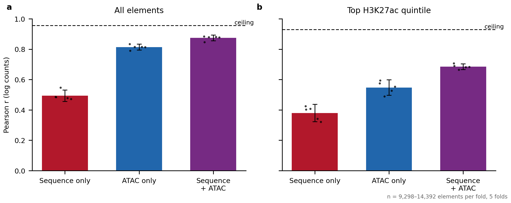
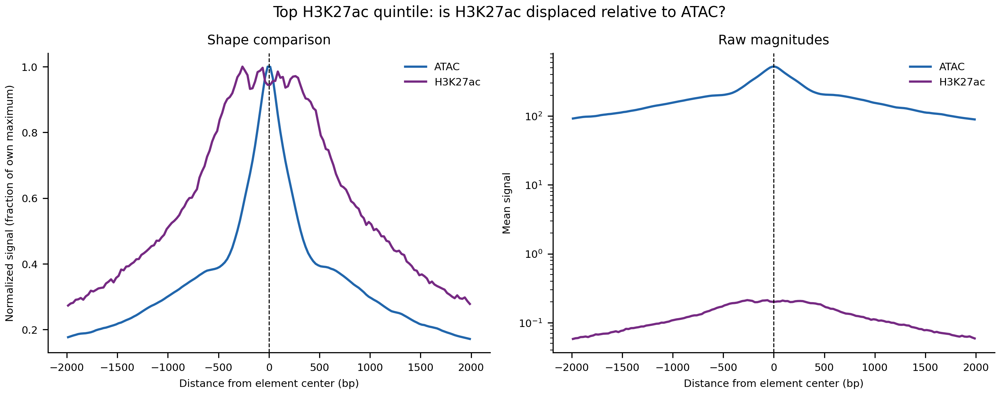
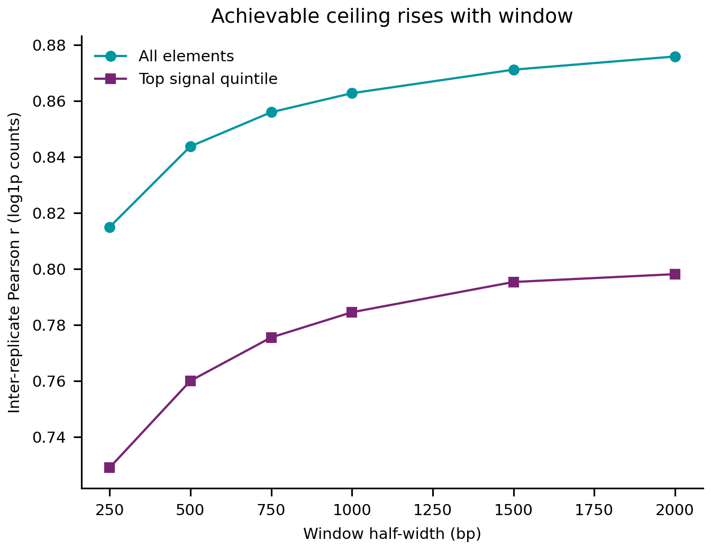
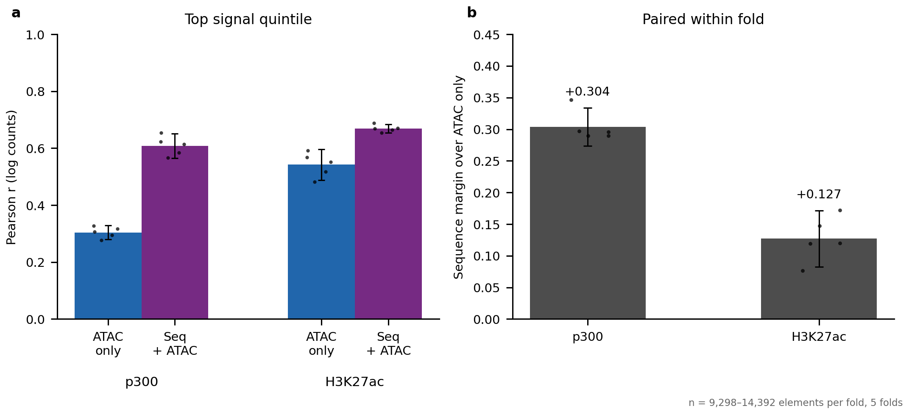
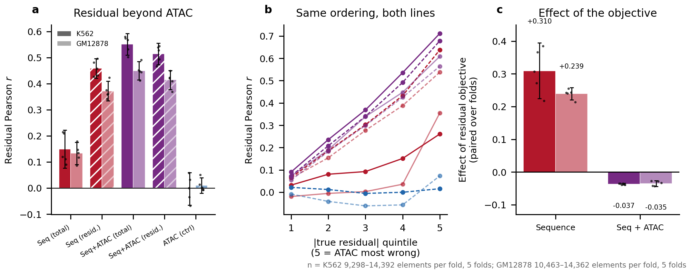
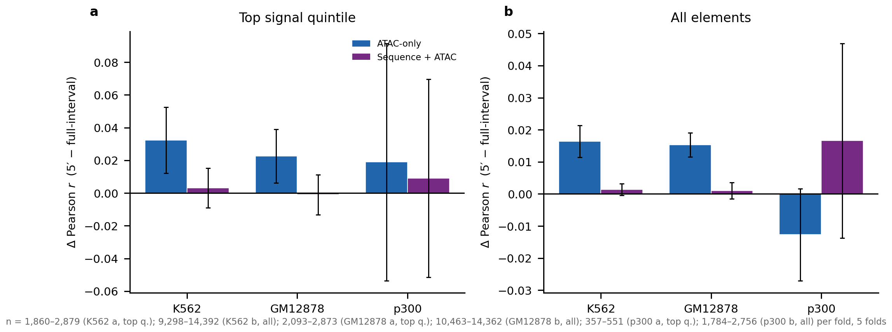
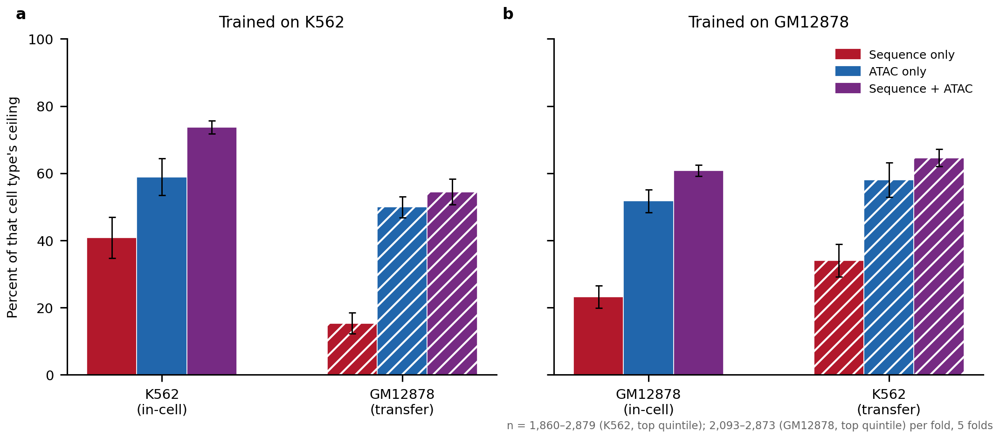
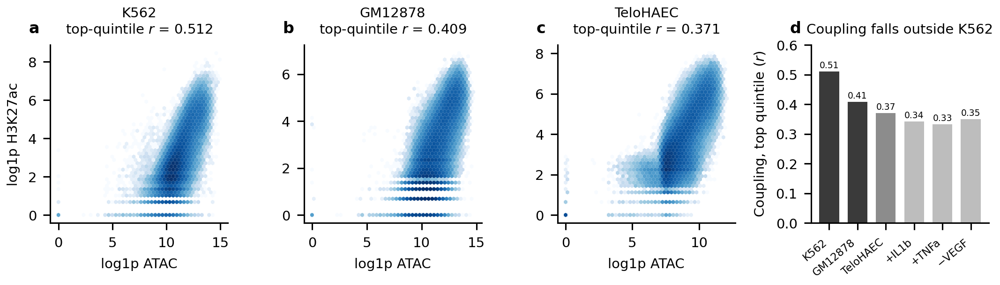
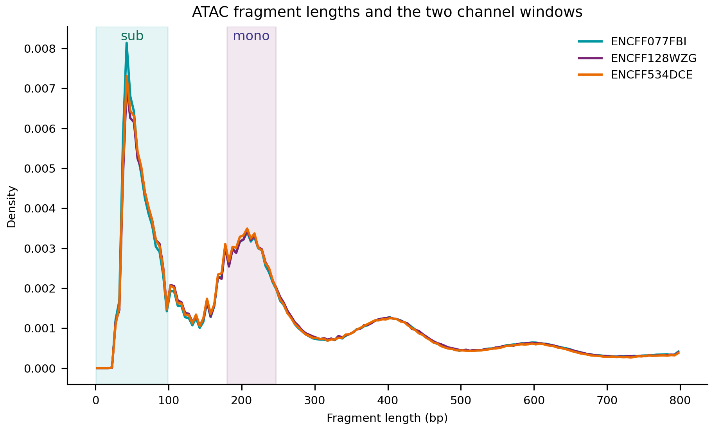

```{=html}
<style>
/* Typography and layout. Present in the document rather than the renderer so the
   report looks the same whether it is built by quarto or by the pandoc fallback
   (Sherlock has pandoc 2.10 and no quarto, which otherwise renders bare Times). */
html { -webkit-text-size-adjust: 100%; }
body {
  font-family: Arial, Calibri, "Helvetica Neue", Helvetica, sans-serif;
  font-size: 15px;
  line-height: 1.6;
  color: #1a1a1a;
  max-width: 980px;
  margin: 0 auto;
  padding: 2.5rem 1.5rem 4rem;
  background: #fff;
}
h1 { font-size: 1.7rem; font-weight: 600; line-height: 1.3; margin: 0 0 .3rem; }
h2 { font-size: 1.15rem; font-weight: 600; margin: 2.6rem 0 .6rem;
     padding-top: 1.1rem; border-top: 1px solid #e4e4e4; }
h3 { font-size: 1rem;   font-weight: 600; margin: 1.6rem 0 .4rem; }
p.date, .date { color: #666; font-size: .85rem; }

/* Figures: never exceed the text column, and centre them. Without this the
   pandoc fallback shows every PNG at natural pixel width and they overflow. */
img {
  display: block;
  max-width: 100%;
  height: auto;
  margin: 1.1rem auto 0.4rem;
}

/* The table of contents pandoc emits as a bare bulleted list */
#TOC, nav#TOC { font-size: .9rem; background: #fafafa; border: 1px solid #eaeaea;
  border-radius: 6px; padding: .8rem 1.2rem; margin: 1.5rem 0 2rem; }
#TOC ul { margin: .2rem 0; padding-left: 1.1rem; }
#TOC a { color: #235; text-decoration: none; }
#TOC a:hover { text-decoration: underline; }

/* Q:/A: lines read as the skimmable layer */
p > strong:first-child { color: #111; }

table { border-collapse: collapse; font-size: .88rem; margin: 1rem 0; width: 100%; }
th, td { border-bottom: 1px solid #e8e8e8; padding: .38rem .6rem; text-align: left;
         vertical-align: top; }
th { background: #f6f6f6; font-weight: 600; }

code, pre { font-family: "SF Mono", Menlo, Consolas, monospace; font-size: .82rem; }
pre { background: #f7f7f8; border: 1px solid #ececec; border-radius: 5px;
      padding: .7rem .9rem; overflow-x: auto; }
code { background: #f2f2f3; padding: .07em .32em; border-radius: 3px; }
pre code { background: none; padding: 0; }

blockquote { border-left: 3px solid #ddd; margin-left: 0; padding-left: 1rem;
             color: #444; }
</style>
```

## Headline figure



**Figure 1 | Sequence alone reaches 0.38 on H3K27ac-positive elements; adding ATAC reaches 0.69.** **Headline figure.**

<details>
<summary>Full legend</summary>

**Figure 1 | Predicting K562 H3K27ac at candidate elements, by input modality.** Pearson *r* between predicted and observed log counts. **a**, All elements. **b**, Top quintile by observed H3K27ac — the elements carrying the mark. Colour encodes input modality throughout this report: **red sequence only, blue ATAC only, purple sequence + ATAC**. Dashed line is the achievable ceiling (Methods); 0.957 all elements, 0.929 top quintile. Top-quintile: sequence 0.380 [0.323, 0.437], ATAC 0.548 [0.497, 0.599], both 0.685 [0.667, 0.704] — all three intervals disjoint. The multimodal model's fold-to-fold spread (sd 0.015) is a third of either single-input model's (0.041–0.046), so combining inputs is also markedly more stable across chromosome sets. Target K562 H3K27ac (ENCSR000AKP), 5′-end counts, 1 kb element-centred window. Source: `results/fiveprime_stratified_fold_summary.tsv`.
</details>

## Summary

- Accessibility does most of the work. On elements carrying the mark, ATAC alone reaches 0.548 [0.497, 0.599] and sequence alone 0.380 [0.323, 0.437]; together 0.685 [0.667, 0.704], so sequence adds +0.137 over accessibility (Fig. 1b).
- The same comparison for p300 gives sequence a +0.304 margin over accessibility against +0.127 for H3K27ac — a difference of 0.177 ± 0.027, about 6.6 standard errors (Fig. 4). H3K27ac scores higher overall but is the poorer substrate for sequence interpretation.
- **GM12878 is simply the harder cell type, which is most of what the transfer asymmetry measures.** GM12878-trained models score higher on K562 than in their own cell type for every modality (Fig. 7), and the ATAC-only gap is explained by weaker ATAC–H3K27ac coupling in GM12878 (Fig. 8). Sequence remains weak everywhere (15–41% of ceiling), and its margin over accessibility shrinks on transfer in both directions.
- **Sequence carries an accessibility-independent component, but only a residual objective exposes it.** The same sequence-only input scores 0.149 on the accessibility residual trained against total signal and 0.459 trained against `observed − atac_pred` (Fig. 5). Joint training extracts more still (0.551) and is the better predictor. Overall correlation overstates what any model adds once accessibility is an input: sequence + ATAC reaches 0.874 overall against 0.551 on the residual.
- **Track construction matters at the resolution level.** ATAC and H3K27ac are spatially offset — ATAC peaks on the element centre, H3K27ac on flanking nucleosomes at ±250 bp and is far broader (Fig. 2). H3K27ac is still at 28% of maximum at ±2 kb, the edge of the profiled window, so its extent exceeds the model's ~1.1 kb receptive field by an unmeasured margin. Relatedly, switching the accessibility input to ChromBPNet-style 5′ insertion counts gains the ATAC-only model +0.032 (K562) and +0.023 (GM12878) on the top quintile while leaving sequence + ATAC unchanged (Fig. 6) — within a cell type the change is one of resolution, and only a model without sequence feels it.

## Goals

H3K27ac is the field's standard readout of element activity, but a downstream one: transcription-factor binding recruits coactivators, which acetylate the *adjacent* nucleosomes. This analysis asks how much H3K27ac at candidate elements is predictable from sequence, how much from chromatin accessibility, how much sequence adds beyond accessibility, and whether that contribution transfers to new cell types — the last because the goal is a sequence + accessibility model that generalises. p300, one step closer to the sequence-specified events, is evaluated identically as a reference.

## Datasets

| Dataset | Assay / system | Source | Used as |
|---|---|---|---|
| **K562 H3K27ac** | H3K27ac ChIP-seq, single-end 36 bp, 2 replicates (ENCFF790GFL, ENCFF817HMW) | ENCODE ENCSR000AKP | Prediction target |
| **K562 ATAC-seq** | ATAC-seq, paired-end, 3 replicates (ENCFF077FBI, ENCFF128WZG, ENCFF534DCE) | ENCODE ENCSR868FGK | Accessibility input |
| **K562 candidate elements** | DNase-derived candidate regulatory elements, n = 150,528, mean width 608 bp | Repo: `reference/K562_DNase_candidate_elements.narrowPeak` | Coordinate system; windows centred on element midpoints |
| **GM12878 H3K27ac** | H3K27ac ChIP-seq, single-end, 2 replicates (ENCFF645BAL, ENCFF865OOP) | ENCODE | Cross-cell-type evaluation target |
| **GM12878 ATAC-seq** | ATAC-seq | ENCODE; repo: `2026_0606_GM12878_transferability/data/atac.bw` | Accessibility input for transfer |
| **GM12878 candidate elements** | Candidate regulatory elements, n = 154,224 | Repo: `2026_0606_GM12878_transferability/reference/` | Transfer coordinate system |
| **K562 p300** | EP300 ChIP-seq, stranded | ENCODE ENCSR000EGE | Reference target for the sequence-margin comparison |
| **hg38 CV folds** | Chromosome-holdout 5-fold split | Repo: `reference/hg38_five_folds.json` | Shared across all models so numbers are comparable |
| **GC-matched negatives** | Genome-wide GC-binned background, hg38 | Repo: `reference/genomewide_gc_stride_1000_flank_size_1057.gc.bed` | Training negatives |

All ChIP-seq targets are counted as **5′ read ends** at single-base resolution (`bedtools genomecov -5 -dz`, stranded), matching the convention already used for the p300 models in this repository. Model architecture is `MultiModalBPNet` (`scripts/multimodal_bpnet.py`), a BPNet variant with a profile head and a counts head; only the counts head is analysed here. All correlations are on log counts.

## H3K27ac sits on flanking nucleosomes and is far broader than ATAC

**Q:** Are ATAC and H3K27ac located in the same place relative to a candidate element?

**A:** No — ATAC peaks on the element centre (offset −12 bp, no dip) while H3K27ac is bimodal with shoulders at ±250 bp and is far broader, still at 28% of maximum at ±2 kb where ATAC has fallen to 17%.



<details>
<summary>Figure 2 legend</summary>

**Figure 2 | H3K27ac is displaced onto flanking nucleosomes and is much broader than accessibility.** Meta-profiles over the top quintile of elements by H3K27ac signal (n = 30,000 elements sampled with seed 0; profiles computed on the same element set for all tracks so the comparison is not confounded by each track selecting its own strong elements). **a**, Each track normalised to its own maximum, so the comparison is one of *location*. **b**, Raw magnitudes, log scale. Tracks: K562 ATAC (teal), K562 H3K27ac as 5′ ends (orange). Dashed vertical line marks the element centre. Summary statistics (`results/profile_comparison_summary.tsv`): peak offset −12.5 bp for ATAC versus −262.5 bp for H3K27ac 5′ ends; centre-to-peak ratio 1.000 for ATAC (no dip) versus 0.944 for H3K27ac. The bimodality is the expected signature of a nucleosome-free element flanked by acetylated nucleosomes. The breadth difference is the more consequential one for modelling: at ±2 kb, the edge of the profiled window, H3K27ac is still at 28% of its maximum where ATAC has fallen to 17%, so its true extent is wider than these profiles measure. Source: `results/profile_comparison.tsv`.
</details>

**Method.**

- Meta-profiles binned at 50 bp over ±2 kb, restricted to the top H3K27ac quintile.
- All tracks profiled on the identical element set; each normalised to its own maximum.

<details>
<summary>Full methods &amp; code</summary>

Windows are centred on the candidate-element midpoint. The `summit` column of `K562_DNase_candidate_elements.narrowPeak` equals `width/2`, so element-centred windows require no change to the extraction code. Elements within `flank` of a contig end are dropped. Signal is read with pyBigWig and `nan` treated as zero.

```bash
pixi run python scripts/0.6.compare_profiles.py \
    --elements reference/K562_DNase_candidate_elements.narrowPeak \
    --track "ATAC:.../atac.bw" \
    --track "H3K27ac (5-prime):data/h3k27ac_5p_plus.bw,data/h3k27ac_5p_minus.bw" \
    --stratify-by "H3K27ac (5-prime)" --outdir results --figdir figures
```
Source: `scripts/0.6.compare_profiles.py`
</details>

## A 1 kb counting window is the best trade-off between signal and neighbour contamination

**Q:** How wide should the window be over which H3K27ac counts are summed?

**A:** ±500 bp — wider windows raise the achievable ceiling only marginally (0.760 → 0.798 from ±500 to ±2000) while the fraction of elements containing a *different* candidate element rises from 0% to 42%.



<details>
<summary>Figure 3 legend</summary>

**Figure 3 | The achievable ceiling saturates by ±1 kb, while neighbour contamination keeps rising.** Inter-replicate Pearson correlation of log H3K27ac counts between the two ENCSR000AKP replicates, as a function of the half-width of the symmetric counting window, over all n = 150,526 candidate elements (teal) and the top signal quintile (purple). Because the two replicates measure the same biology, their agreement bounds how well any model can predict the merged target. Top-quintile values: 0.729 (±250 bp), 0.760 (±500), 0.776 (±750), 0.785 (±1000), 0.795 (±1500), 0.798 (±2000). The countervailing cost is neighbour contamination — the fraction of elements with another candidate element's centre inside the window, which is a property of element spacing and independent of the assay: 0% at ±250 and ±500 bp, 9.9% at ±750, 19.9% at ±1000, 33.1% at ±1500, 41.5% at ±2000 (`results/window_tradeoff.tsv`). A contaminated window's count is not attributable to the element it is centred on, which matters for any subsequent sequence-attribution work. ±500 bp is the widest window with zero contamination. Source: `results/fiveprime_replicate_ceiling_by_window.tsv`.
</details>

**Method.**

- Per-replicate 5′-end BigWigs built with identical processing to the merged training target.
- Neighbour contamination computed from element-centre spacing per chromosome.

<details>
<summary>Full methods &amp; code</summary>

Ceilings are reported as the raw inter-replicate *r*. Converting to a bound on model performance requires two corrections, applied wherever a fraction-of-ceiling is quoted in this report: Spearman–Brown for the fact that the model predicts the two-replicate *merge* rather than one replicate (`rel = 2r/(1+r)`), then a square root, since a model predicts the expected signal while a replicate is one noisy realisation of it. At ±500 bp this converts a raw 0.760 into a bound of 0.929 on the top quintile, and a raw 0.844 into 0.957 over all elements.

A separate test asked whether excluding the nucleosome-free centre sharpens the target, on the reasoning that H3K27ac is deposited on the flanks. It does not: excluding ±125/±250/±375 bp lowers the top-quintile ceiling monotonically (0.760 → 0.747 → 0.729 → 0.717) because the shallow central dip means the centre still carries ~91% of peak signal, so excluding it discards real reads. The flanking-only count also correlates 0.93–0.99 with the full-window count, so the two targets are barely different. Full symmetric window retained (`results/flanking_vs_full_window.tsv`).

```bash
pixi run python scripts/0.3.replicate_ceiling_by_window.py \
    --elements reference/K562_DNase_candidate_elements.narrowPeak \
    --rep1-bw data/h3k27ac_rep1_5p_plus.bw,data/h3k27ac_rep1_5p_minus.bw \
    --rep2-bw data/h3k27ac_rep2_5p_plus.bw,data/h3k27ac_rep2_5p_minus.bw \
    --outdir results --figdir figures --label fiveprime_
pixi run python scripts/0.4.flanking_vs_full.py --outer 500 1000 --inner 0 125 250 375
```
Source: `scripts/0.3.replicate_ceiling_by_window.py`, `scripts/0.4.flanking_vs_full.py`
</details>

## Sequence contributes less to H3K27ac than to p300, by a factor of 2.2

**Q:** Does sequence add as much information beyond accessibility for H3K27ac as it does for p300?

**A:** No — sequence adds +0.304 over accessibility for p300 but only +0.127 for H3K27ac, a difference of 0.177 ± 0.027 (about 6.6 SE), despite H3K27ac scoring higher overall.



<details>
<summary>Figure 4 legend</summary>

**Figure 4 | H3K27ac is the easier target but the weaker substrate for sequence.** Top quintile of elements by observed signal. **a**, ATAC-only (blue) and sequence + ATAC (purple) for each target; bars are the mean across five chromosome-holdout folds, whiskers the 95% CI, points the individual folds. p300 (ENCSR000EGE, stranded 5′ ends): ATAC only 0.304 [0.280, 0.329], sequence + ATAC 0.608 [0.566, 0.651]. H3K27ac (ENCSR000AKP): ATAC only 0.542 [0.489, 0.596], sequence + ATAC 0.669 [0.654, 0.684]. **b**, The sequence margin — sequence + ATAC minus ATAC-only — computed **within each fold and then averaged**, a paired comparison: both models see the same held-out chromosomes in a given fold, so differencing within a fold removes the between-fold variation that dominates the absolute values in **a**. p300 **+0.304**, H3K27ac **+0.127**; the intervals do not overlap. Sequence-only is deliberately absent: there is no p300 sequence-only model in this format (the p300 sequence models are bpnet-refactor/TensorFlow checkpoints), and the margin is defined without it. Both targets are evaluated on the same K562 DNase candidate elements with element-centred ±500 bp windows, so the comparison isolates the target. Caveat: the p300 models were *trained* on ENCSR000EGE peak summits and *evaluated* here on element centres, matching this repository's existing p300 prediction pipeline; a matched element-centred p300 model would likely raise p300 further and widen the gap. Source: `results/p300_vs_h3k27ac_stratified_per_fold.tsv`.
</details>

**Method.**

- Same elements, windows, folds and metric for both targets; only the target differs.
- Accessibility-only control included so the sequence margin is identifiable.

<details>
<summary>Full methods &amp; code</summary>

The accessibility-only control is what makes this comparison interpretable. Without it, p300 and H3K27ac would be compared on joint-model correlation alone, which ranks them in the opposite order. p300 model directories are `2026_0529_multimodal_p300_model/models/atac` (sequence + ATAC) and `models/atac_only` (ATAC only) — note `atac` there names the multimodal model whose accessibility input is ATAC; the ATAC-only mode lives in `atac_only`.

```bash
pixi run python scripts/2.2.evaluate_stratified.py \
    --config-json config/compare_configs.json --out-prefix p300_vs_h3k27ac_ \
    --elements reference/K562_DNase_candidate_elements.narrowPeak \
    --fold-json reference/hg38_five_folds.json --outdir results --figdir figures
```
Source: `scripts/2.2.evaluate_stratified.py`
</details>

## The residual objective helps only a sequence-blind input — replicated in two cell types

**Q:** How much does each model add beyond what accessibility alone predicts, and does sequence carry anything accessibility cannot supply?

**A:** It does, but only a residual objective exposes it — the same sequence-only input scores 0.149 [0.076, 0.222] against the total signal and 0.459 [0.421, 0.496] against `observed − atac_pred`.

The same switch *costs* a model that already sees accessibility, and both halves reproduce independently in GM12878.

The training objective is what limits the sequence-only model: told to predict total signal it spends its capacity on the large accessibility-correlated component and leaves the residual alone.



<details>
<summary>Figure 5 legend</summary>

**Figure 5 | The residual objective helps a sequence-blind input and costs a multimodal one, in two independent cell types.** Baseline is each cell type's own accessibility-only *model* prediction, so the residual is what accessibility genuinely cannot explain. Hatching encodes the training objective (hatched = trained on `observed − atac_pred`); shade encodes cell type (solid K562, pale GM12878). Bars sharing colour and shade have **identical inputs** and differ only in objective. **a**, Residual Pearson *r*. K562 / GM12878: sequence-on-total 0.149 / 0.133; sequence-on-residual 0.459 / 0.372; multimodal-on-total 0.551 / 0.449; multimodal-on-residual 0.514 / 0.414; ATAC control −0.003 / +0.010. **b**, Residual *r* by quintile of |true residual| (5 = accessibility most wrong), pooled over folds. Every informative model rises monotonically in both cell types while the ATAC control stays flat at zero across all ten strata. **c**, The paired effect of switching objective, computed within fold. Training on the residual **gains** +0.310 [0.224, 0.395] (K562, *p*=5×10⁻⁴) and +0.239 [0.220, 0.258] (GM12878, *p*<10⁻⁴) for sequence-only input, but **costs** −0.037 [−0.039, −0.034] (*p*<10⁻⁴) and −0.035 [−0.044, −0.026] (*p*=4×10⁻⁴) when accessibility is already an input. The multimodal cost lands within 0.002 of itself across two cell types with different targets, accessibility libraries and element sets, and is negative in all ten folds — that stability is what makes it a property of the objective. n = 58,655 (K562) and 57,144 (GM12878) element–fold observations. Source: `results/{,gm12878_}residual_grid_{per_fold,fold_summary,residual_evaluation}.tsv`.
</details>

**Sequence is not redundant with accessibility.** A sequence model scoring 0.149 on the residual reflects its training objective: the identical input trained on the residual reaches 0.459.

**The objective helps only where the input is blind to accessibility.** It triples the sequence-only score but **costs** the multimodal model 0.037 residual *r* — small, but present in all five folds, paired interval [−0.039, −0.034]. A multimodal model can already learn whatever transform of ATAC it needs; a fixed offset it cannot adjust only removes that freedom. Joint training therefore remains the best predictor, beating residual-trained sequence by +0.093 [0.072, 0.113].

**The metric is not manufacturing the effect.** An ATAC-input model trained on the residual — asked to predict an ATAC model's own errors from the same ATAC input — scores −0.003 [−0.065, 0.060], incremental *R²* −0.000, flat across all |residual| quintiles. A clearly positive control here would have made the sequence result an artifact.

**The effect belongs to the training objective and holds across cell types.** It reproduces in GM12878, where weaker ATAC–H3K27ac coupling (0.409 vs 0.510) and a higher ceiling (0.832 vs 0.760) pull in opposite directions; the multimodal cost lands within 0.002 of itself. Absolute levels are lower throughout, consistent with GM12878 being harder to predict (Fig. 7), but every ordering and sign holds.

Residual training is therefore an interpretability tool. Its attributions are forced onto signal accessibility cannot supply — what the motif work needs, and what multimodal attributions cannot cleanly separate — and being a property of the objective, it needs no per-cell-type re-testing.

**Method.**

- Baseline is the accessibility-only model's held-out prediction.
- Stratified by |true residual| so performance is scored where accessibility fails, and reported as mean ± 95% CI over folds, since between-fold sd here is 0.041–0.046.

<details>
<summary>Full methods &amp; code</summary>

**A suspected artifact turned out to be largely closed by construction.** Because `true_resid = obs − atac_pred`, anything merely anti-correlated with `atac_pred` might earn positive residual *r* for free. It does not: `obs − atac_pred` is near-orthogonal to `atac_pred` by the least-squares residual property, so that correlation cannot leak in. The ATAC control demonstrates it — its output correlates −0.620 with `atac_pred`, the channel wide open, and it still scores −0.003. Three checks bound the risk for the residual-trained sequence model: its output correlates only −0.090 with `atac_pred`; partialling `atac_pred` out of both sides leaves 0.459 unchanged (against 0.149 → 0.205 for the more entangled sequence-on-total model, at +0.477); and panel **c**'s incremental *R²* is scored against the observed signal, which cannot be faked out of sample. The controls were worth running and the negative control is load-bearing, but the alarm was disproportionate.

**A trap for anyone re-running this.** `MultiModalBPNet.forward()` does **not** add the count offset — that happens only inside `fit()` when scoring the loss — so an offset-trained model's raw output *is* the residual. `2.4.evaluate_residual.py` originally subtracted `atac_pred` anyway, double-counting the baseline and correlating a residual against observed signal for `overall_pearson`; both produced plausible wrong numbers instead of failing. The fix sits behind a `"residual": true` config key so earlier results stay reproducible, and `2.7.diagnose_residual_offset.py` verifies the semantics empirically first: a residual predictor's output centres near 0 (measured −0.044), a logcounts predictor near the observed mean (2.835 vs 2.786), with the plain sequence model as a control proving the test discriminates.

The same metric applied to p300 gives residual *r* = 0.654 and incremental *R²* = +0.265, versus 0.551 and +0.102 for H3K27ac's multimodal model, reinforcing Fig. 4 on a second statistic. p300's residual *r* is also high (0.260) in the quintile where accessibility is nearly right, against 0.091 for H3K27ac, so p300's sequence contribution is broadly useful across strata. The p300 side has **not** been re-run with the residual objective — that comparison is open.

The evaluator refuses to run when the baseline and comparison models use different windows, since a residual across mismatched geometries is not meaningful, and refuses folds lacking `training_complete.json`.

```bash
# semantics check, then the pooled evaluation
pixi run python scripts/2.7.diagnose_residual_offset.py
pixi run python scripts/2.4.evaluate_residual.py \
    --config-json config/residual5p_eval_configs.json --out-prefix residual5p_ \
    --elements reference/K562_DNase_candidate_elements.narrowPeak \
    --genome $GEN --signal-bw data/h3k27ac_5p_plus.bw \
    --accessibility-bw $ATAC --fold-json reference/hg38_five_folds.json \
    --outdir results --figdir figures

# the full grid: 3 standard + 3 residual-objective models
pixi run python scripts/2.4.evaluate_residual.py \\
    --config-json config/residual_grid_eval_configs.json --out-prefix residual_grid_ ...
# per-fold CIs + artifact controls, then the figure
pixi run python scripts/2.8.residual_perfold_and_artifact.py residual_grid_
pixi run python scripts/3.3.plot_residual_figure.py
```
Source: `scripts/2.4.evaluate_residual.py`, `scripts/2.7.diagnose_residual_offset.py`, `scripts/2.8.residual_perfold_and_artifact.py`, `scripts/3.3.plot_residual_figure.py`
</details>

## A sharper accessibility input helps the ATAC-only model and nothing else

**Q:** Our accessibility tracks use `genomecov -bg` over the whole tagAlign interval so coverage scales with read length, whereas ChromBPNet uses single-base 5′ insertion counts — does the convention matter?

**A:** Only for the model with nothing but accessibility — ATAC-only gains +0.032 (K562) and +0.023 (GM12878) on the top quintile, while sequence + ATAC is unchanged in both.



<details>
<summary>Figure 6 legend</summary>

**Figure 6 | Sharpening the accessibility input helps only a model with no other input.** Every ATAC-input model was retrained on `bedtools genomecov -bg -5` single-base insertion counts and paired within fold against its counterpart on full-interval coverage. The training scripts are byte-identical copies apart from the accessibility path and the output directory, and both arms are scored in one run with each reading its own input and its own saved normalisation statistics, so the only difference is the input definition. **a**, Top signal quintile. ATAC-only: K562 **+0.032** [0.012, 0.053] *p*=0.011; GM12878 **+0.023** [0.006, 0.039] *p*=0.019; p300 +0.019 [−0.054, 0.092] *p*=0.51. Sequence + ATAC: +0.003, −0.001, +0.009, none significant. **b**, All elements — the same split, ATAC-only +0.016 (*p*=0.001) and +0.015 (*p*<0.001), multimodal +0.001 in both. p300 is underpowered: 11,412 elements pooled against 57,144 for H3K27ac, giving intervals roughly 5× wider, with point estimates trending the same way. Source: `results/accs5p_{k562,gm12878,p300}_stratified_per_fold.tsv`.
</details>

**Method.**

- Each model retrained on `genomecov -bg -5` and paired within fold against its full-interval counterpart; training scripts differ only in the accessibility path and output directory.
- Both arms scored in one run, each reading its own input and its own saved normalisation statistics.
- Reported as the paired within-fold difference, since the effects are smaller than the between-fold spread.

**Why the split.** Within a cell type read length is constant, so the switch is not a change of scale and z-normalisation has nothing to absorb. What it does change is **resolution**: a 94–95 bp interval smears each insertion across ~95 bases. A model with only accessibility feels that blur directly. A model that also sees sequence does not, because sequence already supplies the fine positional detail the smeared track lacked — the sharper input is redundant with what it had. This is the same shape as the residual result in Fig. 5: joint training already extracts what is available, and improving one input does not add to it.

<details>
<summary>Full methods &amp; code</summary>

**Where the convention actually matters is across cell types, which this comparison does not test.** Read length is constant within a cell type, so the smear is a constant there; it becomes a confound when cell types differ. Our K562 and GM12878 tagAligns are both 94–95 bp — which is why their transfer results were never affected — but TeloHAEC's are 35–36 bp, making its full-interval coverage a different quantity from theirs. The 5′ tracks are read-length independent by construction and remove that confound.

Verified by an arithmetic identity: `sum(full-interval) / sum(5′)` must equal the mean read length, since full-interval coverage counts `read_length` bases per read and 5′ counting counts exactly one. Measured 84.5 and 85.6 for K562/GM12878 (94–95 bp reads) and 30.9–35.5 for the four TeloHAEC conditions (35–36 bp). With read length removed, the K562-vs-TeloHAEC gap falls from 13–27× to 5.3–12.3× nuclear depth, which is genuine sequencing depth.

ChromBPNet's convention, from `chrombpnet/helpers/preprocessing/reads_to_bigwig.py`: `bedtools genomecov -bg -5`, unstranded, with ATAC shift `4-plus_shift, -4-minus_shift` and DNase `-plus_shift, 1-minus_shift`, the shift applied before `-5`. Our tagAligns are already Tn5-shifted, so the deltas are zero and the correct build reduces to adding `-5`; applying the shift again would double-shift.

Nothing in the rest of this report uses the 5′ input. Switching would require retraining every ATAC-input model as a set, and mixing the two inputs across results is invalid.

```bash
pixi run bash scripts/0.20.make_atac_5prime_bigwigs.sh    # build *_atac_5p.bw
pixi run python scripts/0.21.validate_atac_5prime.py      # ratio == mean read length
pixi run bash scripts/2.10.submit_accs5p_comparison.sh    # paired evaluation
pixi run python scripts/3.5.plot_accs5p_figure.py         # Fig 6
```
Source: `scripts/0.20`, `0.21`, `2.10`, `3.5`; training scripts `1.11`, `1.12` (H3K27ac) and `1.1b`, `1.3b` (p300), generated by `scripts/make_accs5p_scripts.py`.
</details>

## Transfer is asymmetric: GM12878 is the harder cell type, in both directions

**Q:** Does the sequence component fail to generalise across cell types, or is one cell type simply harder to predict?

**A:** Mostly the latter — GM12878-trained models score *higher* on K562 than in their own cell type for every modality (sequence 34% vs 23% of ceiling), so the one-directional picture of a sequence collapse does not survive the reciprocal.



<details>
<summary>Figure 7 legend</summary>

**Figure 7 | Both transfer directions, each scored against the ceiling of the cell type being predicted.** Top-quintile Pearson as a percentage of that cell type's corrected ceiling. Solid = evaluated in the training cell type, hatched = transferred. **a**, Trained on K562. **b**, Trained on GM12878 with identical settings — same architecture, window, count-loss weight, negative cap, folds and 5′ target processing — so the directions are comparable. Absolute top-quintile values (sequence / ATAC / both): K562→K562 0.380 / 0.548 / 0.685; K562→GM12878 0.146 / 0.476 / 0.519; GM→GM 0.221 / 0.493 / 0.579; GM→K562 0.317 / 0.539 / 0.600; as a percentage of the relevant ceiling, 41/59/74, 15/50/54, 23/52/61, 34/58/65. **Every GM-trained model does better on K562 than in GM12878**, so much of what a one-directional analysis reads as failed transfer is that GM12878 is harder to predict — which the inter-replicate ceiling cannot capture, since it measures how reproducibly the target can be measured, which is a different quantity from how strongly the inputs determine it. Two conclusions survive the reciprocal: sequence is weak in all four settings (15–41% of ceiling against 50–59% for accessibility), and its margin over accessibility shrinks on transfer in both directions (+0.138 → +0.044; +0.086 → +0.061). Sources: `results/{fiveprime,k562_to_gm_5p,gm_incell,gm_to_k562}_stratified_fold_summary.tsv`.
</details>

**Method.**

- Four evaluations: both transfer directions and both in-cell-type references.
- Each scored against the ceiling of the cell type being predicted.

<details>
<summary>Full methods &amp; code</summary>

Transfer numbers need the target ceiling in *both* cell types: a raw cross-cell-type correlation cannot distinguish a model that fails to generalise from a target that is simply harder. The GM12878 ceiling agrees across both processings of the target (top quintile 0.832 on 5′ ends, 0.834 otherwise), so the normalisation holds either way.

```bash
pixi run python scripts/2.2.evaluate_stratified.py \
    --config-json config/gm_transfer_configs.json --out-prefix gm12878_transfer_ \
    --elements 2026_0606_GM12878_transferability/reference/GM12878_candidate_elements.narrowPeak \
    --fold-json reference/hg38_five_folds.json --outdir results --figdir figures
```
Source: `scripts/2.2.evaluate_stratified.py`, `scripts/0.7.make_gm12878_5prime.sh`
</details>

## Deploying to a new cell type: transfer the multimodal model

**Q:** In the intended application there is ATAC in the new cell type but no H3K27ac — which model should be transferred?

**A:** The multimodal one — it matches the residual alternative on the top signal quintile and is simpler, with no offset model to ship alongside it.

**Top signal quintile, deployable configuration** (everything transferred; only target ATAC used):

| | ATAC-only | sequence only | multimodal | residual multimodal |
|---|---|---|---|---|
| K562 → GM12878 | 0.477 | 0.147 | **0.520** | 0.512 |
| GM12878 → K562 | 0.541 | 0.317 | **0.602** | 0.600 |

**Sequence adds on transfer.** Every sequence-containing model beats transferred ATAC-only by 0.04–0.06 on the top quintile. That margin is what sequence buys.

**Accessibility is portable but must be measured locally.** Transferring the ATAC baseline costs only ~0.017 against fitting it in the target (0.494 → 0.477), while sequence-only transfer is useless (0.147, 0.317).

**A shallow target H3K27ac library would be worth more than its size suggests.** The residual design beats multimodal once the accessibility baseline is fitted in the target (+0.005 to +0.011 on all elements, *p* < 0.01 both directions). Fitting that baseline needs only an ATAC-only model — far less data than training a full model — so even a modest H3K27ac library in a new cell type would make the residual architecture preferable.

**Method.**

- Two variants per direction: offset from the target's own ATAC model (an optimistic upper bound, since that model requires target H3K27ac) and offset from the transferred source ATAC model (deployable).
- Headline metric is correlation with *observed* H3K27ac in the target — the quantity the application needs — reported on the top signal quintile.
- Paired within fold, since the differences are far below the between-fold spread.

<details>
<summary>Full methods &amp; code</summary>

**The all-elements stratum tells a different and misleading story.** There, residual-multimodal beats multimodal by +0.005 (K562→GM, *p*=0.009) and +0.011 (GM→K562, *p*=0.003) with a locally fitted baseline and loses by −0.005 (*p*=0.012, 0.022) when it is transferred — a clean sign flip, all four significant. None of it is resolvable on the top quintile (*p* = 0.17–0.76). All-elements correlation here is dominated by the dead-versus-active contrast accessibility already resolves, so that effect sits in the contrast and is not reported as a finding.

A residual model predicts `observed − atac_pred`, so transferring it requires choosing whose `atac_pred`. Both choices are evaluated because the gap between them is itself informative: it measures what is lost by being unable to fit the accessibility baseline in the target cell type.

```bash
pixi run bash scripts/2.13.submit_residual_transfer.sh    # upper bound: local offset
pixi run bash scripts/2.14.submit_deployment_transfer.sh  # deployable: transferred offset
pixi run bash scripts/2.16.submit_transfer_perfold.sh     # per-fold CIs + paired tests
```
Per-fold scoring uses `scripts/2.15.perfold_from_config.py`, which is driven by the same config JSON as `2.4`, so in-cell grids and transfer runs are scored through one code path with identical metric definitions — a difference between cell types cannot come from which evaluator ran.
</details>

## Accessibility explains less of H3K27ac in GM12878, which accounts for the ATAC-only transfer drop

**Q:** Is the ATAC-only model's lower score in GM12878 a failure to generalise, or is accessibility simply less coupled to H3K27ac there?

**A:** Accessibility is less coupled there — the model-free ATAC–H3K27ac correlation is 0.409 in GM12878 against 0.510 in K562, while the ATAC-only model extracts a larger fraction of that available signal in GM12878 (ratio 1.14) than in K562 (1.06).



<details>
<summary>Figure 8 legend</summary>

**Figure 8 | Accessibility–H3K27ac coupling weakens outside K562.** **a–c**, log1p summed ATAC against log1p summed H3K27ac over identical ±500 bp element-centred windows, one panel per cell type; colour is element density on a log scale. No model is involved, so these bound what any accessibility-only predictor could reach. Top-quintile Pearson **0.512 (K562), 0.409 (GM12878), 0.371 (TeloHAEC)**, on n = 150,519 / 154,215 / 151,399 elements. The x-range differs in **c** because the TeloHAEC ATAC library is shallower; correlation is unaffected by that scale. **d**, Top-quintile coupling across all six cell types and conditions measured so far, with K562 the outlier at the top of the range. Placing the ATAC-only model against this reference:

| | K562 | GM12878 |
|---|---|---|
| model-free ATAC–H3K27ac coupling | 0.510 | 0.409 |
| ATAC-only model | 0.542 | 0.467 |
| model / coupling | 1.06 | 1.14 |

The ATAC-only model does not degrade across cell types — it exceeds the raw coupling in both, by a wider margin in GM12878 — so its lower absolute score there is a property of the assay pair. Sequence-only falls 0.360 → 0.146 with no analogous denominator to absorb it. This sharpens the transfer conclusion: accessibility transfers, only sequence collapses. K562 and GM12878 use the same 5′ target processing and window; TeloHAEC uses its read-1-only equivalent. Sources: `results/atac_vs_h3k27ac_by_celltype.tsv`, `results/coupling_panel_recomputed.tsv`.
</details>

**Method.**

- Summed ATAC against summed H3K27ac over identical element windows; no model.
- Reported on the top H3K27ac quintile, matching every other evaluation here.

<details>
<summary>Full methods &amp; code</summary>

This is the model-free reference for the ATAC-only baseline: it separates how much accessibility can explain in principle from how well a network learns it. Both are needed to read a cross-cell-type comparison, because the coupling is the denominator that makes accessibility-based numbers comparable between cell types. Results accumulate one row-set per label into a single TSV, so the panel extends by one invocation per cell type.

```bash
pixi run python scripts/0.12.atac_vs_h3k27ac.py --label K562 \
    --elements reference/K562_DNase_candidate_elements.narrowPeak \
    --atac-bw .../atac.bw \
    --h3k27ac-bw data/h3k27ac_5p_plus.bw,data/h3k27ac_5p_minus.bw \
    --outdir results --figdir figures
```
Source: `scripts/0.12.atac_vs_h3k27ac.py`
</details>

## The ATAC library supports fragment-size stratification

**Q:** Does the K562 ATAC data contain a usable mono-nucleosomal population?

**A:** Yes — a clean nucleosomal ladder with a sub-nucleosomal mode at 42 bp and mono-nucleosomal peak at ~205 bp, though the two currently-built channels capture only 50% of fragments.



<details>
<summary>Figure 9 legend</summary>

**Figure 9 | K562 ATAC fragment lengths show clear nucleosomal laddering.** Fragment-length density from TLEN of properly-paired reads, chr1, ~1.4 million fragments per replicate, three ENCSR868FGK replicates overlaid (ENCFF077FBI, ENCFF128WZG, ENCFF534DCE). Sub-nucleosomal mode at 42 bp, mono-nucleosomal peak at ~205 bp, di-nucleosomal at ~400 bp and tri-nucleosomal at ~600 bp; median 201 bp; replicates superimpose. Shaded bands are the two channel windows built so far: sub-nucleosomal 1–99 bp (30.3% of fragments) and mono-nucleosomal 180–247 bp (19.7%), leaving **49.8% of fragments in neither** — the 100–180 bp trough and everything above 247 bp, including both higher-order peaks. A four-channel design of [all fragments, sub, mono, di] would make the input a strict superset of the current flat-accessibility baseline, so it cannot regress, while adding the higher-order structure the ladder shows is present. Source: `results/atac_fragment_length_summary.tsv`.
</details>

**Method.**

- TLEN from properly-paired reads; each pair counted once via positive TLEN.
- Fragment lengths require the paired-end BAMs; the Tn5 tagAlign files are per-read and lose them.

<details>
<summary>Full methods &amp; code</summary>

```bash
pixi run python scripts/0.10.plot_fragment_lengths.py \
    --bams $SCRATCH/atac_pe/ENCFF077FBI.pe.bam $SCRATCH/atac_pe/ENCFF128WZG.pe.bam \
           $SCRATCH/atac_pe/ENCFF534DCE.pe.bam \
    --outdir results --figdir figures
```
Source: `scripts/0.10.plot_fragment_lengths.py`, `scripts/0.9.make_atac_fragment_channels.sh`
</details>

## Open questions / next steps

**The panel is ATAC-only.** DNase and ATAC are not interchangeable inputs, so substituting one would confound assay with cell type inside the comparison the panel exists to make. A DNase-input model is therefore not on this list, despite being the only route to four of the cell types below.

**Motif syntax is the highest-value remaining work** (SHAP / TF-MoDISco / FiNeMo, not started). Run attributions on the **residual-trained** model: its predictions are forced onto signal accessibility cannot supply, which is the accessibility-independent grammar of interest, and multimodal attributions cannot separate the two. Use the ±500 bp window, which carries no neighbour contamination. Expect less attributable signal than p300 (Figs. 4, 5, 7).

**Only three cell types qualify for multi-cell-type expansion:** K562, GM12878 and TeloHAEC. ENCODE has no ATAC for H1, H9, Jurkat or THP-1 (all 559 released ATAC experiments checked), and HCT116's H3K27ac replicates differ in run type, so no inter-replicate ceiling is computable there.

- **TeloHAEC is the one new cell type available without new data processing.** Endothelial, so a more distant lineage from K562/GM12878 than H1/H9 would have been. Tracks are built (5′ target, read-1-only for its paired-end ChIP) and its model-free coupling is measured: top-quintile 0.33–0.37 across the four conditions, below GM12878's 0.409 and K562's 0.510.
- **Its ±IL1b / ±TNFa / ±no-VEGF conditions are a sharper, cheaper test** — same genome and cell line, genuinely different regulatory state, no input-domain shift and no change in element definition. Weak evidence for cross-cell-type transfer, strong evidence for whether the model tracks condition-specific change.
- **Element derivation is documented as a confound** (`reference/ELEMENT_DERIVATION.md`). K562 and GM12878 sets are DNase-derived and TeloHAEC's ATAC-derived, so TeloHAEC is the one matching its input assay. An ATAC-derived K562 set exists (`K562_ATAC_ChromBPNet/data/`, same rE2G model type as TeloHAEC's); adopting it would make two of three consistent at the cost of re-deriving every K562 number.
- **Run the model-free coupling (Fig. 8) before any model in a new cell type.** Minutes of CPU, and a transfer number cannot be interpreted without it — the ATAC-only "transfer drop" into GM12878 turned out to be entirely explained by coupling.

**Also open**

- **Repeat the residual comparison for p300.** Resolved only for H3K27ac; p300's residual *r* is already 0.654, so the headroom may be smaller.
- **Predict the composite activity metric directly.** Downstream consumers use `geomean(accessibility, H3K27ac)`, best in the `geomean(DHS, H3K27ac)` form, rather than H3K27ac alone. Is that composite easier to predict than predicting H3K27ac and combining afterwards? Design caution: if the accessibility input is the same assay as the accessibility term in the target, half the target is readable off the input and the comparison is circular — predict `geomean(DHS, H3K27ac)` from sequence + ATAC, and baseline against the two-step route scored on the *same* composite.
- **Switch the accessibility input to 5′ insertion counts, as a set.** Tracks are built and validated but unused. Within a cell type this moves only the ATAC-only model (Fig. 6); across cell types it removes a read-length confound that bites the moment TeloHAEC's 36 bp reads meet K562's 95 bp.

**Architecture, in expected order of value**

- **Wider receptive field.** `n_layers = 8` gives ~1.1 kb against an H3K27ac extent of at least several kilobases (Fig. 2); `n_layers = 10` gives ~4.2 kb for a 5,186 bp input window. ~30–60 GPU-hours, the most expensive item — worth deferring until motif work shows whether the sequence component justifies it.
- **Nucleosome-resolution profile target.** H3K27ac has no meaningful single-base structure; binning to ~50–150 bp matches the biology and makes the multinomial profile loss appropriate at the scale where signal exists.
- **Fragment-size-stratified accessibility channels.** Current input is flat coverage, discarding the fragment length that distinguishes nucleosome-free from nucleosome-occupied. The library supports it (Fig. 9) and an `[all, sub, mono, di]` design keeps the input a strict superset of the present baseline, so it cannot regress.

**Standing cautions**

- **Stratify.** Most elements carry no H3K27ac, so all-element correlations are dominated by the dead-versus-active contrast — three misleading readings so far, most recently a significant all-elements transfer effect that vanished on the top quintile.
- **Score architecture changes on transfer** — Fig. 7 shows in-cell-type performance is a poor guide to generalisation here.
- **Between-fold variability dominates.** Fold `sd` is 0.041–0.046 for single-input models, giving CI half-widths near 0.05 against a run-to-run variance of 0.018. Differences under ~0.05 need more folds or elements, and paired within-fold comparison where the models see identical held-out chromosomes.
- **[Q for Maya]** Is a model that mostly reads accessibility useful for the intended application, or does the goal require the sequence component specifically? That decides whether the architecture list is worth the GPU time.

## Methods

Model is `MultiModalBPNet` (`scripts/multimodal_bpnet.py`), a BPNet variant with a dilated-convolution trunk, a profile head trained with multinomial negative log-likelihood, and a counts head trained with log1p mean-squared error; total loss is `profile_loss + w · count_loss`. All results here concern the counts head. Training uses `n_layers = 8` (a ~1.1 kb receptive field), a ±500 bp counting window with the required 2,114 bp input window, `w = 10`, reverse-complement augmentation, chromosome-holdout 5-fold cross-validation, and a 50,000-window cap on the GC-matched negative pool. Windows are centred on candidate-element midpoints, because the H3K27ac summit sits on a flanking nucleosome (Fig. 2).

All correlations are reported as the **mean across the five chromosome-holdout folds with a t-based 95% confidence interval**, with individual fold values shown as points. Each fold is an independent replicate of the train-and-evaluate procedure, so between-fold spread is the only uncertainty estimate available; a single pooled correlation over concatenated folds gives no error bar and can be biased when folds differ in mean or scale. Per-fold tables are in `results/*_stratified_per_fold.tsv`, summaries in `results/*_stratified_fold_summary.tsv`.

`w = 10` was chosen from a single-fold sweep over 1, 3, 10, 100 and 1,000. Only the extremes are resolvable at the measured noise level: 10 clearly beats 1 (0.437) and 1,000 (0.464), while 3, 10 and 100 are within run-to-run variance of one another. `w = 10` sits in a flat region; a properly powered sweep is listed under next steps. With between-fold `sd` of 0.041–0.046, a single-fold sweep could not have resolved those differences at all.

### Regenerate

```
Environment: pixi env `multimodal`, pixi.lock sha256:069960d36312
```

```bash
# Target and accessibility tracks
sbatch scripts/0.5.make_5prime_bigwigs.sh                   # K562 H3K27ac 5' ends, merged + per-replicate
sbatch scripts/0.7.make_gm12878_5prime.sh                   # GM12878 H3K27ac 5' ends
sbatch scripts/0.9.make_atac_fragment_channels.sh           # fragment-size ATAC channels

# Characterisation (Figs 2, 3, 9)
pixi run python scripts/0.6.compare_profiles.py   ...       # Fig 2
pixi run python scripts/0.3.replicate_ceiling_by_window.py ...   # Fig 3
pixi run python scripts/0.10.plot_fragment_lengths.py ...   # Fig 9

# Models: 3 modes x 5 folds on the 5' target
for MODE in atac multimodal sequence; do for F in 0 1 2 3 4; do
    sbatch scripts/1.4.submit_training_5prime.sh $MODE $F        # K562
    sbatch scripts/1.8.submit_training_gm12878.sh $MODE $F       # GM12878
    sbatch scripts/1.9.submit_training_residual.sh $MODE $F      # K562, residual objective
    sbatch scripts/1.10.submit_training_residual_gm12878.sh $MODE $F
done; done

# Evaluation (Figs 1, 4, 5, 7)
sbatch scripts/2.2.submit_evaluate.sh                       # Fig 1
pixi run python scripts/2.2.evaluate_stratified.py --config-json config/compare_configs.json ...      # Fig 4
pixi run python scripts/2.7.diagnose_residual_offset.py     # offset semantics check
sbatch scripts/2.9.submit_residual_grid_eval.sh             # K562 residual grid
sbatch scripts/2.12.submit_gm12878_residual_grid.sh         # GM12878 residual grid
pixi run python scripts/3.4.plot_residual_grid_both.py      # Fig 5
pixi run python scripts/2.2.evaluate_stratified.py --config-json config/gm_transfer_configs.json ...  # Fig 7
sbatch scripts/2.14.submit_deployment_transfer.sh           # deployment transfer
sbatch scripts/2.16.submit_transfer_perfold.sh              # per-fold CIs + paired tests

# This report
python render_report.py h3k27ac_model_report.qmd
```

Per-result provenance, including which processing of the target each result file used, is in `results/TARGET_PROVENANCE.md`.
