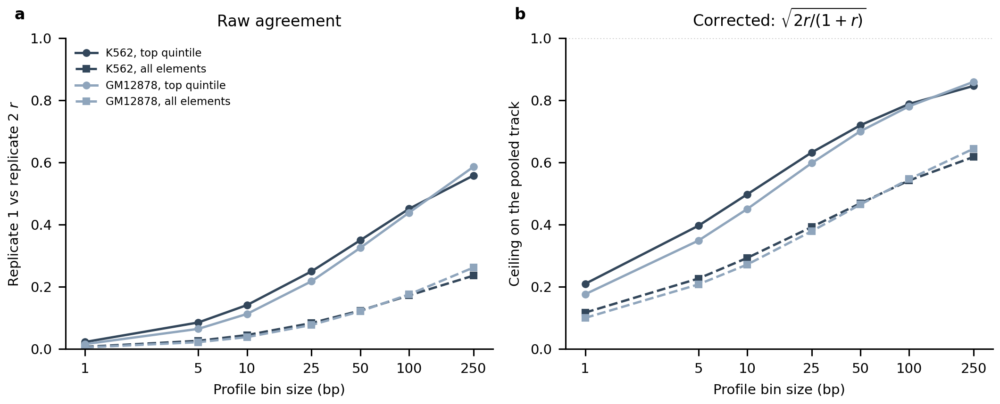

```{=html}
<style>
/* Typography and layout. Present in the document rather than the renderer so the
   report looks the same whether it is built by quarto or by the pandoc fallback
   (Sherlock has pandoc 2.10 and no quarto, which otherwise renders bare Times). */
html { -webkit-text-size-adjust: 100%; }
body {
  font-family: Arial, Calibri, "Helvetica Neue", Helvetica, sans-serif;
  font-size: 15px;
  line-height: 1.6;
  color: #1a1a1a;
  max-width: 980px;
  margin: 0 auto;
  padding: 2.5rem 1.5rem 4rem;
  background: #fff;
}
h1 { font-size: 1.7rem; font-weight: 600; line-height: 1.3; margin: 0 0 .3rem; }
h2 { font-size: 1.15rem; font-weight: 600; margin: 2.6rem 0 .6rem;
     padding-top: 1.1rem; border-top: 1px solid #e4e4e4; }
h3 { font-size: 1rem;   font-weight: 600; margin: 1.6rem 0 .4rem; }
p.date, .date { color: #666; font-size: .85rem; }

/* Figures: never exceed the text column, and centre them. Without this the
   pandoc fallback shows every PNG at natural pixel width and they overflow. */
img {
  display: block;
  max-width: 100%;
  height: auto;
  margin: 1.1rem auto 0.4rem;
}

/* The table of contents pandoc emits as a bare bulleted list */
#TOC, nav#TOC { font-size: .9rem; background: #fafafa; border: 1px solid #eaeaea;
  border-radius: 6px; padding: .8rem 1.2rem; margin: 1.5rem 0 2rem; }
#TOC ul { margin: .2rem 0; padding-left: 1.1rem; }
#TOC a { color: #235; text-decoration: none; }
#TOC a:hover { text-decoration: underline; }

/* Q:/A: lines read as the skimmable layer */
p > strong:first-child { color: #111; }

table { border-collapse: collapse; font-size: .88rem; margin: 1rem 0; width: 100%; }
th, td { border-bottom: 1px solid #e8e8e8; padding: .38rem .6rem; text-align: left;
         vertical-align: top; }
th { background: #f6f6f6; font-weight: 600; }

code, pre { font-family: "SF Mono", Menlo, Consolas, monospace; font-size: .82rem; }
pre { background: #f7f7f8; border: 1px solid #ececec; border-radius: 5px;
      padding: .7rem .9rem; overflow-x: auto; }
code { background: #f2f2f3; padding: .07em .32em; border-radius: 3px; }
pre code { background: none; padding: 0; }

blockquote { border-left: 3px solid #ddd; margin-left: 0; padding-left: 1rem;
             color: #444; }
</style>
```

## Headline figure


**Figure 1 | How much of H3K27ac accessibility can explain is a property of the cell type, and the ordering inverts between strata.** **Headline figure.**

<details>
<summary>Full legend</summary>

See the coupling section below for the complete legend. The two points that make this the
headline: the model-free ATAC-H3K27ac correlation on the elements carrying the mark is
0.51 in K562 against 0.33-0.41 in every other cell type measured, so an accessibility-based
number is not comparable across cell types without this denominator; and on all elements the
ordering inverts, with TeloHAEC highest, because that stratum is dominated by the
dead-versus-active contrast every accessible-element set shares. Source:
`results/atac_vs_h3k27ac_by_celltype.tsv`, `results/coupling_panel_recomputed.tsv`.
</details>

## Summary

- **The target is not where the input is.** ATAC peaks on the element centre; H3K27ac is bimodal with shoulders at +/-250 bp and is still at 28% of maximum at +/-2 kb, so its extent exceeds the models' ~1.1 kb receptive field by an unmeasured margin (Fig. 2).
- **A 1 kb counting window is the widest choice with zero neighbour contamination**, and the achievable ceiling is nearly saturated there: top-quintile inter-replicate *r* rises only 0.760 to 0.798 from +/-500 to +/-2000 bp while the fraction of windows containing another element's centre rises from 0% to 41.5% (Fig. 3).
- **There is almost nothing at base resolution to predict.** A perfect model caps at *r* = 0.21 (K562) and 0.18 (GM12878) on the top quintile at 1 bp, rising to 0.72 and 0.70 at 50 bp binning (Fig. 4). Any profile-head number must be read against that cap, not against 1.
- **Accessibility-H3K27ac coupling varies two-fold across cell types and the strata disagree about the ordering** (Fig. 1), which is why every evaluation in this project is stratified and why a new cell type gets its coupling measured before any model is trained in it.
- **The ATAC library supports fragment-size stratification** -- a clean nucleosomal ladder with a sub-nucleosomal mode at 42 bp and a mono-nucleosomal peak near 205 bp (Fig. 5).

## Goals

This report records what the H3K27ac and ATAC data *are*, and what is predictable from them
in principle, separately from any model. It exists so that the other two reports can cite a
ceiling, a coupling or a track definition without re-deriving it, and so that a number
quoted anywhere in the project can be checked against the measurement it came from. Every
ceiling in the project lives here.

Three companion documents:

- **Report 2, evaluation methodology** -- how a comparison in this project is scored and what
  each metric can and cannot support. Standing cautions, each with the incident that
  motivated it.
- **Report 3, design decisions** -- the workbench. Which architecture and input changes were
  tried, what each did to the reporting metric, and the verdict.
- `reference/DATA_INVENTORY.md` -- the full assay inventory across all nine cell types,
  including which assays exist where and which files must not be used.

## Datasets

| Dataset | Assay / system | Source | Used as |
|---|---|---|---|
| **K562 H3K27ac** | H3K27ac ChIP-seq, single-end 36 bp, 2 replicates (ENCFF790GFL, ENCFF817HMW) | ENCODE ENCSR000AKP | Prediction target |
| **K562 ATAC-seq** | ATAC-seq, paired-end, 3 replicates (ENCFF077FBI, ENCFF128WZG, ENCFF534DCE) | ENCODE ENCSR868FGK | Accessibility input |
| **K562 candidate elements** | DNase-derived candidate regulatory elements, n = 150,528, mean width 608 bp | Repo: `reference/K562_DNase_candidate_elements.narrowPeak` | Coordinate system; windows centred on element midpoints |
| **GM12878 H3K27ac** | H3K27ac ChIP-seq, single-end, 2 replicates (ENCFF645BAL, ENCFF865OOP) | ENCODE | Cross-cell-type evaluation target |
| **GM12878 ATAC-seq** | ATAC-seq | ENCODE; repo: `2026_0606_GM12878_transferability/data/atac.bw` | Accessibility input for transfer |
| **GM12878 candidate elements** | Candidate regulatory elements, n = 154,224 | Repo: `2026_0606_GM12878_transferability/reference/` | Transfer coordinate system |
| **K562 p300** | EP300 ChIP-seq, stranded | ENCODE ENCSR000EGE | Reference target for the sequence-margin comparison |
| **hg38 CV folds** | Chromosome-holdout 5-fold split | Repo: `reference/hg38_five_folds.json` | Shared across all models so numbers are comparable |
| **GC-matched negatives** | Genome-wide GC-binned background, hg38 | Repo: `reference/genomewide_gc_stride_1000_flank_size_1057.gc.bed` | Training negatives |

All ChIP-seq targets are counted as **5′ read ends** at single-base resolution (`bedtools genomecov -5 -dz`, stranded), matching the convention already used for the p300 models in this repository. Model architecture is `MultiModalBPNet` (`scripts/multimodal_bpnet.py`), a BPNet variant with a profile head and a counts head; only the counts head is analysed here. All correlations are on log counts.

## Accessibility explains less of H3K27ac outside K562, and the strata disagree about the ordering

**Q:** Is the ATAC-only model's lower score in GM12878 a failure to generalise, or is accessibility less coupled to H3K27ac there?

**A:** Accessibility is less coupled there — the model-free ATAC–H3K27ac correlation is 0.409 in GM12878 against 0.510 in K562, while the ATAC-only model extracts a larger fraction of that available signal in GM12878 (ratio 1.14) than in K562 (1.06).


<details>
<summary>Figure 1 legend</summary>

**Figure 1 | Accessibility–H3K27ac coupling weakens outside K562.** **a–c**, log1p summed ATAC against log1p summed H3K27ac over identical ±500 bp element-centred windows, one panel per cell type; colour is element density on a log scale. No model is involved, so these bound what any accessibility-only predictor could reach. Top-quintile Pearson **0.512 (K562), 0.409 (GM12878), 0.371 (TeloHAEC)**, on n = 150,519 / 154,215 / 151,399 elements. The x-range differs in **c** because the TeloHAEC ATAC library is shallower; correlation is unaffected by that scale. **d, e**, Coupling across all six cell types and conditions measured so far, on all elements (**d**) and the top signal quintile (**e**). **The ordering inverts between the two.** On all elements TeloHAEC scores highest (0.73) and every cell type sits within 0.06 of the others, because that stratum is dominated by the dead-versus-active contrast every accessible-element set shares. On the top quintile the range triples and K562 stands clear at 0.51 against 0.33–0.41 elsewhere. The top quintile is the informative stratum, and the contrast between **d** and **e** is why this report stratifies throughout. Placing the ATAC-only model against the top-quintile reference:

| | K562 | GM12878 |
|---|---|---|
| model-free ATAC–H3K27ac coupling | 0.510 | 0.409 |
| ATAC-only model | 0.542 | 0.467 |
| model / coupling | 1.06 | 1.14 |

The ATAC-only model does not degrade across cell types — it exceeds the raw coupling in both, by a wider margin in GM12878 — so its lower absolute score there is a property of the assay pair. Sequence-only falls 0.360 → 0.146 with no analogous denominator to absorb it. This sharpens the transfer conclusion: accessibility transfers, only sequence collapses. K562 and GM12878 use the same 5′ target processing and window; TeloHAEC uses its read-1-only equivalent. Sources: `results/atac_vs_h3k27ac_by_celltype.tsv`, `results/coupling_panel_recomputed.tsv`.
</details>

**Method.**

- Summed ATAC against summed H3K27ac over identical element windows; no model.
- Reported on the top H3K27ac quintile, matching every other evaluation here.

<details>
<summary>Full methods &amp; code</summary>

This is the model-free reference for the ATAC-only baseline: it separates how much accessibility can explain in principle from how well a network learns it. Both are needed to read a cross-cell-type comparison, because the coupling is the denominator that makes accessibility-based numbers comparable between cell types. Results accumulate one row-set per label into a single TSV, so the panel extends by one invocation per cell type.

```bash
pixi run python scripts/0.12.atac_vs_h3k27ac.py --label K562 \
    --elements reference/K562_DNase_candidate_elements.narrowPeak \
    --atac-bw .../atac.bw \
    --h3k27ac-bw data/h3k27ac_5p_plus.bw,data/h3k27ac_5p_minus.bw \
    --outdir results --figdir figures
```
Source: `scripts/0.12.atac_vs_h3k27ac.py`
</details>

## H3K27ac sits on flanking nucleosomes and is far broader than ATAC

**Q:** Are ATAC and H3K27ac located in the same place relative to a candidate element?

**A:** No — ATAC peaks on the element centre (offset −12 bp, no dip) while H3K27ac is bimodal with shoulders at ±250 bp and is far broader, still at 28% of maximum at ±2 kb where ATAC has fallen to 17%.


<details>
<summary>Figure 2 legend</summary>

**Figure 2 | H3K27ac is displaced onto flanking nucleosomes and is much broader than accessibility.** Meta-profiles over the top quintile of elements by H3K27ac signal (n = 30,000 elements sampled with seed 0; profiles computed on the same element set for all tracks so the comparison is not confounded by each track selecting its own strong elements). **a**, Each track normalised to its own maximum, so the comparison is one of *location*. **b**, Raw magnitudes, log scale. Tracks: K562 ATAC (teal), K562 H3K27ac as 5′ ends (orange). Dashed vertical line marks the element centre. Summary statistics (`results/profile_comparison_summary.tsv`): peak offset −12.5 bp for ATAC versus −262.5 bp for H3K27ac 5′ ends; centre-to-peak ratio 1.000 for ATAC (no dip) versus 0.944 for H3K27ac. The bimodality is the expected signature of a nucleosome-free element flanked by acetylated nucleosomes. The breadth difference is the more consequential one for modelling: at ±2 kb, the edge of the profiled window, H3K27ac is still at 28% of its maximum where ATAC has fallen to 17%, so its true extent is wider than these profiles measure. Source: `results/profile_comparison.tsv`.
</details>

**Method.**

- Meta-profiles binned at 50 bp over ±2 kb, restricted to the top H3K27ac quintile.
- All tracks profiled on the identical element set; each normalised to its own maximum.

<details>
<summary>Full methods &amp; code</summary>

Windows are centred on the candidate-element midpoint. The `summit` column of `K562_DNase_candidate_elements.narrowPeak` equals `width/2`, so element-centred windows require no change to the extraction code. Elements within `flank` of a contig end are dropped. Signal is read with pyBigWig and `nan` treated as zero.

```bash
pixi run python scripts/0.6.compare_profiles.py \
    --elements reference/K562_DNase_candidate_elements.narrowPeak \
    --track "ATAC:.../atac.bw" \
    --track "H3K27ac (5-prime):data/h3k27ac_5p_plus.bw,data/h3k27ac_5p_minus.bw" \
    --stratify-by "H3K27ac (5-prime)" --outdir results --figdir figures
```
Source: `scripts/0.6.compare_profiles.py`
</details>

## A 1 kb counting window is the best trade-off between signal and neighbour contamination

**Q:** How wide should the window be over which H3K27ac counts are summed?

**A:** ±500 bp — wider windows raise the achievable ceiling only marginally (0.760 → 0.798 from ±500 to ±2000) while the fraction of elements containing a *different* candidate element rises from 0% to 41.5%.


<details>
<summary>Figure 3 legend</summary>

**Figure 3 | The achievable ceiling saturates by ±1 kb, while neighbour contamination keeps rising.** Inter-replicate Pearson correlation of log H3K27ac counts between the two ENCSR000AKP replicates, as a function of the half-width of the symmetric counting window, over all n = 150,526 candidate elements (teal) and the top signal quintile (purple). Because the two replicates measure the same biology, their agreement bounds how well any model can predict the merged target. Top-quintile values: 0.729 (±250 bp), 0.760 (±500), 0.776 (±750), 0.785 (±1000), 0.795 (±1500), 0.798 (±2000). The countervailing cost is neighbour contamination — the fraction of elements with another candidate element's centre inside the window, which is a property of element spacing and independent of the assay: 0% at ±250 and ±500 bp, 9.9% at ±750, 19.9% at ±1000, 33.1% at ±1500, 41.5% at ±2000 (`results/window_tradeoff.tsv`). A contaminated window's count is not attributable to the element it is centred on, which matters for any subsequent sequence-attribution work. ±500 bp is the widest window with zero contamination. Source: `results/fiveprime_replicate_ceiling_by_window.tsv`.
</details>

**Method.**

- Per-replicate 5′-end BigWigs built with identical processing to the merged training target.
- Neighbour contamination computed from element-centre spacing per chromosome.

<details>
<summary>Full methods &amp; code</summary>

Ceilings are reported as the raw inter-replicate *r*. Converting to a bound on model performance requires two corrections, applied wherever a fraction-of-ceiling is quoted in this report: Spearman–Brown for the fact that the model predicts the two-replicate *merge* rather than one replicate (`rel = 2r/(1+r)`), then a square root, since a model predicts the expected signal while a replicate is one noisy realisation of it. At ±500 bp this converts a raw 0.760 into a bound of 0.929 on the top quintile, and a raw 0.844 into 0.957 over all elements.

A separate test asked whether excluding the nucleosome-free centre sharpens the target, on the reasoning that H3K27ac is deposited on the flanks. It does not: excluding ±125/±250/±375 bp lowers the top-quintile ceiling monotonically (0.760 → 0.747 → 0.729 → 0.717) because the shallow central dip means the centre still carries ~94% of peak signal, so excluding it discards real reads. The flanking-only count also correlates 0.93–0.99 with the full-window count, so the two targets are barely different. Full symmetric window retained (`results/flanking_vs_full_window.tsv`).

```bash
pixi run python scripts/0.3.replicate_ceiling_by_window.py \
    --elements reference/K562_DNase_candidate_elements.narrowPeak \
    --rep1-bw data/h3k27ac_rep1_5p_plus.bw,data/h3k27ac_rep1_5p_minus.bw \
    --rep2-bw data/h3k27ac_rep2_5p_plus.bw,data/h3k27ac_rep2_5p_minus.bw \
    --outdir results --figdir figures --label fiveprime_
pixi run python scripts/0.4.flanking_vs_full.py --outer 500 1000 --inner 0 125 250 375
```
Source: `scripts/0.3.replicate_ceiling_by_window.py`, `scripts/0.4.flanking_vs_full.py`
</details>

## H3K27ac has no reproducible base-resolution profile

**Q:** Is there base-resolution structure in the H3K27ac profile for the 1 bp profile head to learn, and if not, at what bin size does reproducible structure appear?

**A:** A perfect model caps at *r* = 0.21 in K562 and 0.18 in GM12878 on the top quintile at 1 bp, rising to 0.72 and 0.70 when binned to 50 bp and 0.79 and 0.78 at 100 bp, so the base-resolution multinomial term is largely fitting Poisson noise.



<details>
<summary>Figure 4 legend</summary>

**Figure 4 | The reproducible part of the H3K27ac profile appears only after coarse binning.** Two replicates of the same experiment, correlated *within* each element across positions so the element's total count drops out and only shape remains; 16,148 K562 and 15,589 GM12878 elements, ±500 bp windows, strands summed. **a**, Raw replicate-vs-replicate agreement: 0.023 and 0.016 at 1 bp on the top quintile. **b**, The corresponding ceiling on the pooled track. Raw agreement understates what a model can reach — each replicate is signal plus independent noise, while the model is scored against the pooled track whose noise variance is halved, so the reachable value is `sqrt(2r/(1+r))`, the same correction applied to the count ceiling. Solid lines top quintile, dashed all elements; K562 dark, GM12878 light. The curve is close to log-linear in bin size and still rising at 250 bp, so it identifies no preferred resolution; in particular there is no step near the ~180 bp nucleosome repeat, indicating a broad envelope rather than sharply phased peaks. Source: `results/profile_ceiling_binsize_{k562,gm12878}.tsv`.
</details>

**Method.**

- Within-element correlation across positions removes the count signal, which the count ceiling already covers.
- Elements flat in either replicate are excluded rather than scored as 0, which would conflate unreproducible with no-shape-to-reproduce.
- 500 bp is omitted: a 1 kb window gives 2 bins, too few for a within-element correlation.

<details>
<summary>Full methods &amp; code</summary>

```bash
sbatch scripts/0.25.submit.sh
```
Source: `scripts/0.25.profile_ceiling_by_binsize.py`
</details>

## The ATAC library supports fragment-size stratification

**Q:** Does the K562 ATAC data contain a usable mono-nucleosomal population?

**A:** Yes — a clean nucleosomal ladder with a sub-nucleosomal mode at 42 bp and mono-nucleosomal peak at ~205 bp, though the two currently-built channels capture only 50% of fragments.


<details>
<summary>Figure 5 legend</summary>

**Figure 5 | K562 ATAC fragment lengths show clear nucleosomal laddering.** Fragment-length density from TLEN of properly-paired reads, chr1, ~1.4 million fragments per replicate, three ENCSR868FGK replicates overlaid (ENCFF077FBI, ENCFF128WZG, ENCFF534DCE). Sub-nucleosomal mode at 42 bp, mono-nucleosomal peak at ~205 bp, di-nucleosomal at ~400 bp and tri-nucleosomal at ~600 bp; median 201 bp; replicates superimpose. Shaded bands are the two channel windows built so far: sub-nucleosomal 1–99 bp (30.3% of fragments) and mono-nucleosomal 180–247 bp (19.7%), leaving **50.0% of fragments in neither** — the 100–180 bp trough and everything above 247 bp, including both higher-order peaks. A four-channel design of [all fragments, sub, mono, di] would make the input a strict superset of the current flat-accessibility baseline, so it cannot regress, while adding the higher-order structure the ladder shows is present. Source: `results/atac_fragment_length_summary.tsv`.
</details>

**Method.**

- TLEN from properly-paired reads; each pair counted once via positive TLEN.
- Fragment lengths require the paired-end BAMs; the Tn5 tagAlign files are per-read and lose them.

<details>
<summary>Full methods &amp; code</summary>

```bash
pixi run python scripts/0.10.plot_fragment_lengths.py \
    --bams $SCRATCH/atac_pe/ENCFF077FBI.pe.bam $SCRATCH/atac_pe/ENCFF128WZG.pe.bam \
           $SCRATCH/atac_pe/ENCFF534DCE.pe.bam \
    --outdir results --figdir figures
```
Source: `scripts/0.10.plot_fragment_lengths.py`, `scripts/0.9.make_atac_fragment_channels.sh`
</details>

## Accessibility track conventions, and the read-length confound they hide

Two conventions are in play for the accessibility input and they are different quantities.

**Full-interval coverage** (`bedtools genomecov -bg` over the tagAlign interval) counts
`read_length` bases per read, so the track scales with read length and smears each Tn5
insertion across ~95 bases in our K562 and GM12878 libraries.

**5' insertion counts** (`genomecov -bg -5`) count exactly one base per read, which is the
ChromBPNet convention (`chrombpnet/helpers/preprocessing/reads_to_bigwig.py`: `-bg -5`,
unstranded, ATAC shift `4-plus_shift, -4-minus_shift`). Our tagAligns are already
Tn5-shifted, so the correct build reduces to adding `-5`; applying the shift again would
double-shift.

**The difference is a constant within a cell type and a confound across them.** Verified by
an arithmetic identity: `sum(full-interval) / sum(5')` must equal the mean read length.
Measured 84.5 and 85.6 for K562 and GM12878 (94-95 bp reads) and 30.9-35.5 for the four
TeloHAEC conditions (35-36 bp). So K562-versus-GM12878 comparisons were never affected,
but TeloHAEC's full-interval coverage is a different quantity from theirs. With read length
removed, the K562-versus-TeloHAEC gap falls from 13-27x to 5.3-12.3x nuclear depth, which
is genuine sequencing depth rather than an artifact of the convention.

The 5' tracks are read-length independent by construction and are the correct choice the
moment a third cell type enters. What the switch does to model performance is a design
decision, not a property of the data, and is reported in Report 3.

## Element derivation differs between cell types, which is a standing confound

Documented in full in `reference/ELEMENT_DERIVATION.md`. The K562 and GM12878 candidate
element sets are DNase-derived; TeloHAEC's are ATAC-derived. TeloHAEC is therefore the one
cell type whose elements match its own input assay, and the two cell types carrying most of
this project's results do not.

An ATAC-derived K562 set exists (`reference/K562_ATAC_candidate_elements.narrowPeak`, same
rE2G model type as TeloHAEC's), so the confound is testable rather than merely noted; the
test and its result are in Report 3. The ABC candidate regions used for the downstream
benchmark are ATAC-derived, from observed K562 ATAC.

**The negatives matter as much as the positives.** Training negatives are a GC-matched
genomic background rather than non-peak regions, so the element set spans active and
inactive elements and a large part of any unstratified correlation is the dead-versus-active
contrast. This is the root reason the evaluation is stratified; see Report 2.

## Methods

All ChIP-seq targets are counted as **5' read ends** at single-base resolution
(`bedtools genomecov -5 -dz`, stranded), matching the convention already used for the p300
models in this repository. Accessibility inputs exist in both conventions described above;
which one a given result used is recorded per result in `results/TARGET_PROVENANCE.md`.

Ceilings are reported as the raw inter-replicate *r*. Converting one to a bound on model
performance requires two corrections, applied wherever a fraction-of-ceiling is quoted
anywhere in this project: Spearman-Brown for the fact that the model predicts the
two-replicate *merge* rather than one replicate (`rel = 2r/(1+r)`), then a square root,
since a model predicts the expected signal while a replicate is one noisy realisation of it.
At +/-500 bp this converts a raw 0.760 into a bound of 0.929 on the top quintile, and a raw
0.844 into 0.957 over all elements.

Windows are centred on candidate-element midpoints rather than summits, because the H3K27ac
summit sits on a flanking nucleosome (Fig. 2). The `summit` column of
`K562_DNase_candidate_elements.narrowPeak` equals `width/2`, so element-centred windows
require no change to the extraction code. Elements within `flank` of a contig end are
dropped. Signal is read with pyBigWig and `nan` treated as zero.

### Regenerate

```
Environment: pixi env `multimodal`, pixi.lock sha256:069960d36312
```

```bash
# Target and accessibility tracks
sbatch scripts/0.5.make_5prime_bigwigs.sh            # K562 H3K27ac 5' ends, merged + per-replicate
sbatch scripts/0.7.make_gm12878_5prime.sh            # GM12878 H3K27ac 5' ends
pixi run bash scripts/0.20.make_atac_5prime_bigwigs.sh
pixi run python scripts/0.21.validate_atac_5prime.py   # ratio == mean read length
sbatch scripts/0.22.calibrate_tn5_shift.sh
PLUS_DELTA=4 MINUS_DELTA=-5 sbatch scripts/0.23.make_atac_fragment_5p_channels.sh
pixi run python scripts/0.24.validate_atac_fragment_channels.py

# Characterisation
pixi run python scripts/0.6.compare_profiles.py   ...           # Fig 2
pixi run python scripts/0.3.replicate_ceiling_by_window.py ...  # Fig 3
pixi run python scripts/0.4.flanking_vs_full.py --outer 500 1000 --inner 0 125 250 375
sbatch scripts/0.25.submit.sh                                   # Fig 4
pixi run python scripts/0.10.plot_fragment_lengths.py ...       # Fig 5
pixi run python scripts/0.12.atac_vs_h3k27ac.py --label K562 ...  # Fig 1

# This report
python render_report.py report1_data_characterisation.qmd
```

Per-result provenance, including which processing of the target each result file used, is in
`results/TARGET_PROVENANCE.md`.
