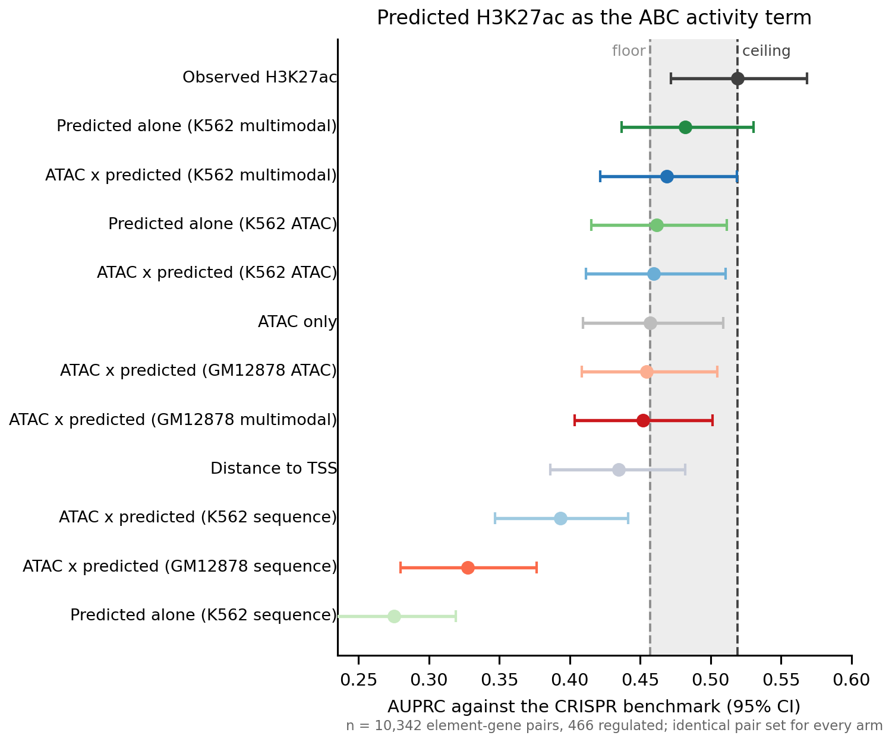
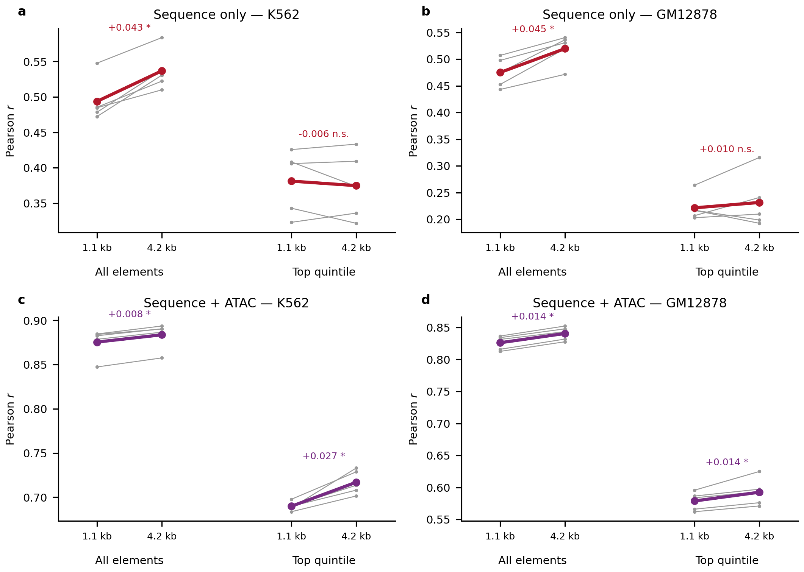
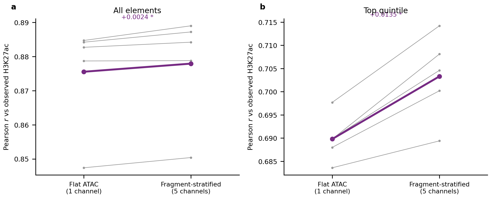
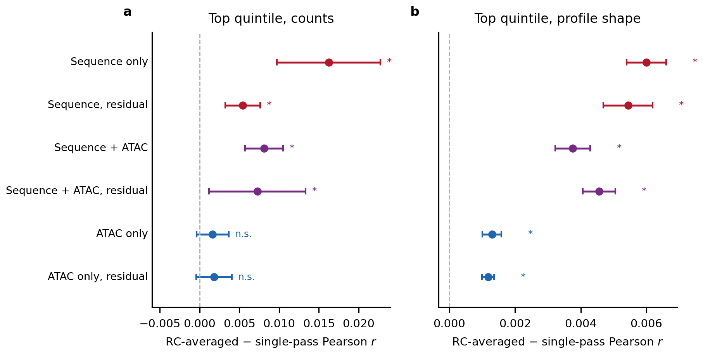

```{=html}
<style>
/* Typography and layout. Present in the document rather than the renderer so the
   report looks the same whether it is built by quarto or by the pandoc fallback
   (Sherlock has pandoc 2.10 and no quarto, which otherwise renders bare Times). */
html { -webkit-text-size-adjust: 100%; }
body {
  font-family: Arial, Calibri, "Helvetica Neue", Helvetica, sans-serif;
  font-size: 15px;
  line-height: 1.6;
  color: #1a1a1a;
  max-width: 980px;
  margin: 0 auto;
  padding: 2.5rem 1.5rem 4rem;
  background: #fff;
}
h1 { font-size: 1.7rem; font-weight: 600; line-height: 1.3; margin: 0 0 .3rem; }
h2 { font-size: 1.15rem; font-weight: 600; margin: 2.6rem 0 .6rem;
     padding-top: 1.1rem; border-top: 1px solid #e4e4e4; }
h3 { font-size: 1rem;   font-weight: 600; margin: 1.6rem 0 .4rem; }
p.date, .date { color: #666; font-size: .85rem; }

/* Figures: never exceed the text column, and centre them. Without this the
   pandoc fallback shows every PNG at natural pixel width and they overflow. */
img {
  display: block;
  max-width: 100%;
  height: auto;
  margin: 1.1rem auto 0.4rem;
}

/* The table of contents pandoc emits as a bare bulleted list */
#TOC, nav#TOC { font-size: .9rem; background: #fafafa; border: 1px solid #eaeaea;
  border-radius: 6px; padding: .8rem 1.2rem; margin: 1.5rem 0 2rem; }
#TOC ul { margin: .2rem 0; padding-left: 1.1rem; }
#TOC a { color: #235; text-decoration: none; }
#TOC a:hover { text-decoration: underline; }

/* Q:/A: lines read as the skimmable layer */
p > strong:first-child { color: #111; }

table { border-collapse: collapse; font-size: .88rem; margin: 1rem 0; width: 100%; }
th, td { border-bottom: 1px solid #e8e8e8; padding: .38rem .6rem; text-align: left;
         vertical-align: top; }
th { background: #f6f6f6; font-weight: 600; }

code, pre { font-family: "SF Mono", Menlo, Consolas, monospace; font-size: .82rem; }
pre { background: #f7f7f8; border: 1px solid #ececec; border-radius: 5px;
      padding: .7rem .9rem; overflow-x: auto; }
code { background: #f2f2f3; padding: .07em .32em; border-radius: 3px; }
pre code { background: none; padding: 0; }

blockquote { border-left: 3px solid #ddd; margin-left: 0; padding-left: 1rem;
             color: #444; }
</style>
```

## Headline figure



**Figure 1 | No predicted-H3K27ac arm clears the ATAC-only floor on the CRISPR benchmark, and the deployment arms sit at or below it.** **Headline figure.**

<details>
<summary>Full legend</summary>

**Figure 1 | CRISPR-benchmark AUPRC for eleven predicted-activity arms, K562.** Forest plot
rather than bars because the confidence intervals are the point: they are roughly +/-0.05
wide while the differences under discussion are ~0.02. Vertical lines mark the floor
(ATAC-only activity, 0.457) and the ceiling (ATAC x observed H3K27ac, 0.519). Best predicted
arm is predicted H3K27ac used as the entire activity term from the K562 multimodal model, at
**0.482 [0.437, 0.530]** -- above the floor point estimate, interval overlapping both
anchors. The geometric mean of observed ATAC with predicted H3K27ac scores **0.469**, and the
two GM12878-trained deployment arms score **0.455** and **0.452**, at or below the floor.
Every sequence-only arm is far below distance-to-TSS (0.435): 0.393 for the geometric mean
and 0.275 for predicted-alone. Benchmark is
`EPCrisprBenchmark_ensemble_data_GRCh38.tsv.gz` with the scE2G intGENCODEv43 universes,
scored by `CRISPR_comparison`. Source:
`CRISPR_comparison_v3/.../results/2026_0904_predicted_activity/performance_summary.txt`.
</details>

## Summary

- **The downstream benchmark is negative.** No predicted-H3K27ac arm clears the ATAC-only floor with a resolvable margin, and the deployment arms -- GM12878-trained models applied to K562, which is the actual use case -- sit at or below it (Fig. 1). This is the project's terminal metric, so it is the headline result.
- **The mechanism is compressed dynamic range, not inaccuracy.** Predicted and observed H3K27ac correlate at Spearman 0.79 genome-wide, but the predicted activity term's p99/p50 ratio is 4.03 against 6.00 on the regions of regulated pairs, so ABC's ranking is displaced rather than wrong.
- **In-cell-type architecture gains do not travel.** Every transferred architecture is within 0.016 of the simplest one, and the richer models have the *larger* transfer drops. Transferring the best model buys +0.013 to +0.036 over simply using the target cell type's own ATAC-only model.
- **The failures have a clean signature.** Over-predicted elements are specifically CTCF-enriched (2.6x by quantitative signal, with IgG *below* background) and carry no more H3K27ac or H3K4me1 than typical; under-predicted elements are canonical active enhancers (EP300 3.4x, H3K4me1 3.3x, zero H3K27me3).
- **p300 as a second target is dropped.** Where the H3K27ac model fails, observed p300 is elevated only ~2.3x over its own input control and the p300 models predict it at 1.83x -- below that control -- so neither a multi-head model nor stacking can help.

## Goals

This is the workbench. It records every architecture and input change tried against the
H3K27ac target, what each did to the reporting metric, and the verdict, followed by the
downstream ABC/CRISPR result and the diagnosis of why it is negative.

It changes most often of the three reports. Report 1 holds the data characterisation and
every ceiling; Report 2 holds the scoring rules these results are read under, and should be
read first by anyone about to quote a number from here.

**Numbers in the decision table are reverse-complement-averaged**, which has been the
default in all scoring since 2026-09-03. The figures and the per-section prose below still
show the single-pass values they were rendered from; where the two differ the RC value in the
table is the current one, and regenerating the figures from the `rc_*` tables is the one
piece of outstanding bookkeeping.

## Decision table

Effect is the paired within-fold change in top-quintile Pearson *r* on K562 H3K27ac unless
stated. Read every row against a between-fold `sd` of 0.041-0.046 (Report 2).

| Change | Effect on the top quintile | Verdict |
|---|---|---|
| **Inputs: sequence only** | 0.397 [0.344, 0.451] absolute | reference |
| **Inputs: ATAC only** | 0.551 [0.500, 0.601] absolute | reference |
| **Inputs: sequence + ATAC** | 0.695 [0.677, 0.713] absolute | **adopted** |
| **Target: p300 instead of H3K27ac** | sequence margin +0.304 against +0.127 | p300 is the better substrate for sequence; H3K27ac is the required target |
| **Objective: residual instead of total** | sequence +0.254, multimodal **-0.018** | adopt for attribution work only; joint training remains the better predictor |
| **Receptive field ~1.1 -> ~4.2 kb** | multimodal **+0.028** (*p*=0.004); GM12878 +0.016 (*p*=0.023); ATAC-only +0.017; sequence-only -0.007 (*p*=0.40) | **adopted for accessibility-input models**; the gain is accessibility neighbourhood, not sequence context |
| **Accessibility: 5 fragment-size channels vs flat** | **+0.016** (*p*=0.002); GM12878 +0.006 (*p*=0.031) | **adopted** |
| **Both: wide + fragments** | +0.034 vs narrow+flat; **+0.007 on top of wide alone** (*p*=0.053) | sub-additive at ~79%; take the receptive field, treat fragments as nearly redundant with it |
| **Inference: reverse-complement averaging** | +0.008 multimodal, +0.016 sequence-only, +0.002 ATAC-only (n.s.) | **adopted as the default everywhere** |
| **Accessibility: 5' insertion counts vs full-interval** | ATAC-only **+0.033** (*p*=0.010); multimodal +0.004 (n.s.) | **adopted**, for the cross-cell-type read-length confound rather than the gain (Report 1) |
| **Elements: ATAC-derived instead of DNase-derived** | -0.001 [-0.015, +0.013] (*p*=0.83) | irrelevant; the derivation confound is real but has no measurable effect |
| **Counting window +/-500 bp** | ceiling nearly saturated, zero neighbour contamination | keep (Report 1, Fig. 3) |
| **`count_loss_weight` = 10** | only the extremes 1 and 1000 are resolvable | keep; sits in a flat region |
| **Profile head at 1 bp** | ceiling 0.21; models reach 0.114-0.171 | not informative, but not failing either; removing it is untested |
| **Architecture choice on transfer** | no arm beats narrow+flat by a resolvable margin (best +0.016, *p*=0.066) | in-cell gains do not travel |
| **Predicted H3K27ac as the ABC activity term** | AUPRC 0.482 against a floor of 0.457 and a ceiling of 0.519 | does not clear the floor; deployment arms at or below it |
| **p300 as a second target or a second head** | predicted p300 1.83x elevation against a 2.10x input control | **dropped** |
| **Sequence-gated accessibility, and asymmetric count loss** | trained, scoring in flight | pending |

## Inputs: accessibility carries most of it, and sequence adds a real but small complement

**Q:** How much of H3K27ac at candidate elements is predictable from sequence, how much from
chromatin accessibility, and how much does sequence add beyond accessibility?

**A:** On the elements carrying the mark, ATAC alone reaches 0.551 [0.500, 0.601] and
sequence alone 0.397 [0.344, 0.451]; together 0.695 [0.677, 0.713], so sequence adds +0.144
over accessibility and accessibility adds +0.298 over sequence.


<details>
<summary>Figure 2 legend</summary>

**Figure 2 | Predicting K562 H3K27ac at candidate elements, by input modality.** Pearson *r*
between predicted and observed log counts. **a**, All elements. **b**, Top quintile by
observed H3K27ac -- the elements carrying the mark. Colour encodes input modality throughout
all three reports: **red sequence only, blue ATAC only, purple sequence + ATAC**. Dashed line
is the achievable ceiling (Report 1); 0.957 all elements, 0.929 top quintile. Single-pass
top-quintile values as plotted: sequence 0.380 [0.323, 0.437], ATAC 0.548 [0.497, 0.599],
both 0.685 [0.667, 0.704] -- all three intervals disjoint. Reverse-complement-averaged, which
is the current default, the same three are 0.397, 0.551 and 0.695. The multimodal model's
fold-to-fold spread (sd 0.015) is a third of either single-input model's (0.041-0.046), so
combining inputs is also markedly more stable across chromosome sets. Target K562 H3K27ac
(ENCSR000AKP), 5' end counts, 1 kb element-centred window. Source:
`results/{,rc_}fiveprime_stratified_fold_summary.tsv`.
</details>

**Sequence + ATAC is the configuration everything else is measured against**, reaching 75% of
the corrected ceiling on the top quintile against 59% for accessibility alone and 43% for
sequence alone.

**The all-elements panel is not a rescaling of the top-quintile panel** and the two support
different conclusions about the size of every effect; Report 2 opens with why.

**Method.**

- Three input modes, five chromosome-holdout folds each, identical everything else.
- Reported on the top quintile by observed signal, with all elements alongside.

<details>
<summary>Full methods &amp; code</summary>

```bash
sbatch scripts/2.2.submit_evaluate.sh
sbatch scripts/2.22.submit_rc_rescore.sh    # the rc_ values quoted in the decision table
```
Source: `scripts/2.2.evaluate_stratified.py`, `scripts/2.15.perfold_from_config.py`
</details>

## Sequence contributes less to H3K27ac than to p300, by a factor of 2.2

**Q:** Does sequence add as much information beyond accessibility for H3K27ac as it does for p300?

**A:** No — sequence adds +0.304 over accessibility for p300 but only +0.127 for H3K27ac, a difference of 0.177 ± 0.027 (about 6.6 SE), despite H3K27ac scoring higher overall.


<details>
<summary>Figure 3 legend</summary>

**Figure 3 | H3K27ac is the easier target but the weaker substrate for sequence.** Top quintile of elements by observed signal. **a**, ATAC-only (blue) and sequence + ATAC (purple) for each target; bars are the mean across five chromosome-holdout folds, whiskers the 95% CI, points the individual folds. p300 (ENCSR000EGE, stranded 5′ ends): ATAC only 0.304 [0.280, 0.329], sequence + ATAC 0.608 [0.566, 0.651]. H3K27ac (ENCSR000AKP): ATAC only 0.542 [0.489, 0.596], sequence + ATAC 0.669 [0.654, 0.684]. **b**, The sequence margin — sequence + ATAC minus ATAC-only — computed **within each fold and then averaged**, a paired comparison: both models see the same held-out chromosomes in a given fold, so differencing within a fold removes the between-fold variation that dominates the absolute values in **a**. p300 **+0.304**, H3K27ac **+0.127**; the intervals do not overlap. Sequence-only is deliberately absent: there is no p300 sequence-only model in this format (the p300 sequence models are bpnet-refactor/TensorFlow checkpoints), and the margin is defined without it. Both targets are evaluated on the same K562 DNase candidate elements with element-centred ±500 bp windows, so the comparison isolates the target. Caveat: the p300 models were *trained* on ENCSR000EGE peak summits and *evaluated* here on element centres, matching this repository's existing p300 prediction pipeline; a matched element-centred p300 model would likely raise p300 further and widen the gap. Source: `results/p300_vs_h3k27ac_stratified_per_fold.tsv`.
</details>

**Method.**

- Same elements, windows, folds and metric for both targets; only the target differs.
- Accessibility-only control included so the sequence margin is identifiable.

<details>
<summary>Full methods &amp; code</summary>

The accessibility-only control is what makes this comparison interpretable. Without it, p300 and H3K27ac would be compared on joint-model correlation alone, which ranks them in the opposite order. p300 model directories are `2026_0529_multimodal_p300_model/models/atac` (sequence + ATAC) and `models/atac_only` (ATAC only) — note `atac` there names the multimodal model whose accessibility input is ATAC; the ATAC-only mode lives in `atac_only`.

```bash
pixi run python scripts/2.2.evaluate_stratified.py \
    --config-json config/compare_configs.json --out-prefix p300_vs_h3k27ac_ \
    --elements reference/K562_DNase_candidate_elements.narrowPeak \
    --fold-json reference/hg38_five_folds.json --outdir results --figdir figures
```
Source: `scripts/2.2.evaluate_stratified.py`
</details>

## The residual objective helps only a sequence-blind input — replicated in two cell types

**Q:** How much does each model add beyond what accessibility alone predicts, and does sequence carry anything accessibility cannot supply?

**A:** It does, but only a residual objective exposes it — the same sequence-only input scores 0.149 [0.076, 0.222] against the total signal and 0.459 [0.421, 0.496] against `observed − atac_pred`.

The same switch *costs* a model that already sees accessibility, and both halves reproduce independently in GM12878.

The training objective is what limits the sequence-only model: told to predict total signal it spends its capacity on the large accessibility-correlated component and leaves the residual alone.


<details>
<summary>Figure 4 legend</summary>

**Figure 4 | The residual objective helps a sequence-blind input and costs a multimodal one, in two independent cell types.** Baseline is each cell type's own accessibility-only *model* prediction, so the residual is what accessibility genuinely cannot explain. Hatching encodes the training objective (hatched = trained on `observed − atac_pred`); shade encodes cell type (solid K562, pale GM12878). Bars sharing colour and shade have **identical inputs** and differ only in objective. **a**, Residual Pearson *r*. K562 / GM12878: sequence-on-total 0.149 / 0.133; sequence-on-residual 0.459 / 0.372; multimodal-on-total 0.551 / 0.449; multimodal-on-residual 0.514 / 0.414; ATAC control −0.003 / +0.010. **b**, Residual *r* by quintile of |true residual| (5 = accessibility most wrong), pooled over folds. Every informative model rises monotonically in both cell types while the ATAC control stays flat at zero across all ten strata. **c**, The paired effect of switching objective, computed within fold. Training on the residual **gains** +0.310 [0.224, 0.395] (K562, *p*=5×10⁻⁴) and +0.239 [0.220, 0.258] (GM12878, *p*<10⁻⁴) for sequence-only input, but **costs** −0.037 [−0.039, −0.034] (*p*<10⁻⁴) and −0.035 [−0.044, −0.026] (*p*=4×10⁻⁴) when accessibility is already an input. The multimodal cost lands within 0.002 of itself across two cell types with different targets, accessibility libraries and element sets, and is negative in all ten folds — that stability is what makes it a property of the objective. n = 58,655 (K562) and 57,144 (GM12878) element–fold observations. Source: `results/{,gm12878_}residual_grid_{per_fold,fold_summary,residual_evaluation}.tsv`.
</details>

**Sequence is not redundant with accessibility.** A sequence model scoring 0.149 on the residual reflects its training objective: the identical input trained on the residual reaches 0.459.

**The objective helps only where the input is blind to accessibility.** It triples the sequence-only score but **costs** the multimodal model 0.037 residual *r* — small, but present in all five folds, paired interval [−0.039, −0.034]. A multimodal model can already learn whatever transform of ATAC it needs; a fixed offset it cannot adjust only removes that freedom. Joint training therefore remains the best predictor, beating residual-trained sequence by +0.093 [0.072, 0.113].

**The metric is not manufacturing the effect.** An ATAC-input model trained on the residual — asked to predict an ATAC model's own errors from the same ATAC input — scores −0.003 [−0.065, 0.060], incremental *R²* −0.000, flat across all |residual| quintiles. A clearly positive control here would have made the sequence result an artifact.

**The effect belongs to the training objective and holds across cell types.** It reproduces in GM12878, where weaker ATAC–H3K27ac coupling (0.409 vs 0.510) and a higher ceiling (0.832 vs 0.760) pull in opposite directions; the multimodal cost lands within 0.002 of itself. Absolute levels are lower throughout, consistent with GM12878 being harder to predict (Fig. 9), but every ordering and sign holds.

Residual training is therefore an interpretability tool. Its attributions are forced onto signal accessibility cannot supply — what the motif work needs, and what multimodal attributions cannot cleanly separate — and being a property of the objective, it needs no per-cell-type re-testing.

**Method.**

- Baseline is the accessibility-only model's held-out prediction.
- Stratified by |true residual| so performance is scored where accessibility fails, and reported as mean ± 95% CI over folds, since between-fold sd here is 0.041–0.046.

<details>
<summary>Full methods &amp; code</summary>

**A suspected artifact turned out to be largely closed by construction.** Because `true_resid = obs − atac_pred`, anything merely anti-correlated with `atac_pred` might earn positive residual *r* for free. It does not: `obs − atac_pred` is near-orthogonal to `atac_pred` by the least-squares residual property, so that correlation cannot leak in. The ATAC control demonstrates it — its output correlates −0.620 with `atac_pred`, the channel wide open, and it still scores −0.003. Three checks bound the risk for the residual-trained sequence model: its output correlates only −0.090 with `atac_pred`; partialling `atac_pred` out of both sides leaves 0.459 unchanged (against 0.149 → 0.205 for the more entangled sequence-on-total model, at +0.477); and panel **c**'s incremental *R²* is scored against the observed signal, which cannot be faked out of sample. The controls were worth running and the negative control is load-bearing, but the alarm was disproportionate.

**A trap for anyone re-running this.** `MultiModalBPNet.forward()` does **not** add the count offset — that happens only inside `fit()` when scoring the loss — so an offset-trained model's raw output *is* the residual. `2.4.evaluate_residual.py` originally subtracted `atac_pred` anyway, double-counting the baseline and correlating a residual against observed signal for `overall_pearson`; both produced plausible wrong numbers instead of failing. The fix sits behind a `"residual": true` config key so earlier results stay reproducible, and `2.7.diagnose_residual_offset.py` verifies the semantics empirically first: a residual predictor's output centres near 0 (measured −0.044), a logcounts predictor near the observed mean (2.835 vs 2.786), with the plain sequence model as a control proving the test discriminates.

The same metric applied to p300 gives residual *r* = 0.654 and incremental *R²* = +0.265, versus 0.551 and +0.102 for H3K27ac's multimodal model, reinforcing Fig. 3 on a second statistic. p300's residual *r* is also high (0.260) in the quintile where accessibility is nearly right, against 0.091 for H3K27ac, so p300's sequence contribution is broadly useful across strata. The p300 side has **not** been re-run with the residual objective — that comparison is open.

The evaluator refuses to run when the baseline and comparison models use different windows, since a residual across mismatched geometries is not meaningful, and refuses folds lacking `training_complete.json`.

```bash
# semantics check, then the pooled evaluation
pixi run python scripts/2.7.diagnose_residual_offset.py
pixi run python scripts/2.4.evaluate_residual.py \
    --config-json config/residual5p_eval_configs.json --out-prefix residual5p_ \
    --elements reference/K562_DNase_candidate_elements.narrowPeak \
    --genome $GEN --signal-bw data/h3k27ac_5p_plus.bw \
    --accessibility-bw $ATAC --fold-json reference/hg38_five_folds.json \
    --outdir results --figdir figures

# the full grid: 3 standard + 3 residual-objective models
pixi run python scripts/2.4.evaluate_residual.py \\
    --config-json config/residual_grid_eval_configs.json --out-prefix residual_grid_ ...
# per-fold CIs + artifact controls, then the figure
pixi run python scripts/2.8.residual_perfold_and_artifact.py residual_grid_
pixi run python scripts/3.3.plot_residual_figure.py
```
Source: `scripts/2.4.evaluate_residual.py`, `scripts/2.7.diagnose_residual_offset.py`, `scripts/2.8.residual_perfold_and_artifact.py`, `scripts/3.3.plot_residual_figure.py`
</details>

## A wider receptive field helps only when accessibility is an input

**Q:** Does widening the receptive field from ~1.1 kb to ~4.2 kb improve H3K27ac prediction, given that the mark extends well past ~1.1 kb (Report 1, Fig. 2)?

**A:** Sequence alone gains +0.043 and +0.045 on all elements and nothing on the elements carrying the mark (−0.006 and +0.010, p = 0.53 in both), while sequence + ATAC gains +0.027 and +0.014 on those same elements and lifts its accessibility residual from 0.502 to 0.547 and from 0.397 to 0.469, placing the useful long-range information in the accessibility track.



<details>
<summary>Figure 5 legend</summary>

**Figure 5 | Quadrupling the receptive field helps sequence + ATAC on the elements carrying the mark and sequence alone not at all.** `n_layers` 8 (trimming 557, 2,114 bp input, ~1.1 kb receptive field) against `n_layers` 10 (trimming 2,093, 5,186 bp input, ~4.2 kb). Grey lines are individual folds, coloured line the mean; the comparison is paired within fold because fold `sd` here is 0.041–0.046, several times the effect. **a**, **b**, Sequence only: all elements 0.494 → 0.537 in K562 (paired +0.043, p = 0.003) and 0.475 → 0.520 in GM12878 (+0.045, p = 0.005); top quintile 0.381 → 0.375 (−0.006, p = 0.53) and 0.221 → 0.232 (+0.010, p = 0.53), the sign flipping between cell types. **c**, **d**, Sequence + ATAC: top quintile 0.690 → 0.717 in K562 (+0.027, p = 0.006) and 0.579 → 0.593 in GM12878 (+0.014, p = 0.025), with all five folds rising in both cell types. Both models are scored on the intersection of regions each could accept; in K562 that intersection costs nothing, the per-fold element counts being identical at both window sizes (10,143 / 14,392 / 12,801 / 12,021 / 9,298), so the comparison carries no region-coverage confound. Everything except `n_layers` and the derived window geometry is byte-identical between the two arms. An ATAC-only arm is training and will show whether the gain needs sequence at all. Source: `results/wide_{k562,gm12878}_per_fold.tsv`.
</details>

**Method.**

- Scripts generated from the existing submit scripts with exactly three edits — `n_layers`, the derived trimming sum, and the output directory — so the narrow models are a matched baseline.
- Scored on the intersection of valid regions, so the receptive field is not confounded with which regions near chromosome ends were scorable.

<details>
<summary>Full methods &amp; code</summary>

```bash
pixi run python scripts/make_wide_scripts.py
for M in sequence multimodal atac; do for F in 0 1 2 3 4; do
    sbatch scripts/1.13.submit_training_5prime_wide.sh $M $F
    sbatch scripts/1.14.submit_training_gm12878_wide.sh $M $F
done; done
sbatch scripts/2.17.submit_regression_and_wide.sh wide
```
Source: `scripts/make_wide_scripts.py`, `scripts/2.17.submit_regression_and_wide.sh`
</details>

## Fragment-size-stratified accessibility adds real information

**Q:** Does supplying fragment length, which flat ATAC coverage discards and which distinguishes nucleosome-free from nucleosome-occupied DNA, improve prediction?

**A:** Yes, on the elements carrying the mark: +0.0135 [+0.0075, +0.0195], p = 0.0034, taking sequence + ATAC from 0.690 to 0.703, with the accessibility residual rising from 0.502 to 0.516.



<details>
<summary>Figure 6 legend</summary>

**Figure 6 | Five fragment-size accessibility channels beat one flat channel on the elements carrying H3K27ac.** K562 sequence + ATAC, 5 folds, paired within fold. Accessibility input is `[all, sub ≤139, mono 140–329, di 330–620, poly ≥621]` bp, every channel a single-base Tn5 insertion count. **a**, All elements 0.876 → 0.878 (paired +0.0024, p = 0.030). **b**, Top quintile 0.690 → 0.703 (paired +0.0135, p = 0.0034), every fold rising. Grey lines individual folds, purple the mean. The four length bins sum to the flat 5′ track exactly — zero discrepancy across 545,661,218 insertions and zero largest single-base difference over 2 Mb — so the input is a strict superset of the baseline and the gain is added information rather than a changed input definition. Bin edges sit in the troughs of the fragment-length distribution (Report 1, Fig. 5); the earlier `sub`/`mono` channels used full-fragment coverage and covered half the fragments, and are superseded. The Tn5 shift needed to build them from the paired-end BAMs was measured against the existing track rather than assumed (*r* = 1.0000 at +4/−5). Source: `results/fragchan_k562_per_fold.tsv`.
</details>

**Method.**

- Fragment length lives in TLEN, so the channels come from the paired-end BAMs while the flat track comes from tagAligns; agreement to the base confirms the two sources hold the same reads.
- `n_acc_filters` stays 8, so the merged representation is still 64 + 8 wide and the only change is what the accessibility branch can see.

<details>
<summary>Full methods &amp; code</summary>

```bash
sbatch scripts/0.22.calibrate_tn5_shift.sh
PLUS_DELTA=4 MINUS_DELTA=-5 sbatch scripts/0.23.make_atac_fragment_5p_channels.sh
pixi run python scripts/0.24.validate_atac_fragment_channels.py
pixi run python scripts/make_fragchan_scripts.py
for F in 0 1 2 3 4; do sbatch scripts/1.15.submit_training_fragchan.sh multimodal $F; done
sbatch scripts/2.17.submit_regression_and_wide.sh fragchan
```
Source: `scripts/0.23`, `scripts/0.24`, `scripts/1.15`, `scripts/3.9`
</details>

## Test-time reverse-complement averaging is free and always helps

**Q:** Training already augments with reverse complements; does averaging each prediction with its reverse complement at inference add anything?

**A:** Yes, and by an amount that tracks how much the model relies on sequence: +0.0162 for sequence only, +0.0081 for sequence + ATAC, and +0.0016 for ATAC only, which is the negative control and the one result that is not significant.



<details>
<summary>Figure 7 legend</summary>

**Figure 7 | Reverse-complement averaging at inference, paired within fold, ordered by reliance on sequence.** K562 residual grid, 5 folds. Points are the mean paired difference between the RC-averaged and single-pass prediction, bars the t-based 95% CI. **a**, Top quintile counts: sequence only +0.0162 [+0.0097, +0.0227], p = 0.0023; sequence + ATAC +0.0081 [+0.0057, +0.0105], p = 0.0007; residual-trained sequence +0.0054 and residual-trained multimodal +0.0073, both significant; ATAC only +0.0016 [−0.0004, +0.0036] at p = 0.086, and its residual counterpart +0.0018 at p = 0.090, both consistent with no effect. **b**, Top quintile profile shape, significant for every model, +0.0012 to +0.0060. Colour follows the input-modality convention. The gradient is the mechanism: RC averaging cancels residual strand asymmetry in the sequence branch, so a model whose only input is unstranded accessibility coverage has nothing to gain, and the two ATAC-only rows behave as that control predicts. Predictions are averaged in probability space over the flattened strand-and-position multinomial, which is the space the loss is defined in. Cost is one extra forward pass and no retraining. Source: `results/prof_{,rc_}residual_grid_per_fold.tsv`.
</details>

**Method.**

- The reverse complement flips the one-hot channel axis and the position axis; accessibility channels are strand-agnostic and are reversed along position only. Profiles are un-flipped and strands swapped before averaging.
- Verified against a deliberately wrong control that reverses positions without complementing: the correct transform agrees with the forward pass at *r* = 0.9918 against 0.9485.
- Off by default (`--rc-average`), so every other number in this report is single-pass and remains comparable to earlier runs.

<details>
<summary>Full methods &amp; code</summary>

```bash
sbatch scripts/2.19.submit_profile_and_rc.sh
pixi run python scripts/3.10.plot_rc_averaging.py
```
Source: `scripts/2.15.perfold_from_config.py` (`--rc-average`), `scripts/2.20.paired_delta_between_runs.py`
</details>

## A sharper accessibility input helps the ATAC-only model and nothing else

**Q:** Our accessibility tracks use `genomecov -bg` over the whole tagAlign interval so coverage scales with read length, whereas ChromBPNet uses single-base 5′ insertion counts — does the convention matter?

**A:** Only for the model with nothing but accessibility — ATAC-only gains +0.032 (K562) and +0.023 (GM12878) on the top quintile, while sequence + ATAC is unchanged in both.


<details>
<summary>Figure 8 legend</summary>

**Figure 8 | Sharpening the accessibility input helps only a model with no other input.** Every ATAC-input model was retrained on `bedtools genomecov -bg -5` single-base insertion counts and paired within fold against its counterpart on full-interval coverage. The training scripts are byte-identical copies apart from the accessibility path and the output directory, and both arms are scored in one run with each reading its own input and its own saved normalisation statistics, so the only difference is the input definition. **a**, Top signal quintile. ATAC-only: K562 **+0.032** [0.012, 0.053] *p*=0.011; GM12878 **+0.023** [0.006, 0.039] *p*=0.019; p300 +0.019 [−0.054, 0.092] *p*=0.51. Sequence + ATAC: +0.003, −0.001, +0.009, none significant. **b**, All elements — the same split, ATAC-only +0.016 (*p*=0.001) and +0.015 (*p*<0.001), multimodal +0.001 in both. p300 is underpowered: 11,412 elements pooled against 57,144 for H3K27ac, giving intervals roughly 5× wider, with point estimates trending the same way. Source: `results/accs5p_{k562,gm12878,p300}_stratified_per_fold.tsv`.
</details>

**Method.**

- Each model retrained on `genomecov -bg -5` and paired within fold against its full-interval counterpart; training scripts differ only in the accessibility path and output directory.
- Both arms scored in one run, each reading its own input and its own saved normalisation statistics.
- Reported as the paired within-fold difference, since the effects are smaller than the between-fold spread.

**Why the split.** Within a cell type read length is constant, so the switch is not a change of scale and z-normalisation has nothing to absorb. What it does change is **resolution**: a 94–95 bp interval smears each insertion across ~95 bases. A model with only accessibility feels that blur directly. A model that also sees sequence does not, because sequence already supplies the fine positional detail the smeared track lacked — the sharper input is redundant with what it had. This is the same shape as the residual result in Fig. 4: joint training already extracts what is available, and improving one input does not add to it.

<details>
<summary>Full methods &amp; code</summary>

**Where the convention actually matters is across cell types, which this comparison does not test.** Read length is constant within a cell type, so the smear is a constant there; it becomes a confound when cell types differ. Our K562 and GM12878 tagAligns are both 94–95 bp — which is why their transfer results were never affected — but TeloHAEC's are 35–36 bp, making its full-interval coverage a different quantity from theirs. The 5′ tracks are read-length independent by construction and remove that confound.

Verified by an arithmetic identity: `sum(full-interval) / sum(5′)` must equal the mean read length, since full-interval coverage counts `read_length` bases per read and 5′ counting counts exactly one. Measured 84.5 and 85.6 for K562/GM12878 (94–95 bp reads) and 30.9–35.5 for the four TeloHAEC conditions (35–36 bp). With read length removed, the K562-vs-TeloHAEC gap falls from 13–27× to 5.3–12.3× nuclear depth, which is genuine sequencing depth.

ChromBPNet's convention, from `chrombpnet/helpers/preprocessing/reads_to_bigwig.py`: `bedtools genomecov -bg -5`, unstranded, with ATAC shift `4-plus_shift, -4-minus_shift` and DNase `-plus_shift, 1-minus_shift`, the shift applied before `-5`. Our tagAligns are already Tn5-shifted, so the deltas are zero and the correct build reduces to adding `-5`; applying the shift again would double-shift.

Nothing in the rest of this report uses the 5′ input. Switching would require retraining every ATAC-input model as a set, and mixing the two inputs across results is invalid.

```bash
pixi run bash scripts/0.20.make_atac_5prime_bigwigs.sh    # build *_atac_5p.bw
pixi run python scripts/0.21.validate_atac_5prime.py      # ratio == mean read length
pixi run bash scripts/2.10.submit_accs5p_comparison.sh    # paired evaluation
pixi run python scripts/3.5.plot_accs5p_figure.py         # Fig 8
```
Source: `scripts/0.20`, `0.21`, `2.10`, `3.5`; training scripts `1.11`, `1.12` (H3K27ac) and `1.1b`, `1.3b` (p300), generated by `scripts/make_accs5p_scripts.py`.
</details>

## Transfer is asymmetric: GM12878 is the harder cell type, in both directions

**Q:** Does the sequence component fail to generalise across cell types, or is one cell type simply harder to predict?

**A:** Mostly the latter — GM12878-trained models score *higher* on K562 than in their own cell type for every modality (sequence 34% vs 23% of ceiling), so the one-directional picture of a sequence collapse does not survive the reciprocal.


<details>
<summary>Figure 9 legend</summary>

**Figure 9 | Both transfer directions, each scored against the ceiling of the cell type being predicted.** Top-quintile Pearson as a percentage of that cell type's corrected ceiling. Solid = evaluated in the training cell type, hatched = transferred. **a**, Trained on K562. **b**, Trained on GM12878 with identical settings — same architecture, window, count-loss weight, negative cap, folds and 5′ target processing — so the directions are comparable. Absolute top-quintile values (sequence / ATAC / both): K562→K562 0.380 / 0.548 / 0.685; K562→GM12878 0.146 / 0.476 / 0.519; GM→GM 0.221 / 0.493 / 0.579; GM→K562 0.317 / 0.539 / 0.600; as a percentage of the relevant ceiling, 41/59/74, 15/50/54, 23/52/61, 34/58/65. **Every GM-trained model does better on K562 than in GM12878**, so much of what a one-directional analysis reads as failed transfer is that GM12878 is harder to predict — which the inter-replicate ceiling cannot capture, since it measures how reproducibly the target can be measured, which is a different quantity from how strongly the inputs determine it. Two conclusions survive the reciprocal: sequence is weak in all four settings (15–41% of ceiling against 50–59% for accessibility), and its margin over accessibility shrinks on transfer in both directions (+0.138 → +0.044; +0.086 → +0.061). Sources: `results/{fiveprime,k562_to_gm_5p,gm_incell,gm_to_k562}_stratified_fold_summary.tsv`.
</details>

**Method.**

- Four evaluations: both transfer directions and both in-cell-type references.
- Each scored against the ceiling of the cell type being predicted.

<details>
<summary>Full methods &amp; code</summary>

Transfer numbers need the target ceiling in *both* cell types: a raw cross-cell-type correlation cannot distinguish a model that fails to generalise from a target that is simply harder. The GM12878 ceiling agrees across both processings of the target (top quintile 0.832 on 5′ ends, 0.834 otherwise), so the normalisation holds either way.

```bash
pixi run python scripts/2.2.evaluate_stratified.py \
    --config-json config/gm_transfer_configs.json --out-prefix gm12878_transfer_ \
    --elements 2026_0606_GM12878_transferability/reference/GM12878_candidate_elements.narrowPeak \
    --fold-json reference/hg38_five_folds.json --outdir results --figdir figures
```
Source: `scripts/2.2.evaluate_stratified.py`, `scripts/0.7.make_gm12878_5prime.sh`
</details>

## Deploying to a new cell type: transfer the multimodal model

**Q:** In the intended application there is ATAC in the new cell type but no H3K27ac — which model should be transferred?

**A:** The multimodal one — it matches the residual alternative on the top signal quintile and is simpler, with no offset model to ship alongside it.

**Top signal quintile, deployable configuration** (everything transferred; only target ATAC used):

| | ATAC-only | sequence only | multimodal | residual multimodal |
|---|---|---|---|---|
| K562 → GM12878 | 0.477 | 0.147 | **0.520** | 0.512 |
| GM12878 → K562 | 0.541 | 0.317 | **0.602** | 0.600 |

**Sequence adds on transfer.** Every sequence-containing model beats transferred ATAC-only by 0.04–0.06 on the top quintile. That margin is what sequence buys.

**Accessibility is portable but must be measured locally.** Transferring the ATAC baseline costs only ~0.017 against fitting it in the target (0.494 → 0.477), while sequence-only transfer is useless (0.147, 0.317).

**A shallow target H3K27ac library would be worth more than its size suggests.** The residual design beats multimodal once the accessibility baseline is fitted in the target (+0.005 to +0.011 on all elements, *p* < 0.01 both directions). Fitting that baseline needs only an ATAC-only model — far less data than training a full model — so even a modest H3K27ac library in a new cell type would make the residual architecture preferable.

**Method.**

- Two variants per direction: offset from the target's own ATAC model (an optimistic upper bound, since that model requires target H3K27ac) and offset from the transferred source ATAC model (deployable).
- Headline metric is correlation with *observed* H3K27ac in the target — the quantity the application needs — reported on the top signal quintile.
- Paired within fold, since the differences are far below the between-fold spread.

<details>
<summary>Full methods &amp; code</summary>

**The all-elements stratum tells a different and misleading story.** There, residual-multimodal beats multimodal by +0.005 (K562→GM, *p*=0.009) and +0.011 (GM→K562, *p*=0.003) with a locally fitted baseline and loses by −0.005 (*p*=0.012, 0.022) when it is transferred — a clean sign flip, all four significant. None of it is resolvable on the top quintile (*p* = 0.17–0.76). All-elements correlation here is dominated by the dead-versus-active contrast accessibility already resolves, so that effect sits in the contrast and is not reported as a finding.

A residual model predicts `observed − atac_pred`, so transferring it requires choosing whose `atac_pred`. Both choices are evaluated because the gap between them is itself informative: it measures what is lost by being unable to fit the accessibility baseline in the target cell type.

```bash
pixi run bash scripts/2.13.submit_residual_transfer.sh    # upper bound: local offset
pixi run bash scripts/2.14.submit_deployment_transfer.sh  # deployable: transferred offset
pixi run bash scripts/2.16.submit_transfer_perfold.sh     # per-fold CIs + paired tests
```
Per-fold scoring uses `scripts/2.15.perfold_from_config.py`, which is driven by the same config JSON as `2.4`, so in-cell grids and transfer runs are scored through one code path with identical metric definitions — a difference between cell types cannot come from which evaluator ran.
</details>

## Which architecture transfers best: none of them, by a resolvable margin

**Q:** The receptive-field and fragment-channel gains were measured in the training cell
type. Which architecture should actually be deployed to a new cell type?

**A:** The question has a null answer. Every transferred architecture lands within 0.016 of
the simplest one on the top quintile, in both directions, and the two gains that were
significant in-cell type are not significant transferred. The richer models also have the
*larger* transfer drops.

**Top-quintile Pearson, transferred against the target cell type's own ATAC-only model:**

| | K562 -> GM12878 | GM12878 -> K562 |
|---|---|---|
| target's own ATAC-only model (the floor) | 0.518 | 0.584 |
| narrow + flat, transferred | 0.531 | 0.614 |
| wide + flat, transferred | 0.542 | 0.620 |
| narrow + fragments, transferred | 0.530 | 0.611 |
| wide + fragments, transferred | 0.547 | not run |
| *best locally trained model, for scale* | *0.602* | *0.733* |

**Paired within-fold differences against narrow + flat, transferred:**

| | K562 -> GM12878 | GM12878 -> K562 |
|---|---|---|
| wide + flat | +0.0115 [-0.0059, +0.0288] *p*=0.14 | +0.0053 [-0.0161, +0.0268] *p*=0.53 |
| narrow + fragments | -0.0012 [-0.0185, +0.0162] *p*=0.86 | -0.0029 [-0.0267, +0.0208] *p*=0.75 |
| wide + fragments | +0.0159 [-0.0017, +0.0335] *p*=0.066 | not run |

**Fragment channels do not travel at all.** -0.0012 and -0.0029, both directions, both
comfortably null. Whatever the five channels add in-cell type -- and it is real, *p*=0.002
locally -- is either cell-type-specific or library-specific. That is the outcome the
comparison was designed to detect: fragment-length structure is a property of a particular
ATAC library as much as of the chromatin, and nothing in a paired in-cell-type test can tell
those apart.

**The wider receptive field survives directionally but not statistically.** +0.0115 and
+0.0053, and +0.0159 when combined with fragments, which is the largest transferred effect
in the matrix at *p*=0.066. It is the only arm worth carrying forward, and it is not
established.

**The better in-cell-type models lose more on transfer.** Paired local-minus-transferred, top
quintile: narrow + flat +0.0546 and +0.0847, wide + flat +0.0593 and +0.1073, narrow +
fragments +0.0613 and +0.1033 (all *p* < 0.006). Every architecture change that helped
locally increased the transfer drop, which is the signature of fitting cell-type-specific
structure rather than a portable rule.

**What transfer actually buys over doing nothing clever.** Between +0.013 and +0.036 on the
top quintile over the target cell type's own ATAC-only model, against a locally trained model
reaching 0.602 and 0.733. On the mechanistic metric the shortfall is larger: transferred
`residual_pearson` is 0.212-0.262 where a local model reaches 0.406-0.481, so roughly half
of what a model extracts beyond accessibility does not survive the move.

**Method.**

- One config JSON per direction through `2.15.perfold_from_config.py`, so every arm in the
  matrix is scored by the same code path with the same metric definitions.
- Each direction includes the target's own ATAC-only model as the floor and each
  architecture's locally trained counterpart, so the transfer drop is paired per architecture.
- All arms reverse-complement-averaged.

<details>
<summary>Full methods &amp; code</summary>

The four pairings answer four separate questions and are listed in the submit script's own
header so the next reader does not have to reconstruct them: transferred against
`atac_LOCAL` asks whether transferring beats the target's own accessibility; wide against
narrow and fragments against flat, both transferred, ask whether each gain travels; local
against transferred, per architecture, is the transfer drop.

The `WIDE_FRAG` transferred arm exists only in the K562 -> GM12878 direction because there is
no GM12878 wide + fragment model; GM12878 fragment channels required its paired-end BAMs,
which were downloaded later than the K562 set.

```bash
sbatch scripts/2.24.submit_transfer_matrix.sh
```
Source: `scripts/make_transfer_matrix.py`, `scripts/2.24.submit_transfer_matrix.sh`,
`results/txmatrix_{k562_to_gm12878,gm12878_to_k562}_{per_fold,fold_summary}.tsv`
</details>

## The downstream benchmark: predicted H3K27ac does not improve ABC

**Q:** Substituted for observed H3K27ac in ABC's activity term, do the model's predictions
recover CRISPR-benchmark performance?

**A:** No. The best predicted arm reaches AUPRC 0.482 [0.437, 0.530] against a floor of
0.457 (ATAC-only activity) and a ceiling of 0.519 (ATAC x observed H3K27ac), so it does not
clear the floor with a resolvable margin -- and the two deployment arms, GM12878-trained
models applied to K562, land at 0.455 and 0.452, at or below it.

See Fig. 1 for all eleven arms with their intervals.

**The ceiling is only 0.062 above the floor.** Observed H3K27ac itself buys ABC very little
here, so the experiment had limited room from the start. Any conclusion about the model has
to be read against that: a predicted track cannot demonstrate much when the observed track
it replaces demonstrates 0.062.

**Sequence-only arms are far below distance-to-TSS.** 0.393 for the geometric mean with
observed ATAC and 0.275 for predicted-alone, against 0.435 for distance to TSS. A
sequence-only activity track is worse than using no activity information at all.

**Method.**

- Model predictions painted over the ABC candidate regions as `predicted_counts / width`,
  substituted for the H3K27ac term, with observed ATAC retained.
- Floor and ceiling arms run in the same pipeline invocation so nothing but the activity
  track differs.
- Per-chromosome fold assembly from `val` union `test`, so no region is scored by a model
  that trained on its chromosome.

<details>
<summary>Full methods &amp; code</summary>

Nine biosample arms plus the two anchors. `run_qnorm` is rank-based, so the arbitrary scale
of a painted prediction track is irrelevant and only the ordering matters -- the scale
compatibility worry that motivated the check turned out to be moot. The qnorm *reference* is
built from observed K562 signal, so a predicted track still inherits the observed
distribution's shape; a qnorm-off arm is listed as open.

The pipeline is ABC on snakemake 7 with `--use-conda` and a cluster profile, so every rule
instance is a job. Setting up the arms required staggering the `Peaks` file mtimes along the
rule chain, because Snakemake requires outputs strictly newer than inputs and a copied
results tree has uniform timestamps; `4.3.setup_abc_arms.py` does that and then verifies the
chain is strictly increasing rather than assuming it.

```bash
pixi run python scripts/4.1.predict_h3k27ac_for_abc.py ...   # or 4.4 for the CPU sweep
pixi run python scripts/4.3.setup_abc_arms.py
bash scripts/4.5.submit_abc.sh
pixi run python scripts/4.6.setup_crispr_comparison.py
bash scripts/4.7.submit_crispr_comparison.sh
pixi run python scripts/4.8.plot_crispr_benchmark.py
```
Source: `scripts/4.1`, `4.3`-`4.8`
</details>

## Why it fails: the ranking is displaced, not wrong

**Q:** Is the benchmark result caused by inaccurate predictions, or by accurate predictions
whose dynamic range is too compressed for ABC's ranking?

**A:** The latter. Predicted and observed H3K27ac agree at Spearman 0.79 over all 153,545
ABC regions, but the predicted activity term's spread is compressed exactly where it matters:
on the regions carrying a regulated pair, p99/p50 is 4.03 against 6.00 observed, and the
top-decile mean/median ratio is 4.23 against 6.46.

| stratum | *n* | Spearman | Pearson (log) |
|---|---|---|---|
| all regions | 153,545 | 0.794 | 0.848 |
| CRISPR-tested regions | 3,016 | 0.824 | 0.785 |
| regions of regulated pairs | 339 | 0.663 | 0.666 |

**Agreement is worst exactly where the benchmark is decided.** 0.66 on the regions of
regulated pairs against 0.79 genome-wide. The regions that matter are the strongly acetylated
ones, which is the stratum the top-quintile reporting standard exists for.

**The arms disagree on only a handful of pairs.** Of 429 regulated pairs scored by all three,
the observed arm catches 322 and the predicted arm 325; 12 are caught by observed and missed
by predicted, 15 the other way. At those 12, observed H3K27ac RPM has a median of 22.79
against a predicted 0.71, where the genome-wide medians are 0.59 and 0.11 -- so observed
calls them 39x elevated and predicted calls them 6x. The model is not blind to them; it
under-states them by enough to move them out of the top of ABC's ranking.

**Method.**

- Join on ABC's `EnhancerList.txt` per arm, reconstructing coordinates rather than trusting
  the `name` column, whose format differs between the enhancer list and the prediction table.
- Every stratum asserted to hold more than 100 regions before any statistic is computed.

<details>
<summary>Full methods &amp; code</summary>

`EnhancerList` `name` is `class|chr:start-end` while `pred_elements` carries bare
coordinates, so an index built on `name` silently produces an empty join. The script now
indexes on reconstructed `chr:start-end` and asserts each stratum's size.

```bash
sbatch scripts/4.9.submit_diagnose.sh
```
Source: `scripts/4.9.diagnose_abc_gap.py`
</details>

## What the mis-predicted elements are: CTCF on one side, canonical enhancers on the other

**Q:** Do the over- and under-predicted elements have a chromatin signature, and in
particular is the over-prediction the CTCF-site pattern -- open but not acetylated?

**A:** Yes, and it is specific. By quantitative signal the over-predicted tail is CTCF-enriched
2.6x with IgG *below* background, while its H3K27ac and H3K4me1 sit at or below typical; the
under-predicted tail is canonical active enhancer -- EP300 3.4x, H3K4me1 3.3x, zero H3K27me3.

Strata are defined by the multimodal model's accessibility-residualised prediction error over
the 153,545 ABC regions.

**Composition (`results/prediction_error_strata.tsv`):**

| stratum | *n* | observed | predicted | ATAC | ATAC/H3K27ac | GC | CpG o/e | % promoter |
|---|---|---|---|---|---|---|---|---|
| under-predicted 1% | 1,536 | 18.56 | 0.65 | 3.90 | 0.21 | 0.466 | 0.289 | 15.6 |
| under-predicted 5% | 7,678 | 11.09 | 0.59 | 3.58 | 0.33 | 0.475 | 0.317 | 18.5 |
| typical (middle 50%) | 76,771 | 0.44 | 0.09 | 0.93 | 2.20 | 0.490 | 0.277 | 13.1 |
| over-predicted 5% | 7,678 | 0.52 | 0.35 | 5.23 | 9.09 | 0.574 | 0.475 | 25.0 |
| over-predicted 1% | 1,536 | 0.59 | 0.80 | 9.93 | 13.25 | 0.593 | 0.551 | 31.6 |

The `ATAC/H3K27ac` column is the accessible-but-unacetylated signature, and it spans a factor
of 60 across the strata. The over-predicted tail is GC-rich, CpG-rich and promoter-enriched;
the under-predicted tail is GC-*poor* and distal.

**Peak overlaps and quantitative signal disagree, and the quantitative version is the one to
believe.** Fraction of each stratum overlapping a peak:

| stratum | CTCF | EP300 | H3K4me1 | H3K27me3 | H3K27ac |
|---|---|---|---|---|---|
| over-predicted 1% | 23.4% | 16.5% | 30.4% | 8.1% | 33.3% |
| over-predicted 5% | 36.9% | 16.4% | 35.5% | 9.6% | 30.6% |
| typical | 17.4% | 8.8% | 28.3% | 11.5% | 15.8% |
| under-predicted 1% | 9.3% | 57.7% | 86.8% | 0.0% | 100.0% |
| under-predicted 5% | 10.8% | 52.3% | 83.2% | 0.0% | 99.6% |

Read as peaks, the over-predicted tail looks enriched for everything -- CTCF 2.1x, EP300
1.9x, H3K27ac 1.9x -- which supports no mechanism in particular. RPKM from the same BAMs,
with an IgG control, says something much sharper:

| stratum | CTCF | EP300 | H3K4me1 | H3K27me3 | H3K27ac | IgG |
|---|---|---|---|---|---|---|
| over-predicted 1% | 3.34 | 1.07 | 0.97 | 0.44 | 0.94 | 0.33 |
| over-predicted 5% | **4.69** | 1.16 | 1.24 | 1.17 | 1.17 | 0.39 |
| typical | 1.79 | 0.85 | 1.31 | 0.53 | 1.24 | 0.48 |
| under-predicted 1% | 1.20 | **2.90** | **4.35** | 0.31 | **17.52** | 0.68 |
| under-predicted 5% | 1.31 | 2.42 | 3.78 | 0.31 | 12.57 | 0.65 |

**The over-predicted tail is specifically CTCF.** 4.69 against 1.79 typical, a 2.6x
enrichment, while IgG is *lower* there than typical (0.39 against 0.48), so it is not an
antibody-accessibility artifact. H3K27ac itself is at 0.9x and H3K4me1 at 0.95x -- these
elements genuinely carry no more of the mark than a random element, despite being 5-10x more
accessible. EP300 at 1.4x is weak. The peak-based reading that they were enriched for
everything was peaks being called on regions with no signal elevation.

**The under-predicted tail is canonical active enhancer.** EP300 3.4x and H3K4me1 3.3x above
typical, against an IgG elevation of only 1.4x, so both are real; H3K27me3 is *depleted*
(0.31 against 0.53) and no element in the stratum overlaps an H3K27me3 peak; CTCF is depleted
(0.67x). These are the elements the model most needs to get right and most under-states.

**Method.**

- Strata residualised on accessibility before defining the error, so they are not simply
  "more open"; the composition table above shows the residualisation does not remove the ATAC
  difference, which is the point.
- Enrichment computed **both** ways: peak overlap with `bedtools`, and RPKM from the same
  BAMs with mapped-read totals as denominators and an IgG control alongside.

<details>
<summary>Full methods &amp; code</summary>

Peak overlaps alone were the first version and were misleading, for the reason above: a peak
call is a thresholded statement and a stratum can be enriched for weak peaks without carrying
more signal. Quantitative signal with a background control is the version to quote. Both are
kept because the disagreement between them is itself the finding.

Mapped-read totals used as RPKM denominators: CTCF 9,231,994; EP300 24,485,729; H3K4me1
8,476,072; H3K27me3 73,060,514; H3K27ac 6,335,377; IgG 24,933,797. Track sources are in
`reference/DATA_INVENTORY.md`.

```bash
sbatch scripts/4.10.characterize_prediction_errors.py --emit-beds
sbatch scripts/4.11.annotate_error_strata.sh    # peak overlaps
sbatch scripts/4.13.quantify_error_strata.sh    # RPKM + IgG
```
Source: `scripts/4.10`, `4.11`, `4.13`
</details>

## Does the sequence branch see the CTCF signature? It does not separate either tail

**Q:** CpG islands and CTCF motifs are strong local sequence signals and the first
convolution is 21 bp, wide enough for a 19 bp CTCF motif. Does the sequence branch already
know these elements are not acetylated, with the accessibility channel overriding it, or does
it fail to see the signature at all?

**A:** It fails to see it. On a scale-free statistic the sequence-only arm puts the
over-predicted and under-predicted tails at essentially the *same* level -- fold elevation
1.55x and 1.44x, ratio 1.07 -- where the truth separates them by a factor of 31 (ratio 0.032).
Its apparent near-correctness on the over-predicted tail is an artifact of having almost no
dynamic range.

**Fold elevation against each arm's own genome-wide median**, over the 153,545 ABC regions:

| stratum | *n* | observed | sequence | ATAC only | multimodal |
|---|---|---|---|---|---|
| under-predicted 1% | 1,536 | **31.33** | 1.44 | 5.01 | 5.81 |
| under-predicted 5% | 7,678 | 18.72 | 1.52 | 4.64 | 5.30 |
| typical (middle 50%) | 76,771 | 0.74 | 0.93 | 0.79 | 0.78 |
| over-predicted 5% | 7,678 | 0.87 | 1.17 | 4.19 | 3.10 |
| over-predicted 1% | 1,536 | **1.00** | 1.55 | 8.41 | 7.12 |

Responsiveness-normalised over-prediction, the over-1% elevation divided by the same arm's
under-1% elevation, which is scale-free within an arm: **observed 0.032, sequence 1.07,
multimodal 1.22, ATAC-only 1.68.**

**Reading the over-predicted column alone inverts the conclusion, and did.** Taken by itself,
sequence at 1.55x against a truth of 1.00x looks nearly right while multimodal is 7.12x, and
that reads as "the signal is in sequence and accessibility drowns it". The under-predicted
column shows why that is wrong: the sequence arm only reaches 1.44x where the truth is 31x,
so it is not correctly declining at the CTCF elements, it is flat everywhere. Both hypotheses
predict a low number in the over-predicted column and only one of them survives the control.

**This also explains the sequence arms' benchmark scores.** A predictor with almost no
dynamic range over ABC regions cannot rank them, which is what AUPRC 0.275 for
predicted-sequence-alone means.

**The indicated fix is representational.** Explicit GC and CpG-density input channels, or
motif-derived features, rather than rebalancing what the model already has. The gating and
loss-reweighting arms below were built on the opposite hypothesis and are worth scoring
anyway, since they were cheap and are already trained -- but this result lowers the prior on
them.

**Method.**

- Fold elevation against each arm's **own** genome-wide median, because the painted
  prediction tracks have medians of 0.11-0.18 against 0.59 for observed RPM and are not on a
  common scale.
- The opposite tail carried as each arm's own responsiveness scale, so a compressed predictor
  cannot pass by being flat.

<details>
<summary>Full methods &amp; code</summary>

The first version of this analysis used accessibility-residualised error and printed the
opposite verdict. It could not have worked: the over-predicted stratum is *defined* as
accessibility-says-high and H3K27ac-says-low, so the observed residual is strongly negative
there and any predictor that does not track accessibility downward -- including a constant --
scores as over-predicting. Report 2 records the general form of the mistake.

```bash
srun -p engreitz -t 20 --mem=24G python scripts/4.12.can_sequence_see_it.py
```
Source: `scripts/4.12.can_sequence_see_it.py`
</details>

## p300 as a second target: not learnable where H3K27ac fails

**Q:** The under-predicted elements are EP300-enriched. p300 is one step closer to the
sequence-specified events, so would a p300-target model -- or a multi-head model predicting
both -- recover them?

**A:** No. Where the H3K27ac model fails, observed p300 is elevated 4.89x but its own input
control is at 2.10x, so real enrichment is only about 2.3x; the p300 models predict 1.83x
(multimodal) and 1.55x (ATAC-only), *below* that control. The p300 models fail on the same
elements, so neither a second head nor stacking p300 predictions as an input can help.

**Fold elevation against each track's own genome-wide median:**

| stratum | *n* | observed H3K27ac | predicted H3K27ac | observed p300 | p300 input control | predicted p300 (mm) | predicted p300 (ATAC) |
|---|---|---|---|---|---|---|---|
| H3K27ac under-predicted 1% | 1,536 | 31.33 | 5.81 | **4.89** | **2.10** | **1.83** | 1.55 |
| H3K27ac under-predicted 5% | 7,678 | 18.72 | 5.30 | 3.88 | 1.80 | 1.76 | 1.53 |
| typical (middle 50%) | 76,771 | 0.74 | 0.78 | 0.79 | 0.90 | 0.80 | 0.85 |
| H3K27ac over-predicted 5% | 7,678 | 0.87 | 3.10 | 1.33 | 0.80 | 1.59 | 1.60 |
| H3K27ac over-predicted 1% | 1,536 | 1.00 | 7.12 | 1.36 | 0.50 | 1.92 | 1.79 |

**The input control changed the answer.** Peak overlap put EP300 at 6.6x enrichment in this
stratum, which made a p300 target look promising. Against its own input control the real
elevation is 2.3x -- the premise was substantially an accessibility artifact, which is why the
control was included before the expensive version was built.

**The p300 models fail the same way, in the same direction.** At the over-predicted tail they
predict 1.92x and 1.79x where observed p300 is 1.36x and its control is 0.50x. So p300
models over-predict the accessible-but-unmarked elements too. Whatever causes the H3K27ac
model's failure is not specific to the H3K27ac target.

**Consequence.** Both p300 ideas are dropped: the multi-head model, and using predicted p300
as an input feature. This closes a branch that would otherwise have cost roughly fifteen GPU
jobs. It does not affect the separate, already-reported finding that p300 is the better
substrate for *sequence* attribution (Fig. 3) -- that is about where motif work should be
done, not about predicting H3K27ac.

**Method.**

- Existing p300 models scored over the same ABC candidate regions through the same prediction
  path as the H3K27ac arms, with `4.4` generalised by environment overrides rather than
  forked, so the two targets cannot differ by which script ran.
- p300's own **input control** track carried through every stratum, since p300 ChIP without
  its control cannot distinguish binding from accessibility.
- The verdict threshold was written into the script before it ran: predicted p300 must reach
  at least half of observed p300's elevation for the multi-head idea to proceed.

<details>
<summary>Full methods &amp; code</summary>

p300 checkpoints predate the `mode` attribute, so loading them raises `AttributeError`;
`4.1` already handles that by setting `m.mode = mode` when the attribute is absent. Model
directories are `2026_0529_multimodal_p300_model/models/atac` (multimodal, despite the name)
and `models/atac_only`. Target and control tracks are
`2025_0703_retrain_p300_model/data/ENCSR000EGE_{plus,minus}.bigWig` and
`ENCSR000EGE_control_{plus,minus}.bigWig`.

```bash
MODEL_ROOT=... OUT_PREFIX=predp300 sbatch scripts/4.4.submit_predict_h3k27ac_cpu.sh atac 0
sbatch --dependency=afterok:... scripts/4.14.p300_at_h3k27ac_failures.py
```
Source: `scripts/4.4`, `scripts/4.14.p300_at_h3k27ac_failures.py`
</details>

## Sequence-gated accessibility and an asymmetric count loss

**Q:** The multimodal trunk merges a sequence branch and an accessibility branch additively,
so it has no way to *withhold* accessibility at elements where accessibility is misleading.
Two cheap interventions target that: a gate that lets sequence modulate the accessibility
representation position by position, and a loss that penalises over-prediction more than
under-prediction. Do either help?

**A:** Neither helps, and together they hurt. In-cell type all three arms are
indistinguishable from the ungated symmetric baseline; transferred to GM12878 the gate is
null, the asymmetric loss trends negative, and the combination is **significantly worse**.

**Paired within-fold difference in top-quintile Pearson against the matched ungated baseline:**

| arm | in-cell K562 | K562 -> GM12878 |
|---|---|---|
| gate | -0.0001 [-0.0152, +0.0151] *p*=0.99 | -0.0015 [-0.0190, +0.0159] *p*=0.82 |
| asymmetric loss | +0.0001 [-0.0122, +0.0124] *p*=0.98 | -0.0078 [-0.0183, +0.0026] *p*=0.11 |
| both | -0.0032 [-0.0157, +0.0092] *p*=0.51 | **-0.0128 [-0.0246, -0.0010]** *p*=0.039 |

For scale, on the transfer arm the gated model beats the target cell type's own ATAC-only
model by +0.0117 (*p*=0.21) and the ungated baseline beats it by +0.0132 (*p*=0.25) -- so both
sit in the same place relative to the floor, and neither intervention moved anything.

**This is the outcome the corrected sequence analysis predicted.** Both interventions assume
the sequence branch already knows which elements are not acetylated and is being overridden
by accessibility. The section above shows it does not know: the sequence arm's elevation is
1.55x at the over-predicted tail and 1.44x at the under-predicted tail, where the truth
separates them 1.00x against 31.3x. A gate cannot surface information that is not in the
branch it gates, and reweighting the loss cannot either. The prediction was recorded before
the scoring ran.

**Why the combination is actively worse on transfer is worth one line of speculation and no
more.** Tripling the over-prediction penalty pushes predictions down; a gate that can also
suppress accessibility gives a second route to the same thing, and on transfer -- where the
accessibility term is the part that generalises -- suppressing it costs more than the
over-prediction it avoids. That is a hypothesis, not a result; the experiment was not designed
to test it and neither arm should be pursued.

**The design.** A 2x2 factorial against a matched ungated symmetric baseline -- same
accessibility bigwig, same `n_layers`, same `count_loss_weight`, differing only in the two
flags -- so the interaction is identifiable rather than inferred from two separate one-change
runs.

- **GATE.** `X_acc = X_acc * sigmoid(gate_conv(X_seq))`, a 21 bp convolution from the
  sequence representation to the accessibility channels, initialised open (`weight = 0`,
  `bias = 4.0`, so the gate starts at 0.982 and the model begins as its own baseline). This
  is a mixture-of-experts gate in the sense asked for: it learns, per position, how much to
  weight accessibility against sequence, so promoters and distal elements can be treated
  differently without that distinction being hand-specified.
- **ASYM.** `overprediction_weight = 3.0` in the count loss: squared error is tripled where
  the prediction exceeds the target. The default `log1pMSE` is already about 400x more
  sensitive to missing signal than to inventing it in the regime these elements sit in, so
  this pushes in the direction the error analysis says is needed.
- **GATE + ASYM**, and the ungated symmetric baseline.

**Scored in-cell type *and* transferred, because the two questions differ.** In-cell type asks
what the fix costs where accessibility is trustworthy; K562 -> GM12878 asks whether it helps
where over-reliance actually bites, which is the reason the gate exists.

**Verdict: both closed.** The gate and the asymmetric loss are the two cheapest
interventions against accessibility over-reliance and neither works, for a reason that is now
measured rather than guessed. Anything further in this direction has to make the sequence
branch discriminative first.

**Method.**

- Both flags live in `scripts/multimodal_bpnet.py` and
  `scripts/train_multimodal_bpnet.py` behind `--gate-accessibility` and
  `--overprediction-weight`, rather than in a forked model file, so the baseline and the
  variants are the same code.
- Guarded by `scripts/test_asymmetric_loss.py`, a four-check regression gate.

<details>
<summary>Full methods &amp; code</summary>

The asymmetric loss mirrors bpnetlite's `_mixture_loss` so that
`overprediction_weight = 1.0` reproduces it exactly; both the train and validation paths
route through the same function via `getattr(self, "overprediction_weight", 1.0)`, so a
pre-gate checkpoint still loads and scores identically.

The regression gate asserts its own preconditions after a first version that verified
nothing -- see Report 2. Its four checks: weight 1.0 matches bpnetlite to a relative
tolerance of 1e-5; a weight above 1 raises the loss by exactly the predicted amount, with
`3 <= n_over <= N-3` asserted so the check cannot be vacuous; a pre-gate checkpoint loads and
is deterministic; and a **weight-matched** gate comparison differs by 0.39%, the matching
being necessary because adding `gate_conv` consumes extra RNG draws and unmatched
initialisations differ by 108%.

```bash
pixi run python scripts/test_asymmetric_loss.py
pixi run python scripts/make_gate_scripts.py
for F in 0 1 2 3 4; do
    sbatch scripts/1.19.submit_training_gate.sh multimodal $F
    sbatch scripts/1.19.submit_training_asym.sh multimodal $F
    sbatch scripts/1.19.submit_training_gate_asym.sh multimodal $F
done
sbatch scripts/2.25.submit_gate_factorial.sh
```
Source: `scripts/multimodal_bpnet.py`, `scripts/train_multimodal_bpnet.py`,
`scripts/1.19.*`, `scripts/2.25.submit_gate_factorial.sh`
</details>

## Open questions / next steps

**The project's central question is now answered negatively, and the next work should be
chosen accordingly.** Predicted H3K27ac does not improve ABC's CRISPR-benchmark performance
(Fig. 1), the failure mode is compressed dynamic range on the strongly acetylated elements,
and the sequence branch does not carry the discriminating signal the obvious fixes assume it
does. Three directions remain, in order of expected value.

**1. Fix the training-element composition, which is the most likely single cause of the
sequence branch's flatness.** The negative pool is not GC-matched (Report 1): it is a uniform
random genome sample at mean GC 0.389 against 0.466-0.593 for candidate elements, and it is
10% of every batch. A sequence branch can satisfy that contrast with a coarse GC detector,
which is exactly what its behaviour looks like -- 0.397 correlation *across* candidate
elements and almost no dynamic range *within* them. Three experiments, cheapest first.

- **Actually GC-match the negatives.** The GC column is already in the file and already
  discarded; matching each fold's negative draw to the fold's positive GC distribution is a
  change to `load_negatives` and the sampler, not new data. This is the one to run first.
- **Harder negatives: accessible but unacetylated regions.** Sampling negatives from open
  chromatin rather than random genome removes accessibility as a discriminator too, forcing
  the sequence branch onto the distinction that actually matters downstream. Note these
  elements are already in the *positive* set with near-zero targets, so the honest framing is
  reweighting rather than relabelling -- up-weight the accessible-but-unacetylated quadrant
  and measure what happens to the over-predicted tail.
- **`negative_ratio` and the 50,000-window cap are untested.** Both were inherited from the
  p300 setup and neither has been swept. They set how much of the loss is spent on the
  positive-versus-background contrast rather than on grading elements against each other.

**2. Give the model the sequence features it is not learning**, if composition alone does not
fix it. Explicit GC-content and CpG-density channels, computed by the same route as the
existing accessibility channels, with an indicator-channel control to confirm the gain comes
from the feature rather than from the extra capacity. Motif-derived channels are the heavier
version of the same idea. Run this after the composition experiments, since a GC channel and
a GC-matched negative set are two ways of attacking the same problem and the second is
cheaper.

**3. Attack the dynamic range directly.** The benchmark fails on compression, not on ranking
error, and no architecture change tried so far targets compression. Candidates: a loss on the
predicted *spread* over each batch, training on rank-transformed targets, or predicting the
composite `geomean(accessibility, H3K27ac)` that downstream consumers actually use. That last
one carries a design caution: if the accessibility input is the same assay as the
accessibility term in the target, half the target is readable off the input and the comparison
is circular, so it must be `geomean(DHS, H3K27ac)` predicted from sequence + ATAC and
baselined against the two-step route scored on the *same* composite.

**4. Motif syntax, which is the remaining scientific question and has never been started.**
SHAP / TF-MoDISco / FiNeMo on the **residual-trained** model, whose predictions are forced
onto signal accessibility cannot supply. Use the +/-500 bp window, which carries no neighbour
contamination. Expect less attributable signal than p300 (Fig. 3).

**Also open, smaller**

- **ABC with predicted *p300* as the activity term.** Not yet run. The predicted-p300 tracks
  over the ABC regions already exist from the learnability diagnostic, so the K562-trained
  arms are nearly free; an observed-p300 arm is needed alongside them as the ceiling, since a
  predicted arm with no anchor decides nothing. This is a different question from F-006 -- that
  finding says p300 is not predictable *at the elements H3K27ac prediction fails*, not that
  predicted p300 is a poor activity term, and its compression in ABC is untested. A
  GM12878-trained arm needs a GM12878 p300 model, which does not exist; the EP300 data does
  (ENCSR000DZG), so it is five folds of training away.
- **A qnorm-off ABC arm.** `run_qnorm` is rank-based so scale is irrelevant, but the reference
  is built from observed K562 signal, so a predicted track inherits the observed
  distribution's shape. Worth one arm.
- **Remove the profile head.** The base-resolution multinomial term is largely fitting Poisson
  noise (Report 1, Fig. 4). Removing it should be free and may help the counts head; untested.
- **Coarser profile resolution.** Binning the profile target to 20-50 bp raises its ceiling
  from 0.21 to about 0.72. The input stays single-base. Only worth doing if the profile head
  is kept.
- **Characterise the twelve threshold-level false negatives individually.** They are named in
  the diagnostic output; a per-element look may be more informative than the aggregate.
- **ATAC to DNase converter.** DNase tracks H3K27ac and enhancer activity better than ATAC
  does, so a converter would improve the input everywhere at once. Gate it on a cheap
  coupling comparison first, in the one cell type where both assays exist.
- **A third cell type and multi-cell-type training.** TeloHAEC is the only one available
  without new data processing, and its +/-IL1b / +/-TNFa / +/-VEGF conditions are a sharper
  and cheaper test than a new cell line: same genome, genuinely different regulatory state,
  no input-domain shift. Run the model-free coupling first (Report 2).
- **Repeat the residual-objective comparison for p300.** Resolved only for H3K27ac. p300's
  residual *r* is already 0.654, so the headroom may be smaller.
- **Train the p300 models with whichever multimodal architecture wins**, since the same
  accessibility over-reliance is likely present there.

**Closed, do not reopen without new evidence**

- **p300 as a second head or a stacked input** -- the target is not predictable where H3K27ac
  fails, and the premise was largely an input-control artifact.
- **Element derivation** -- ATAC-derived against DNase-derived training elements,
  *p* = 0.83.
- **Fragment channels for deployment** -- real in-cell type, exactly null transferred in both
  directions.

## Methods

Model is `MultiModalBPNet` (`scripts/multimodal_bpnet.py`), a BPNet variant with a
dilated-convolution trunk, a profile head trained with multinomial negative log-likelihood,
and a counts head trained with log1p mean-squared error; total loss is
`profile_loss + w * count_loss`. All results here concern the counts head unless a profile
metric is named. Baseline training uses `n_layers = 8` (a ~1.1 kb receptive field), a
+/-500 bp counting window with the required 2,114 bp input window, `w = 10`,
reverse-complement augmentation, chromosome-holdout 5-fold cross-validation, and a random
50,000-window subsample of the genome-wide negative pool, which is **not** GC-matched to the
positives (Report 1). Negatives are 10% of each batch and are never evaluated on. The wide arm uses `n_layers = 10`, whose trimming of
2,093 requires a 5,186 bp input window for the same output; the trimming is
`47 + sum(2^i for i in 1..n_layers)`.

`w = 10` was chosen from a single-fold sweep over 1, 3, 10, 100 and 1,000. Only the extremes
are resolvable at the measured noise level: 10 clearly beats 1 (0.437) and 1,000 (0.464),
while 3, 10 and 100 are within run-to-run variance of one another. With between-fold `sd` of
0.041-0.046, a single-fold sweep could not have resolved those differences at all, so this
choice rests on a flat region rather than on a measured optimum.

Scoring rules, metric definitions and the paired-test procedure are in Report 2; ceilings,
track definitions and the data inventory are in Report 1.

### Regenerate

```
Environment: pixi env `multimodal`, pixi.lock sha256:069960d36312
```

```bash
# Models: 3 modes x 5 folds, plus each architecture arm
for MODE in atac multimodal sequence; do for F in 0 1 2 3 4; do
    sbatch scripts/1.4.submit_training_5prime.sh $MODE $F        # K562 baseline
    sbatch scripts/1.8.submit_training_gm12878.sh $MODE $F       # GM12878 baseline
    sbatch scripts/1.9.submit_training_residual.sh $MODE $F      # residual objective
    sbatch scripts/1.13.submit_training_5prime_wide.sh $MODE $F  # wide receptive field
done; done
for F in 0 1 2 3 4; do
    sbatch scripts/1.15.submit_training_fragchan.sh multimodal $F   # fragment channels
    sbatch scripts/1.19.submit_training_gate.sh multimodal $F       # gate
done

# Evaluation: one code path, one config JSON per comparison
sbatch scripts/2.22.submit_rc_rescore.sh          # the rc_* tables the decision table quotes
sbatch scripts/2.23.submit_final_comparisons.sh   # factorial + element-derivation arms
sbatch scripts/2.24.submit_transfer_matrix.sh     # transfer matrix
sbatch scripts/2.25.submit_gate_factorial.sh      # gate 2x2

# Downstream: ABC + CRISPR benchmark, then the diagnostics
pixi run python scripts/4.3.setup_abc_arms.py && bash scripts/4.5.submit_abc.sh
pixi run python scripts/4.6.setup_crispr_comparison.py
bash scripts/4.7.submit_crispr_comparison.sh
sbatch scripts/4.9.submit_diagnose.sh
sbatch scripts/4.13.quantify_error_strata.sh

# Figures and this report
pixi run python scripts/3.7.build_numbers_manifest.py
python render_report.py report3_design_decisions.qmd
```

Per-result provenance, including which processing of the target each result file used, is in
`results/TARGET_PROVENANCE.md`.
