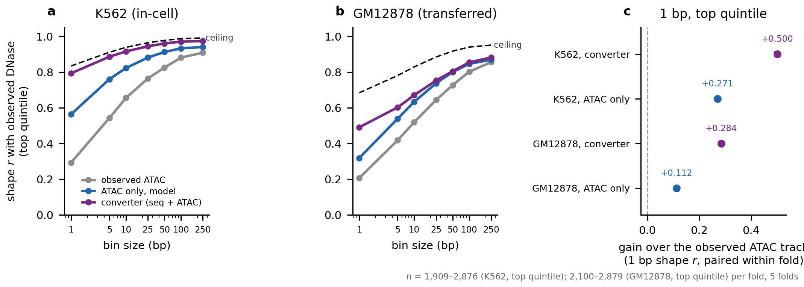

```{=html}
<style>
/* Typography and layout. Present in the document rather than the renderer so the
   report looks the same whether it is built by quarto or by the pandoc fallback
   (Sherlock has pandoc 2.10 and no quarto, which otherwise renders bare Times). */
html { -webkit-text-size-adjust: 100%; }
body {
  font-family: Arial, Calibri, "Helvetica Neue", Helvetica, sans-serif;
  font-size: 15px;
  line-height: 1.6;
  color: #1a1a1a;
  max-width: 980px;
  margin: 0 auto;
  padding: 2.5rem 1.5rem 4rem;
  background: #fff;
}
h1 { font-size: 1.7rem; font-weight: 600; line-height: 1.3; margin: 0 0 .3rem; }
h2 { font-size: 1.15rem; font-weight: 600; margin: 2.6rem 0 .6rem;
     padding-top: 1.1rem; border-top: 1px solid #e4e4e4; }
h3 { font-size: 1rem;   font-weight: 600; margin: 1.6rem 0 .4rem; }
p.date, .date { color: #666; font-size: .85rem; }

/* Figures: never exceed the text column, and centre them. Without this the
   pandoc fallback shows every PNG at natural pixel width and they overflow. */
img {
  display: block;
  max-width: 100%;
  height: auto;
  margin: 1.1rem auto 0.4rem;
}

/* The table of contents pandoc emits as a bare bulleted list */
#TOC, nav#TOC { font-size: .9rem; background: #fafafa; border: 1px solid #eaeaea;
  border-radius: 6px; padding: .8rem 1.2rem; margin: 1.5rem 0 2rem; }
#TOC ul { margin: .2rem 0; padding-left: 1.1rem; }
#TOC a { color: #235; text-decoration: none; }
#TOC a:hover { text-decoration: underline; }

/* Q:/A: lines read as the skimmable layer */
p > strong:first-child { color: #111; }

table { border-collapse: collapse; font-size: .88rem; margin: 1rem 0; width: 100%; }
th, td { border-bottom: 1px solid #e8e8e8; padding: .38rem .6rem; text-align: left;
         vertical-align: top; }
th { background: #f6f6f6; font-weight: 600; }

code, pre { font-family: "SF Mono", Menlo, Consolas, monospace; font-size: .82rem; }
pre { background: #f7f7f8; border: 1px solid #ececec; border-radius: 5px;
      padding: .7rem .9rem; overflow-x: auto; }
code { background: #f2f2f3; padding: .07em .32em; border-radius: 3px; }
pre code { background: none; padding: 0; }

blockquote { border-left: 3px solid #ddd; margin-left: 0; padding-left: 1rem;
             color: #444; }
</style>
```

## Headline figure



**Figure 1 | The converter predicts the DNase profile at base resolution, and the gain over the ATAC track survives transfer.** **Headline figure.**

<details>
<summary>Full legend</summary>

**Figure 1 | ATAC-to-DNase conversion, K562 and transferred to GM12878, 5 folds.** Within-element
shape correlation with observed DNase on the top signal quintile, chromosome-holdout folds,
means over 5 folds. **a**, **b**, Against bin size. Grey is the **observed ATAC track**, no
model, which is what currently occupies the downstream accessibility slot and is therefore
the comparator that decides deployment. Blue is an ATAC-only model trained on the same target
(the control for whether sequence contributes). Purple is the converter, sequence + ATAC.
The dashed line is the DNase inter-replicate ceiling computed on the same held-out windows by
the same estimator. At 1 bp in K562 the converter reaches **0.792** against a ceiling of
0.834 while observed ATAC sits at 0.292; transferred to GM12878, **0.490** against a ceiling
of 0.684 with observed ATAC at 0.206. **c**, Gain over the observed ATAC track at 1 bp,
differenced within fold. Intervals are 95% t on 5 folds and are narrow because fold-to-fold
variation in a mean over ~10,000 elements is small; the sampling uncertainty they describe is
not the uncertainty that matters here (see Limits). Source:
`results/converter_profile_{converter5f,ataconly5f}_{k562,gm12878}.tsv`,
`results/atac_vs_dnase_profile_baseline.tsv`, paired deltas from `scripts/2.35`.
</details>

## Summary

- **The converter works in K562.** Given only sequence and ATAC, it predicts the DNase cut-site profile at single-base resolution with a correlation of 0.792, where two DNase replicates of the same experiment agree at 0.834. It gets 95% of the way to the best a model could do.
- **The ATAC track it replaces is far worse at this.** Raw observed ATAC matches the DNase profile at 0.292. Swapping in the converted track roughly triples how DNase-like the input is (+0.500 paired within fold).
- **Sequence is doing the work, not rescaling.** An identical model with the sequence branch removed reaches 0.563. Sequence adds +0.229 on top of what ATAC alone can give.
- **The gain survives a new cell type; the performance drops.** Applied to GM12878 with no retraining, the converter still beats that cell type's ATAC track by +0.284 and keeps 91% of its sequence margin, where nearly every other change tried in this project has been exactly null on transfer. But it reaches only 72% of the ceiling there against 95% at home, and a new cell type is the only place a converter is ever used.
- **Nothing here shows it helps.** Every number is a correlation with DNase. Whether feeding the converted track to the H3K27ac model improves a prediction anyone would act on is untested.

## Goals

This report covers one model: sequence + ATAC in, DNase out, trained in K562 and applied
unchanged to GM12878. It exists because Report 3 established that DNase is the better
accessibility representation to be in and that the advantage survives transfer, while most
cell types have ATAC and no DNase.

Read Report 2 first for the scoring rules. The metric here is **not** the `profile_pearson`
used elsewhere in the project, for a reason given under Methods.

## The converter reaches 95% of the DNase profile ceiling in K562

**Q:** Can a model with no DNase at inference produce a base-resolution DNase track good
enough to feed a model that reads base resolution?

**A:** In K562, yes. Within-element shape correlation with observed DNase at 1 bp on the top
quintile is **0.792** against an inter-replicate ceiling of **0.834**, so the converter
recovers 95% of the reproducible profile. The observed ATAC track reaches 0.292 on the same
windows.

| 1 bp, top quintile | K562 | GM12878, transferred |
|---|---|---|
| observed ATAC track | 0.292 | 0.206 |
| ATAC-only model | 0.563 | 0.318 |
| **converter (sequence + ATAC)** | **0.792** | **0.490** |
| DNase inter-replicate ceiling | 0.834 | 0.684 |
| converter, as % of ceiling | 95% | 72% |

| paired within-fold, vs the observed ATAC track | delta | 95% CI | *p* |
|---|---|---|---|
| K562, converter | +0.500 | [+0.492, +0.508] | <1e-4 |
| K562, ATAC-only model | +0.271 | [+0.263, +0.278] | <1e-4 |
| GM12878, converter | +0.284 | [+0.279, +0.289] | <1e-4 |
| GM12878, ATAC-only model | +0.112 | [+0.110, +0.114] | <1e-4 |

**The comparator is the ATAC track, not the ceiling.** Fraction of the DNase ceiling says how
close the converter gets to DNase. It does not say whether swapping the track changes what
the downstream model reads, because the model is not currently fed DNase; it is fed ATAC. The
question that decides deployment is whether the painted track is more DNase-like than the one
already in the slot, which is a lower bar and a different one. `0.35` measures it directly and
the answer is yes in both cell types.

**Resolution matters and is why this is a curve.** The downstream accessibility branch reads a
base-resolution track over 2,114 bp. A converter accurate only at 50 bp would emit a smooth
bump that a flat fill could approximate, stripping the structure the branch uses. The
advantage over ATAC is largest exactly where it needs to be: +0.500 at 1 bp, falling to +0.135
at 50 bp as both tracks approach the ceiling (Fig. 1a).

**Method.**

- `1.24` is `1.11` with three changes: the target bigwigs, the element set, and the output
  directory. Everything else is byte-identical, so the target swap is the only thing that can
  explain a difference.
- Elements are **ATAC-derived**, departing from every other K562 model here. At deployment the
  element set can only come from ATAC, so training on DNase-derived elements would mean the
  converter never sees the regions ATAC nominates and DNase does not, which is where a
  conversion does work rather than copying. Element derivation made no difference on the
  H3K27ac task (*p*=0.83), so the swap is free.
- The target is `0.34`'s pooled stranded DNase, built by merging BAMs and calling `genomecov`
  once per strand. Plus and minus sum to the main-chromosome read count exactly (301,112,388
  in K562), and match `0.32`'s independently built unstranded track to the read.

## Sequence contributes, so this is a conversion and not a rescaling

**Q:** ATAC and DNase are both cut-site assays over the same open chromatin. Is the converter
learning anything, or reweighting its own input?

**A:** Sequence contributes **+0.229** at 1 bp in K562 and **+0.172** transferred. An
otherwise identical model with the sequence branch removed, same target and same elements,
reaches 0.563 in-cell against the converter's 0.792.

This was the control that could have closed the line of work. A trained ATAC-only mapping
already improves on the raw ATAC track by +0.271, so some of the gain is normalisation that
needs no sequence at all. The converter roughly doubles that.

| paired within-fold, counts head | delta | 95% CI | *p* |
|---|---|---|---|
| top-quintile Pearson, converter - ATAC-only | +0.064 | [+0.047, +0.082] | 0.0005 |
| all elements, converter - ATAC-only | +0.025 | [+0.016, +0.034] | 0.0016 |

**Method.** The ATAC-only arm is `1.24` with `MODE=atac`, which drops the genome argument and
leaves the accessibility branch alone. Scored by `2.15` with the ATAC-only arm as the config
baseline, so `incremental_r2` and `residual_pearson` are defined against exactly the control
that matters.

## The gain transfers, the performance does not

**Q:** Does any of this survive the move to a cell type the model never saw?

**A:** The margin does. The absolute number does not, and the gap is large.

Applied to GM12878 with no retraining, the converter reaches 0.490 against that cell type's
ceiling of 0.684. As a fraction of ceiling that is **72%**, against 95% at home. The gain over
GM12878's own ATAC track is **+0.284 [+0.279, +0.289]**, and the sequence margin over the
ATAC-only arm keeps **91%** of its in-cell size (25.1 against 27.5 percentage points of
ceiling).

That retention is the notable part against this project's record. The receptive field,
fragment channels, the sequence gate, the asymmetric loss and GC-matched negatives all
produced in-cell gains that were null or negative transferred (Report 3). Fragment channels
in particular were real in-cell and exactly null in both directions.

**Do not read 72% of ceiling as a working converter.** A new cell type is the only place a
converter is ever used, so the transferred number is the operating point, not a robustness
check on the K562 result. 0.490 raw correlation with the DNase profile leaves a large gap to
what a GM12878 DNase experiment would give.

**Two cell types cannot separate the two available explanations.** F-009 established that
K562 and GM12878 transfer asymmetrically for p300, and equalising training-signal volume did
not close it. Whether "K562-trained converters are portable" or "K562 happens to transfer to
GM12878" is unresolved here for the same reason it is unresolved there, and a third cell type
is required rather than desirable.

## Limits

**No downstream test exists.** Every number in this report is a correlation with observed
DNase. The claim that motivates the converter is that a more DNase-like accessibility input
improves the H3K27ac model, and that has not been run, for the converted track or for real
DNase (Report 3 carries the same gap). Until it is, this is a well-measured intermediate
quantity with no demonstrated effect on anything downstream.

**The ceiling is understated, which flatters the converter.** It comes from the two
ENCSR000EOT replicates, 142M reads between them, Spearman-Brown corrected to their pool. The
training target is the 3-BAM pool at 301M reads, which is less noisy and so has a higher true
ceiling. Every "% of ceiling" here is therefore optimistic, and the gap to what is reachable
is larger than printed.

**The confidence intervals describe the wrong uncertainty.** They are 95% t over 5 folds of a
mean across roughly 10,000 elements, and fold-to-fold variation in such a mean is small, so
they are narrow. They say the effect is stable across chromosome holdouts. They say nothing
about the third cell type, which is where the real uncertainty is.

**GM12878's DNase is the weaker library**, 53.8M usable reads against K562's 301.1M, with a
correspondingly lower ceiling (0.684 against 0.834 at 1 bp). The fraction-of-ceiling framing
is what makes the two cell types comparable at all; the raw correlations are not.

## Methods

Architecture, training schedule and cross-validation are as in Report 3: `MultiModalBPNet`,
`n_layers = 8`, +/-500 bp counting window with a 2,114 bp input window, `w = 10`,
reverse-complement augmentation, chromosome-holdout 5-fold cross-validation, negatives at 10%
of each batch and never evaluated on. The only changes are the target and the element set.

**The profile metric here is not the project's usual one, and the two are not comparable.**
`2.15`'s `profile_pearson` comes from bpnetlite's `calculate_performance_measures` with
`kernel_sigma = 7, kernel_width = 81`, so both profiles are Gaussian-smoothed before
correlating. The DNase ceiling in Report 1 is a raw within-element correlation at 1 bp from
`0.25`. Reading one against the other would compare different estimators on different scales:
on the same fold-0 model the smoothed metric reads 0.774 where the raw 1 bp value is 0.799 and
the ceiling is 0.831. `2.31` therefore scores the model with `0.25`'s `shape_corr` unchanged
and computes the ceiling on the same held-out windows in the same run, leaving no estimator or
element-set difference between the model number and the ceiling beside it.

Shape correlation centres each element before correlating, so the element total divides out
and any positive rescaling of the prediction is invisible. Counts are scored separately by
`2.15`.

**Count loss weight.** `w = 1` and `w = 10` were both trained on fold 0. They differ by 0.001
in shape correlation at every bin size and `w = 10` is slightly better on counts (0.904
against 0.895 overall Pearson), so the project standard is kept and no sweep was run. The
profile head being the deliverable did not move the optimum.

**All-elements stratum.** Figure 1 shows the top quintile only. At 1 bp on all elements the
converter reaches 0.506 against a ceiling of 0.585 in K562 (observed ATAC 0.151), and 0.282
against 0.455 in GM12878 (observed ATAC 0.107). The ordering is the same and the margins are
smaller, as they are for every metric in this project, because low-signal elements carry
little reproducible shape.

Track definitions, library depths and the DNase profile ceilings are in Report 1; scoring
rules and the paired-test procedure are in Report 2.

### Regenerate

```
Environment: pixi env multimodal, pixi.lock sha256:069960d36312
```

```bash
# Target: pooled stranded DNase, both cell types
sbatch scripts/0.34.make_pooled_dnase_stranded.sh

# Models: the converter and its ATAC-only control, 5 folds each
for MODE in multimodal atac; do for F in 0 1 2 3 4; do
    sbatch scripts/1.24.submit_training_converter.sh $MODE $F
done; done

# Scoring: counts paired against the ATAC-only control, then raw shape against the
# ceiling, in-cell and transferred
sbatch scripts/2.34.submit_converter_full.sh

# The deployment comparator: observed ATAC vs observed DNase, per fold, model-free
sbatch scripts/0.35.atac_vs_dnase_profile_baseline.sh

# Paired delta against that comparator, and the figure
python scripts/2.35.converter_vs_atac_paired.py --label converter5f --label ataconly5f
python scripts/3.13.plot_converter.py

# Rebuild this report
python build_reports.py h3k27ac_model_report.qmd .
python render_report.py report4_atac_to_dnase_converter.qmd
```
